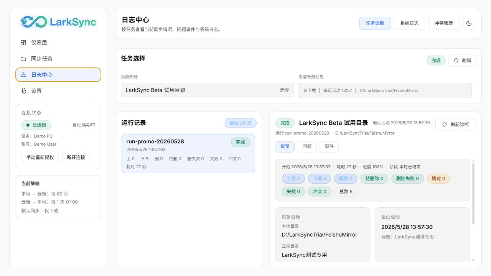

# LarkSync

<p align="center">
  
</p>

本地优先的飞书文档同步工具：把飞书云文档稳定同步到本地 Markdown / 文件系统，同时保留继续在飞书协作的工作方式。
当前开发版本：`v0.8.0-dev.24`（2026-07-14）；最新稳定版：`v0.7.29`。核心运行形态正在从托盘常驻 + Web 管理面板迁移为 Windows 桌面壳 + 托盘常驻。

## 快速入口

| 你要做什么 | 入口 |
| --- | --- |
| 直接试用 | [下载最新版安装包](https://github.com/gooderno1/LarkSync/releases) |
| 首次安装和创建任务 | [快速开始](docs/QUICK_START.md) |
| 配置飞书开放平台 | [OAuth 配置指南](docs/OAUTH_GUIDE.md) |
| 了解数据边界 | [安全与隐私说明](docs/SECURITY_AND_PRIVACY.md) |
| 遇到问题 | [反馈与排障指南](docs/FEEDBACK.md) / [FAQ](docs/FAQ.md) |

## 适合谁

- 飞书重度用户：需要把云端协作文档沉淀到本地目录、NAS 或长期知识库。
- Obsidian / VS Code 用户：希望把飞书 Docx 同步成可检索、可版本化的 Markdown。
- AI Agent 用户：希望先把飞书内容低频缓存到本地，再让 OpenClaw 等工具高频读取本地文件。
- 需要双向工作流的个人或小团队：本地编辑、云端协作、多设备同步同时存在。

## 3 分钟试用路径

第一次试用建议从低风险的 `download_only` 模式开始，只同步一个小型飞书测试目录。

1. 从 [GitHub Releases](https://github.com/gooderno1/LarkSync/releases) 下载 Windows 安装包或对应架构的 macOS DMG。
2. 按 [OAuth 配置指南](docs/OAUTH_GUIDE.md) 创建飞书企业自建应用，填入 App ID、App Secret 和 Redirect URI。
3. 按 [快速开始](docs/QUICK_START.md) 创建 `download_only` 任务，把少量文档同步到本地。
4. 在「活动与问题」确认最近一次同步结果，再决定是否扩大目录或启用双向同步。

## 界面预览



## 核心能力

- Windows 桌面总览页使用固定 `1536x1024` 设计画布整体缩放，覆盖 `1080x720` 最小窗口到宽屏窗口；应用壳采用冷白分区背景，并集中展示同步健康、运行任务、最近同步、待处理项和实时连接状态。
- 总览页生产数据态只展示真实运行任务、未解决冲突和已采集指标；日志未提供数据量、耗时或连接延迟时明确显示 `—` / `未采集`，零传输事件显示空状态。设计样例仅在开发环境显式访问 `?ui-demo=dashboard` 时启用。
- 总览页侧栏固定常驻，不提供含义不明确的折叠入口；右侧“需要处理 / 快速操作 / 实时连接”与主区三层采用同一行高和起始坐标。次级文字、表格字重和面板边框已提高对比度；右上账号区提供明确的账户菜单，可进入“账号与授权”和“更新与维护”。
- 同步任务页将搜索、状态、模式、健康筛选与新建操作合并为同一工具栏；表格模式与操作列保持单行，任务启停使用可识别的开关；三点任务设置使用独立居中弹窗，按内容流向、写入方式、删除联动组织，并通过一次保存提交全部变更；从未执行的任务明确显示“尚未运行”。
- 新建任务采用五步单页向导：每次只显示当前决策，右侧常驻展示目录、模式、删除策略和风险等级；未完成本地/云端目录选择时不可越级，首次创建默认使用低风险的仅下载模式。
- 任务详情以真实任务名称为页面标题，主区按同步关系、当前或最近一次运行、运行历史组织；右侧 300px 连续检查栏集中任务控制、需关注问题、策略和折叠维护操作，零问题时直接显示健康状态。
- 活动与问题页使用任务上下文条和连续三栏诊断工作台，统一运行历史、问题概览、事件时间线、事件诊断与处理操作；冲突处理在零冲突时展示完整健康空状态，有冲突时切换为连续版本决策工作台。
- 设置页将账号与当前设备合并为同一上下文区，默认同步策略、OAuth 等修改统一由页面右上角一次保存；更新与维护页仅保留一个更新检查入口，并将重置同步映射的任务列表默认收起。
- 飞书 Docx 与本地 Markdown 双向同步，图片会下载到本地 `assets/` 并以相对路径引用。
- 任务级同步模式：`enhanced` / `download_only` / `doc_only`，首次试用推荐 `download_only`。
- 删除联动策略：`off` / `safe` / `strict`，避免首次运行或长时间离线后的误删除。
- 事件管理统一展示待删除、失败、取消和冲突事件，并会把 `forbidden`、云端镜像目录创建失败、Docx 块写入失败和删除目标不存在解释成具体问题；冲突仍支持“使用本地 / 使用云端”定向解决。
- 活动与问题页按任务和运行记录查看上传、下载、删除、跳过、失败、待删除和冲突事件；冲突处理页提供独立版本对比和处理队列。
- Windows 桌面壳首轮改造已接入浅色科技风导航、顶栏、底栏、总览工作台、表格化同步任务页、独立任务详情页、活动与问题、冲突处理、设置和更新维护入口。
- OAuth token 本地保存，支持自动续期；详见 [安全与隐私说明](docs/SECURITY_AND_PRIVACY.md)。
- 内置 CLI 和 OpenClaw Skill 模板，适合 Agent / 自动化工作流读取本地飞书缓存。

## 当前边界

- 非 Markdown 文件的覆盖更新接口尚未完全接入。
- 在线文档内嵌 `sheet` 优先转 Markdown 表格；权限不足、接口异常或超限时会回退为 `sheet_token` 占位。
- 文档内附件块若字段结构与当前样例不同，需要提供 docx blocks JSON 样例后继续完善解析。
- 双向同步会修改云端或本地内容。首次试用请使用测试目录或 `download_only` 模式。

<details>
<summary>近期工程化与同步细节</summary>

- 飞书 Docx 与本地 Markdown 双向同步。
- 超长 Docx 全量回写在根块子节点接近飞书上限时，会自动将过多一级块压缩为透明容器，并在必要时先最小化删除尾部旧块腾位，避免 `too many children in block (1770007)` 导致整段内容被误跳过。
- Docx 全量替换在根块已接近上限时，透明容器块现会写入合法的零宽字符段落；若创建过程中途失败，也会回滚本轮刚插入的顶层块，避免一次失败把云端文档越写越大并持续触发 `invalid param`。
- Markdown 上行现在会跳过 fenced code 中的图片/附件示例，不再把代码示例里的 `` 误当成真实资源上传；若历史链路仍产出空 code block，也会在发往飞书前自动补零宽占位，避免 `block_type=14` 空 `elements` 触发 `1770001 invalid param`。
- 默认 OAuth 权限说明与本地配置已切换到新版 Docx scopes：新环境会直接要求 `docx:document` / `docx:document.block:convert`，历史 `docs:doc` 配置会在运行时自动迁移，减少首次授权后仍缺文档权限的问题。
- OAuth 自动续期链路已串行化 refresh；若飞书 token 响应未返回新的 `refresh_token`，会保留当前已存值，降低并发续期触发 `code=20026` 或误清空本地 refresh token 的风险。
- 云端文件下载写回本地时，若目标文件被 WPS/Office 等进程占用，会短暂重试，并在日志里明确提示“目标文件正被其他程序占用，请关闭后重试”。
- 任务级 MD 模式：`enhanced` / `download_only` / `doc_only`。
- 删除联动策略：`off` / `safe` / `strict`。
- 文件夹会作为同步对象持久化映射；本地删除已同步文件夹会删除对应飞书文件夹并清理子映射，云端文件夹删除会按删除策略移动或删除本地目录。
- 设置页支持“默认忽略隐藏/缓存路径”开关：默认会跳过所有以 `.` 开头的文件或目录以及 `__pycache__`；同时仍可按任务配置“双向忽略目录”，单独排除 `node_modules`、构建产物或其他自定义子目录。
- 设备 + 飞书账号双重归属隔离，避免跨设备串任务。
- 仪表盘改为同步健康总览，优先展示本地与飞书是否一致、待处理事件、失败与冲突，以及最近成功同步结果。
- 仪表盘现在会把 `待删除` 与同步队列分开说明：`delete_pending` 表示安全删除宽限队列，到期后自动执行，不再被写成待上传。
- 仪表盘主内容区改为更保守的宽屏两列触发条件，任务路径和事件消息会自动换行，降低中等宽度窗口下的卡片拥挤和路径溢出。
- 仪表盘整体外壳在宽屏下与左侧边栏同高；顶部 Header 固定在外壳内，“任务概览”和“需要关注”共享剩余高度并各自内部滚动，中等宽度仍保持自然纵向布局。
- 任务卡片默认聚焦“本地目录 ↔ 飞书目录”的同步关系与健康摘要，工程字段收进任务管理详情。
- 事件管理保留冲突处理队列，支持连续为多条冲突选择“使用本地 / 使用云端”；前端会明确显示“已排队 / 处理中 / 等待任务空闲 / 已完成 / 处理失败”，并通过单 worker 严格串行提交请求，对“任务运行中”的冲突处理自动重试，避免连续点击时并发打到后端。
- 事件管理改为和任务诊断一致的排障工作台：顶部选择任务，左侧选择同步运行进程，右侧展示该进程的具体问题、原因、建议动作和原始事件；左侧进程列表和右侧问题详情都具备独立滚动边界。
- 事件管理中的同一同步进程支持多类问题并列展示：运行卡片会显示“问题类型数 / 事件数”，右侧会按问题类型拆分多张详情卡。
- 事件管理默认只展示需关注事件，普通上传、下载、跳过和完成日志默认隐藏；用户可切换“显示全部事件”做完整审计。
- 事件管理会把增强 MD 模式下 `_LarkSync_MD_Mirror` 创建 forbidden、Docx `blocks/children` 写入 forbidden、删除目标 not found 分别识别为“镜像目录权限”“文档写入权限”和“删除状态已失效”，避免只显示笼统待处理数量。
- 事件管理配色收敛为中性工作台 + 状态胶囊，只有失败、冲突和待删除等状态使用小面积提示色，避免整页被警告/成功色块占满。
- 活动与问题页、任务运行摘要和任务卡片现在会明确展示 `删除 / 待删除 / 删除失败` 等删除链路状态，不再只显示上传/下载。
- 活动与问题页任务诊断默认只显示有上传、下载、删除、待删除、失败、冲突或正在运行的任务；全 0 无动作任务会折叠隐藏，并可在任务选择区切换显示全部。
- 任务管理页的任务卡不再只显示笼统的“待处理”数量，而会展开为 `队列 / 待删 / 删失败 / 失败 / 冲突` 的组成，并说明每一类对应的处理方式。
- 桌面化总览页改为 v3 浅色科技风布局：摘要卡、主列“正在运行/最近同步”和右侧处理轨分层展示；当前桌面壳使用 1536x1024 设计稿基准，最小窗口按 1080x720 等比呈现，窗口变大时按宽高较小比例同步缩放，同时 shell 反向占满 viewport，避免外层白边。
- 同步任务页新增独立任务详情入口；任务详情页固定采用主列 + 右侧 300px 连续检查栏，已完成运行明确显示“最近一次运行”，从未运行时不再显示误导性的 0% 进度环。
- 新建任务向导由五列同屏改为五步单页结构，正文采用“当前步骤 + 280px 配置摘要”；删除策略改为三张可比较卡片，启用状态使用标准语义开关，底部每一步只保留一个主操作。
- 桌面壳内的页面适配参考 codex-companion 的固定画布缩放方法：左侧栏固定 220px，顶栏和底栏固定展示完整状态，总览、任务、任务详情、活动与问题、冲突处理、设置、更新维护和首次授权页均保持同一设计结构，再由外层画布统一缩放；大窗口不再居中露出背景边。
- 桌面壳新增 `/system/desktop/status` 聚合状态接口，统一向顶栏和底栏提供后端运行、前端静态/开发模式、数据库、OAuth、任务、冲突、更新和最近同步摘要；托盘 `/tray/status` 继续保持旧字段兼容。
- 托盘启动后优先打开 pywebview/WebView2 桌面窗口；若桌面宿主不可用，会自动回退浏览器入口，托盘菜单保留“打开桌面窗口”和“在浏览器中打开”双入口；设置、活动与问题等托盘入口通过 hash 路由直达对应桌面页面；托盘进程内会复用已打开窗口，避免重复点击生成多个 WebView。
- 开发期新增 `npm run dev:test` 隔离测试入口，默认使用 `18000` 后端、`13666` 前端、独立单实例锁和项目内 `data/dev-test` 测试数据目录，可在安装版运行时查看桌面化开发效果，避免影响安装版实例。
- `npm run dev:test` 会校验已有后端的数据目录；若默认 `18000` 指向其他测试目录，会自动切换到后续可用后端端口，并让 Vite 代理跟随，避免桌面测试页误连旧库。
- 项目内 `data/dev-test` 可放置隔离历史样例数据，用于在不影响安装版和默认网页版本的情况下审查真实数据态页面。
- 桌面总览页已按真实数据态继续对齐 v3 设计稿：统计卡高度、主表格行高、模块间距和右侧上下文栏密度进一步收紧。
- 桌面总览页新增设计到工程契约与模块审计口径；摘要卡图标语义、长值显示、运行表速度列、样例冲突卡和实时连接折线已按 `03-dashboard-light-v3.png` 继续收敛，并保留 1080/1440/1536/1920 截图证据。
- 首次授权页接入桌面聚合状态，展示窗口宿主、后端、前端资源、运行模式和数据目录；扫码授权完成后会轮询进入桌面壳，并保留当前 hash 路由。
- 首次授权页新增 `lark-cli auth status --json --verify` 只读状态探测，展示 CLI 安装、用户身份和 docs/drive scope 检测结果；该入口只做辅助诊断，不导入 CLI token，也不在前端暴露 open_id。
- 更新与维护页会读取真实 `install-request.json` 和 `install-handoff.json`，保守展示校验、托盘接管、helper、静默安装和自动重启阶段，不把未确认状态写成成功。
- 活动与问题页切换任务时，任务概览和运行摘要优先读取 `sync_runs` 摘要表；旧任务即使暂时没有 `sync_runs` 摘要，也不会在概览切换时回退扫描 `sync-events.jsonl`，只有真正打开事件/问题明细时才按需读取大日志。
- `sync_run_events` 事件持久化层会将同步事件双写到 SQLite 与 `sync-events.jsonl`，后台按 checkpoint 持续回填/追平旧日志；任务诊断、问题列表和事件时间线优先读取数据库，回填未完成时才受控回退 JSONL。
- 更新安装、重置同步映射和删除任务等高风险维护动作统一使用浅色应用内确认框，明确说明影响范围。
- 首次授权向导支持从“连接飞书”返回 OAuth 配置页，填错参数可直接修正重试。
- 设置页已收敛为 `OAuth / 同步策略 / 设备显示名 / 本地忽略目录`；自动更新、日志保留和同步映射重置统一放在更新维护页，避免桌面端配置入口重复。
- 任务页与“新建任务”向导已拆成独立浅色卡片/步骤组件，并将路径摘要、任务健康、手动云端目录解析和创建 payload 组装下沉为可测试 helper，便于继续治理任务管理流程。
- 任务表格三点按钮打开独立“任务设置”弹窗：任务表不再插入行内面板或改变高度；弹窗右侧实时展示变更数量和风险，原先四个独立“应用”已合并为单次组合 PATCH，删除任务收进默认折叠的维护操作；存在未保存修改时，关闭或按 `Escape` 会先提示是否放弃。
- 后端 `sync_tasks` 接口已抽出独立的请求/响应模型与任务诊断/同步日志服务层，任务 CRUD、任务诊断和日志查询的边界开始收口，便于继续拆解剩余的大型后端模块。
- `sync_runner` 的云端父目录解析、MD 镜像目录查找/创建、目录缓存与导入后文档探测逻辑已下沉到独立 `SyncCloudFolderService`，主同步 runner 正在从“巨型总控器”收口为组合服务。
- `sync_runner` 的删除墓碑、本地回收目录、删除映射清理与云端幂等删除判断逻辑已下沉到独立 `SyncDeleteSyncService`，主同步 runner 继续朝“编排层 + 专项服务”结构收口。
- `sync_runner` 的 Markdown 云端文档导入/重导入、导入源文件清理、同名旧文档清理与新建文档时间戳兜底逻辑已下沉到独立 `SyncMarkdownCloudDocService`，上传链路开始从主 runner 中剥离。
- `sync_runner` 的下载候选构建、表格/多维表格 `sub_id` 补齐、导出任务轮询、导出文件下载和候选去重逻辑已下沉到独立 `SyncDownloadSupportService`，下载链路开始从主 runner 中剥离。
- `docx_service` 的 Markdown 资源占位与回填逻辑已下沉到独立 `DocxMarkdownAssetService`，本地图片、HTML 图片、附件链接和 placeholder 替换开始从文档服务主类中剥离。
- `docx_service` 的表格运行时逻辑已下沉到独立 `DocxTableRuntimeService`，大表格降级、单元格回填和插行补足开始从文档服务主类中剥离。
- `docx_service` 的块级局部更新 diff、重复签名规避与锚点匹配逻辑已下沉到独立 `DocxPartialUpdateService`，文档服务主类进一步向“飞书文档 API 编排层”收口。
- `docx_service` 的子块创建、失败拆分重试、图片/附件回填逻辑已下沉到独立 `DocxBlockCreateService`，主类开始从“内容替换执行器”收口为更薄的文档编排层。
- `docx_service` 的内容替换、`convert -> create` 写入编排与 Markdown 块插入逻辑已下沉到独立 `DocxContentWriteService`，文档服务主类继续向“API 能力集合 + 薄编排层”收口。
- `docx_service` 的 Markdown convert 前后 continuation/placeholder 处理已下沉到独立 `docx_markdown_convert_helper.py`，Markdown 预处理与块文本修补开始从文档服务主类中剥离。
- `sync_runner` 的上传全量扫描、按路径上传批次、运行时服务组装与失败归档逻辑已下沉到独立 `SyncUploadOrchestrationService`，上传主编排开始从同步 runner 中剥离。
- `sync_runner` 的下载树扫描、候选筛选、写回循环、删除联动前置判定与运行时服务组装已下沉到独立 `SyncDownloadOrchestrationService`，下载主编排开始从同步 runner 中剥离。
- `sync_runner` 的上传路径分发、通用文件上传与旧云端文件清理逻辑已下沉到独立 `SyncPathUploadService`，单文件上传细节开始从主 runner 中剥离。
- `sync_runner` 的 Markdown 上传主编排已下沉到独立 `SyncMarkdownUploadService`，冲突校验、块级状态、同 token 覆盖与导入重建回退开始从主 runner 中剥离。
- `transcoder` 中的块类型常量、`DocxParser` 与解析辅助逻辑已下沉到独立 `docx_parser.py`，`transcoder.py` 继续兼容导出原入口，转码编排与块解析职责正式分层。
- `transcoder` 的内嵌 sheet 预览转码、表格矩阵裁剪和 add-ons 文本块渲染已下沉到独立 `transcoder_sheet_helper.py`，表格/附加块渲染开始从主转码器中剥离。
- `tray_app` 的 Windows 安装脚本构造、PowerShell helper 启动参数与静默安装 bootstrap/worker 文本模板已下沉到独立 `windows_install_helper.py`，托盘主入口继续保留兼容函数名，但安装链路开始从主托盘文件中剥离。
- Windows 开机自启动现已区分开发态与打包态入口：开发态快捷方式优先指向受版本控制的 `apps/tray/launcher.py`，安装版直接指向当前 `LarkSync.exe`，托盘启动时还会自动修复旧的失效快捷方式，避免菜单显示“已启用”但实际开机不拉起。
- macOS 安装版链路已补齐：更新包版本识别同时支持 `LarkSync-Setup-*.exe` 与 `LarkSync-*.dmg`，LaunchAgent 会在开发态使用受版本控制的 `launcher.py`、在打包态直接启动 `.app` 内可执行文件，托盘后端日志统一落到用户数据目录，避免安装到 `/Applications` 后继续回写应用目录。
- GitHub Release 正式版 tag 现会默认同时构建 Windows `exe` 与 macOS `dmg`，减少发布时漏传 mac 安装包的风险；仅手动重跑工作流时才允许按需跳过 mac 构建。
- 安装版托盘管理面板固定打开后端 `8000` 提供的生产静态页面；`3666` 仅保留给显式 `--dev` 的 Vite 热重载开发模式，避免本机仍有开发服务运行时新安装版误打开测试页面。
- GitHub Actions 现额外在 PR / `main` 非 tag 场景执行 macOS 定向后端回归 + 打包 smoke，尽量把 `.app` / `dmg` 与 LaunchAgent / 更新链路问题提前暴露，而不是等到正式发布时才首次发现。
- macOS CI 现已进一步补齐安装/启动级 smoke：构建出 DMG 后会自动挂载镜像、显式校验卷内 `Applications` 安装入口、复制 `.app` 到临时安装目录，并直接启动 bundle 内 `LarkSync --backend` 做 `/health` 检查；若启动超时或提前退出，会回抛 bundle stdout/stderr 与 `larksync.log` 尾部，并将默认等待时间提高到 60 秒，避免 GitHub runner 上再次出现“只知道 Connection refused、不知道为什么没起来”的黑盒失败。
- 后端运行时现在将 `greenlet` 作为显式依赖声明，安装包构建也会显式打入该模块，避免 Python 3.14 arm64 等环境里 `sqlalchemy.ext.asyncio` 初始化数据库时因上游不再自动携带 `greenlet` 而直接崩溃，导致安装后启动 smoke 卡在 `/health` 之前。
- macOS 双架构 CI matrix 现已显式关闭 `fail-fast`：即使某个架构先失败，另一个架构的构建与安装 smoke 也会继续跑完，避免 Intel 结果再次因为 arm64 的先发失败被 GitHub 自动取消。
- macOS 打包现默认按当前 runner 原生架构出包，并在 Intel `macos-15-intel` (`x86_64`) 与 Apple Silicon `macos-14` (`arm64`) runner 上分别做日常 smoke；正式版 tag 会上传双架构 DMG，更新服务会优先选择与当前机器架构匹配的安装包。
- 自动更新检查与更新包下载（sha256 校验）。
- 自动更新检查在 GitHub Release API 被匿名限流返回 403/429 时，会回退到公开 Release 跳转页解析最新版本，避免安装包存在但检查失败。
- 自动更新支持校验来源回退：优先使用 GitHub Release 资产 `digest`，其后兼容 `.sha256` 文件与 Release 正文中的 sha256。
- 发布流程会同步上传 `.sha256` 资产并写入 Release 正文，兼容旧版本客户端自动更新。
- 更新包下载完成后支持“确认安装”安全流程：用户确认后由托盘延迟接管安装请求，避免前端请求被中断；Windows 端优先使用系统 ShellExecute 直接拉起安装包，失败时再回退 PowerShell，降低“程序退出但安装器未启动”的风险。
- Windows 静默更新 helper 现在使用 PowerShell `Start-Process -FilePath` 正确拉起安装器和重启当前版本，修复 `-LiteralPath` 参数错误导致 helper 接管后立即失败的问题。
- Windows 静默更新 helper 现在会以 detached + breakaway 方式脱离托盘进程，避免只写出 `installer_started` 就因主程序退出而中断，确保安装完成后仍能负责重启新版本。
- Windows 静默更新 helper 会在安装器退出码为空时复核安装目录版本，并对重启进程做多轮确认与重试；日志会记录目标版本、安装后版本、重启 attempt 和 `restart_failed`，便于定位升级后未自动拉起的问题。
- Windows 静默安装启动改为落地 bootstrap/worker `.ps1` 脚本并通过 PowerShell `-File` 拉起，避免嵌套 `-EncodedCommand` 过长触发 `WinError 206`，导致安装包已下载但静默安装没有启动。
- Windows 静默安装交接文件兼容 PowerShell 5.1 的 UTF-8 BOM，并改为无 BOM UTF-8 写入，避免 helper 已启动但托盘读取 handoff 失败后误报接管超时。
- Windows 静默安装现在会区分 bootstrap 与 worker 的 handoff 阶段；托盘只有在 worker 真正开始执行或安装器已启动后才退出，若只收到 bootstrap 的 `worker_pid` 暂存回执会保留当前版本并明确报错，不再误判为“已接管”。
- Windows 静默安装生成的 `bootstrap.ps1` / `worker.ps1` 现在改为带 BOM 的 UTF-8 脚本文件，兼容 Windows PowerShell 5.1 对 `.ps1` 编码的读取；避免脚本里的中文日志文本被误解码后直接触发 ParserError，导致 handoff 永远停在 `bootstrap_started`。
- Windows 静默安装 helper 的启动参数现在支持分级回退：优先尝试 `CREATE_BREAKAWAY_FROM_JOB`，若受限环境拒绝再回退到普通隐藏进程组；`python scripts/update_install_smoke.py` 会记录实际采用的 `creationflags` 与回退日志，降低受限环境下 smoke 和真实静默安装一起卡死在 helper 启动阶段的风险。
- PyInstaller 打包现在使用仓库自定义 hooks，显式排除未使用的 `pydantic.v1` 与 FastAPI 对其的静态兼容导入，避免 Python 3.14 构建日志继续出现 `Core Pydantic V1 functionality isn't compatible` 噪音，并确保产物分析结果不再携带 `pydantic.v1` 命名空间。
- 发布构建环境固定为 `Python 3.14.x + Node 25.x`；`python scripts/build_installer.py` 会在非基线环境下 fail fast，并输出完整构建环境摘要，避免“本地能打包、CI/正式版环境不一致”的漂移问题。
- FastAPI 应用生命周期已切换为 `lifespan`，统一管理数据库初始化、watcher、同步调度、更新调度和日志维护后台服务的启动与关闭顺序。
- SQLite 初始化已升级为显式 schema version 迁移流程：`init_db()` 会顺序执行迁移注册表并将当前版本写入 `sync_meta.schema_version`，旧库升级路径可以通过自动化测试稳定验证。
- 前端质量门补齐 `eslint + vitest` 页面级 smoke 回归，覆盖 App、总览、任务页、活动与问题、冲突处理、设置和维护页的基础挂载与关键壳层文案。
- 桌面版诊断入口已从旧 `LogCenterPage` 收敛为独立的「活动与问题」和「冲突处理」页面；旧日志中心页面、旧暗色 panel 组件、分页/骨架/空态死代码已移除。
- 冲突处理队列状态机独立为 `useConflictResolutionQueue`，相关状态统计与状态文案判断沉淀到可测试 helper，页面不直接维护队列 ref 和重试状态流转细节。
- 活动与问题页继续复用 `useLogCenterTaskDiagnostics`、`useTaskDiagnosticsSelection` 和 `useTaskEventTimeline` 等诊断 hook；这些 hook 只负责查询与选择状态，不再绑定旧日志中心视图组件。
- 诊断 query 的 `include_problems` 判断、URL 参数组装、轮询间隔、概览排序、`runAlert` 和展示派生状态已沉到 `taskDiagnosticsQuery` / `taskDiagnosticsState` 等 helper，并保留独立测试。
- 新增 `python scripts/update_install_smoke.py`，可在 Windows 上用真实 PowerShell bootstrap/worker 链路验证静默安装接管是否能推进到目标 handoff 阶段。
- 更新检查会保留已校验且版本、大小、sha256 匹配的安装包路径，避免下载完成后再次检查把 `download_path` 清空，造成页面误判为尚未下载。
- 设置页更新区新增“打开安装包目录”，静默安装失败时可直接打开下载目录手动排查或重试安装。
- 静默安装接口会拒绝“当前版本或更旧版本”的重复安装请求，避免升级其实已成功、再次点击却只看到无效安装的误判。
- Windows 托盘会忽略“安装包版本小于等于当前运行版本”的过期静默安装请求，避免安装成功后因残留请求再次触发自更新，表现成打不开或反复重启。
- 活动与问题页与同步状态面板，便于排查同步异常。
- 运行详情的事件时间线支持按 `上传 / 下载 / 删除 / 问题 / 跳过 / 实际变更` 分别筛选，便于单独查看不同同步动作。
- 仪表盘拆分“当前运行”和“最近同步”任务视图，并用真实任务状态展示服务当前是否正在同步，避免启用、运行、最近活动混淆。
- 日志中心重构为任务诊断入口：后端提供任务概览与单任务诊断接口，事件带运行 ID，前端可按任务查看真实运行状态、当前处理文件、问题摘要和事件时间线，并保留系统日志与冲突管理。
- 日志中心进一步改为“任务 -> 运行 -> 事件”视图：每次同步执行单独生成一条运行记录，任务卡片和诊断概览默认只反映最近一次运行，历史失败不会继续污染后续成功运行；可按 `run_id` 单独查看某次同步的问题摘要和完整时间线。
- 后端新增 `sync_runs` 运行摘要表：每次同步的开始时间、结束时间、触发来源、上传/下载/失败/冲突计数和最近错误会单独持久化，日志中心优先读取该表展示运行列表与最近结果，`sync-events.jsonl` 继续保留为细粒度事件时间线。
- 日志中心任务诊断页继续收口：任务诊断工作区与侧边栏底边对齐，`概览` 去掉重复的当前处理文件卡片，改为展示本地目录和云端目录等同步目标信息。
- 正式 CLI 入口 `python scripts/larksync_cli.py`：覆盖授权状态、配置、任务、日志、更新、冲突与目录树等核心能力，并提供 `bootstrap-cache` 高层初始化命令、`workflow-template*` 标准工作流模板命令，以及支持恢复执行和运行记录索引化的 `workflow-plan` / `workflow-execute` / `workflow-run-*`，适合 Agent / Skill 自动化调用。
- 发布质量门会在 GitHub Actions 中执行后端 pytest、后端 editable 安装校验和前端构建，避免测试红灯或包元数据错误进入正式安装包发布。
- 内置 OpenClaw Skill 模板：支持“低频同步到本地再本地读取”的降 token 用法。
- 本地持续编辑静默窗口：连续修改同一文档时合并上传，避免重复上云。
- 双向同步的 Markdown 上行会在覆盖云端前复核云端修改时间；若云端相对本地基线已更新，会阻止覆盖并记录冲突，避免本地旧版本覆盖飞书协作版本。
- 冲突管理对同一文件、同一版本差异的未解决冲突做幂等处理，并折叠历史残留的重复未解决记录，避免页面出现两条相同冲突。
- 冲突管理中的“使用本地 / 使用云端”会真正执行一次定向同步：本地优先会强制把当前本地版本上传覆盖云端，云端优先会强制下载当前云端版本覆盖本地；执行失败时冲突不会被提前标记为已解决。
- 本地新建 Markdown 首次创建飞书文档后，会立即补齐 `local_hash/local_mtime/cloud_mtime/cloud_revision` 同步基线，避免同一轮后续上传把“刚由程序自己创建的云端文档”误判成冲突。
- 自动更新的安装包、状态文件与安装请求会在正式版中落到用户数据目录而不是安装目录；更新后会用当前程序版本重算更新状态，避免安装成功后仍误判“有可更新版本”。
- Windows 自动更新支持静默安装链路：更新请求默认走 NSIS `/S`，托盘会等待外部 helper 确认接管后再退出；helper 使用隐藏窗口的 PowerShell 进程组启动，避免 `DETACHED_PROCESS` 导致接管回执丢失；helper 负责等待安装器退出、记录 PID/退出码/重启动作，并在安装器未拉起或失败时恢复当前版本；如安装到 `Program Files`，Windows 仍可能弹出 UAC 权限确认。
- 非 MD 文件更新上传自动替换旧云端副本，避免 PDF 等附件多次修改后在飞书侧累积同名重复文件。
- 上传链路自动忽略常见临时文件与系统噪音文件（如 `~$*.docx`、`*.tmp`、`Thumbs.db`），避免本地编辑过程中的临时产物误传到飞书。
- Markdown 上行支持 HTML 内嵌 `data:image/...` 图片：会优先复用本地 `figures/`、`插图/`、`assets/` 中的对应图片资源并带 MIME 上传为飞书图片块，避免飞书前端显示“无法导入该图片”。
- Markdown 上行解析本地图片和附件链接时会正确处理文件名中的括号，避免 `blocks/convert` 收到残缺图片语法后返回 400 并跳过图片上传。
- Markdown 图片回填飞书图片块时会按源图像素尺寸写入等比显示宽高，避免空图片块默认尺寸导致插图被横向拉伸。
- Markdown 上行遇到失效的 `fig-数字` 图片相对路径时，会按图号回退查找同级 `figures/`、`插图/`、`assets/` 中的真实源图，避免重命名/迁移后的设计说明书缺图。
- 同步器会忽略 `figures/` 与 `插图/` 这类嵌入源图目录，避免源图被当作独立附件重复上传。
- Markdown 上行遇到超限表格时，会优先保留一张原生飞书表格：创建阶段先按飞书建表上限建立初始行，再通过表格行插入补齐剩余行，避免把 V1.5 这类长表拆成多张表；列宽按 Markdown 文档顺序匹配并覆盖飞书转换器的窄默认值，常见多列表格以 732 偏好总宽为目标，贴近飞书原生云文档默认表格宽度，短列保留最小宽度、长文本列按内容权重分配剩余空间，同时保留整表上限防止横向滚动；单元格内容写入后会清理默认空段落，避免内容被空行顶到下方；既有云端文档缺少当前表格渲染修复标记时，即使本地内容 hash 未变化，也会跳过局部 diff 并在原 doc token 内全量重建。
- 飞书 API 请求会对 429、飞书限频码以及 500/502/503/504 临时网关错误执行指数退避重试，降低 `blocks/convert` 瞬时 502 对同步任务的影响。
- 新建任务或距离上次运行超过 48 小时的任务，会先执行一轮“无删除补齐”：只下载/上传双方缺失的内容并跳过删除墓碑，再进入常规同步，降低首次运行和长时间离线后的误删除风险。
- 删除同步在执行云端删除前会检查同一云端 token 是否仍被其他本地路径使用，并静默程序自身移入 `.larksync_trash` 的文件事件，避免文件移动/回收触发反向误删。
- 云端下载写回本地前会预先静默 watcher，避免程序自己下载文件时又被当成本地修改排进上传队列，反向覆盖刚更新过的飞书文档。
- 上传与下载调度改为任务级独立循环：单个任务长时间同步、失败或卡在大文件处理时，不再拖住其他任务开启新的同步 run。
- `sync_links` 现在会单独记录 Markdown 本地资源基线：下载生成的图片/附件引用会和对应云端版本一起落库，后续只有正文或本地资源真正偏离该基线时才会重新上传，避免“云端刚下载到本地，随后同轮又被回传覆盖云端”。
- 日志中心任务诊断页改为更紧凑的排障工作台：保留全局侧边栏和顶部页头，任务选择上移到页头下方的上下文选择条，下方主区域只保留“左侧运行记录 / 右侧运行详情”；运行详情用摘要条替代碎片化统计卡，事件筛选仅在事件 Tab 下显示，整体更适合任务数量不多时的快速排障。
- 日志中心任务诊断页进一步压缩信息密度：任务上下文条收成更扁的一行半，运行记录卡与详情头部去除重复信息并采用更紧凑的两行结构，`run_id` 改为短码显示，减少拥挤与视觉噪音。
- 日志中心任务诊断页继续收口：`任务上下文` 更名为 `任务选择`，移除无意义说明文案和常驻任务筛选标签，右下常驻运行状态并入 `概览` 标签页，同时在头部保留最近活动时间，释放事件时间线的可视高度。
- 日志中心任务诊断页的任务选择器升级为可搜索 Combobox：任务选择框不再混入本地路径，只显示任务名；搜索、筛选和选择合并到一个下拉面板中，右侧详情头部的最近活动时间与任务名同排显示，并进一步减少多余分割线。
- 日志中心任务诊断页继续压缩：任务选择器只展示任务名、任务路径从选择框移出；右侧详情头部保留最近活动时间但并入标题行，常驻运行摘要维持在 `概览` 标签页中，默认详情区更聚焦事件时间线。
- 日志中心会把应用退出、更新或进程终止遗留的历史 `running` 运行显示为“已中断”，避免旧运行记录长期误显示为同步中；运行耗时按秒级时间戳正确计算。
- 同步事件中的等待上传记录会带上当前运行 ID，便于按单次运行完整筛选排障。
- 飞书文件上传失败会在错误信息中保留飞书错误码、HTTP 状态和请求 ID（如有），避免只显示 `unknown error.` 难以定位。
- 更新状态缓存会自动清理已过期或版本不匹配的下载包路径，避免页面拿旧安装包再次发起静默安装。
- `download_only` 任务不会创建或写入云端 `_LarkSync_MD_Mirror`，即使历史任务遗留了 `md_sync_mode=enhanced` 也只做纯下载。
- 设置页、新建任务与任务管理页会根据同步模式收起不适用的上传/下载配置，减少 `download_only` / `upload_only` 场景中的无效选项与误操作。

</details>

## 快速开始

### 方式 1：直接下载安装包（面向使用者）
- 打开发布页：<https://github.com/gooderno1/LarkSync/releases>
- Windows 下载 `LarkSync-Setup-*.exe`
- macOS 下载与你机器架构匹配的 `LarkSync-*.dmg`
- 首次试用请继续参考 [快速开始](docs/QUICK_START.md)

### 方式 2：本地开发
```bash
npm install
cd apps/frontend && npm install
cd ../backend && python -m pip install -r requirements.txt
cd ../..
npm run dev
```

启动后：
- 前端：`http://localhost:3666`
- 后端：`http://localhost:8000`

### 开发质量门
```bash
npm --prefix apps/frontend run lint
npm --prefix apps/frontend run test
npm --prefix apps/frontend run build
python -m pytest -q        # 在 apps/backend 目录执行
python scripts/update_install_smoke.py  # Windows 静默安装 smoke
```

### 安装包构建基线
- 发布打包默认基线：`Python 3.14.x` + `Node 25.x`
- `python scripts/build_installer.py` 会打印 Python/Node/平台环境摘要，并在非基线环境下直接失败
- 如需临时绕过，可显式设置 `LARKSYNC_ALLOW_UNSUPPORTED_BUILD_PYTHON=1` 或 `LARKSYNC_ALLOW_UNSUPPORTED_BUILD_NODE=1`

## 文档导航（建议先读）
- 快速开始：[`docs/QUICK_START.md`](docs/QUICK_START.md)
- 使用文档：[`docs/USAGE.md`](docs/USAGE.md)
- OAuth 配置：[`docs/OAUTH_GUIDE.md`](docs/OAUTH_GUIDE.md)
- 安全与隐私：[`docs/SECURITY_AND_PRIVACY.md`](docs/SECURITY_AND_PRIVACY.md)
- 反馈与排障：[`docs/FEEDBACK.md`](docs/FEEDBACK.md)
- FAQ：[`docs/FAQ.md`](docs/FAQ.md)
- OpenClaw / AI Agent 本地缓存教程：[`docs/OPENCLAW_LOCAL_CACHE_GUIDE.md`](docs/OPENCLAW_LOCAL_CACHE_GUIDE.md)
- 同步逻辑：[`docs/SYNC_LOGIC.md`](docs/SYNC_LOGIC.md)
- 发布标准：[`docs/RELEASE_STANDARD.md`](docs/RELEASE_STANDARD.md)
- CLI 契约：[`docs/CLI_AGENT_CONTRACT.md`](docs/CLI_AGENT_CONTRACT.md)
- OpenClaw Skill：[`docs/OPENCLAW_SKILL.md`](docs/OPENCLAW_SKILL.md)

## CLI 示例
```bash
python scripts/larksync_cli.py check
python scripts/larksync_cli.py workflow-template-list
python scripts/larksync_cli.py workflow-template --template daily-cache
python scripts/larksync_cli.py workflow-plan --template daily-cache --entrypoint helper --set "local_path=D:\\Knowledge\\FeishuMirror" --set "cloud_folder_token=<TOKEN>"
python scripts/larksync_cli.py workflow-execute --template daily-cache --dry-run --from-step bootstrap --to-step inspect-task --output-json-file data\\workflow.json --set "local_path=D:\\Knowledge\\FeishuMirror" --set "cloud_folder_token=<TOKEN>"
python scripts/larksync_cli.py workflow-execute --template daily-cache --run-id demo-run --skip-completed --set "local_path=D:\\Knowledge\\FeishuMirror" --set "cloud_folder_token=<TOKEN>"
python scripts/larksync_cli.py workflow-run-list --limit 10
python scripts/larksync_cli.py workflow-run-show --run-id demo-run
python scripts/larksync_cli.py workflow-run-prune --keep 20
python scripts/larksync_cli.py task-list
python scripts/larksync_cli.py bootstrap-cache --local-path "D:\\Knowledge\\FeishuMirror" --cloud-folder-token "<TOKEN>" --sync-mode download_only --download-value 1 --download-unit days --download-time 01:00 --run-now
python scripts/larksync_cli.py task-create --name "Agent Sync" --local-path "D:\\Knowledge\\FeishuMirror" --cloud-folder-token "<TOKEN>" --sync-mode download_only
python scripts/larksync_cli.py update-status
python scripts/larksync_cli.py logs-sync --limit 20
```

## OpenClaw 集成
- Skill 目录：`integrations/openclaw/skills/larksync_feishu_local_cache/`
- 设计目标：通过 LarkSync 低频同步飞书文档到本地，让 OpenClaw 优先本地检索，减少飞书 API 调用次数。
- WSL helper 已收敛为“诊断 + 安全转发”，不再自动安装依赖或自动拉起后端，降低 ClawHub 安全扫描误报风险。

## License
本项目采用 **Creative Commons Attribution-NonCommercial-ShareAlike 4.0 International (CC BY-NC-SA 4.0)**。  
完整法律文本见 [`LICENSE`](LICENSE) 或官网：<https://creativecommons.org/licenses/by-nc-sa/4.0/legalcode>
