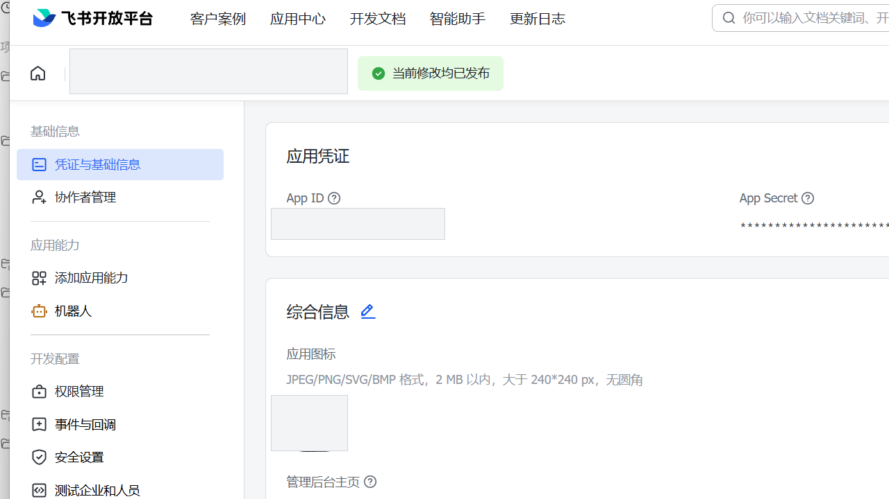
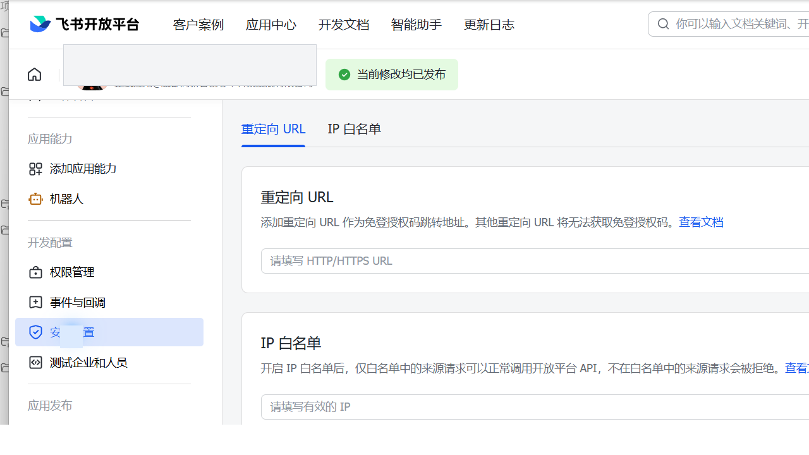
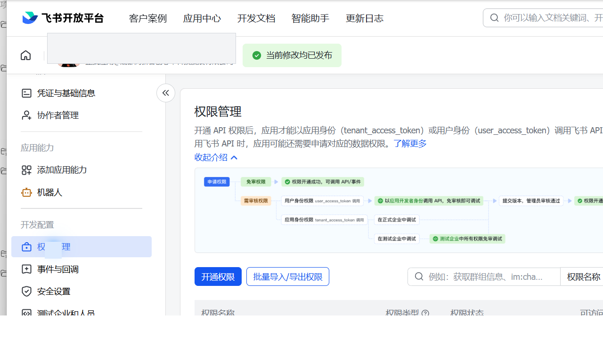

# OAuth 配置指南（飞书）

> v0.9 更新：默认登录方式已经改为官方 `lark-cli` 验证过的 App Registration + OAuth Device Flow。安装后在首次使用页点击“开始扫码连接”即可；LarkSync 原生执行协议，不要求安装 CLI，也不再要求手机回调桌面 `localhost`。下方手动创建应用和 Redirect URI 内容仅用于旧版兼容与受组织策略限制时的高级配置。

## v0.9 推荐流程

1. 安装并启动 LarkSync。
2. 点击“开始扫码连接”，扫码确认创建个人应用。
3. 页面自动进入账号授权，再扫码确认一次。
4. 桌面端按服务端返回间隔轮询官方 Token 端点，成功后进入总览。

二维码只承载官方验证地址与短期用户码。`device_code` 只存在于后端内存，不会返回前端或写入日志；App Secret 与各账号 Token 分别保存在 Windows Credential Manager 或 macOS Keychain。

多账号可从左侧“添加账号”进入。多个账号会同时同步，任务、状态、运行、映射、冲突、问题与通知按`account_id`隔离。设置页可暂停单个账号、断开本机登录或软移除账号。本机断开不等于撤销服务端全部授权；如需彻底撤销，应在飞书授权管理页取消。

从 v0.8 升级时不需要手动迁移：LarkSync 会先创建`pre-v9`数据库备份，再自动搬迁原任务、历史、Token 和应用密钥；只有系统安全存储写入成功后才从旧`config.json`清除明文 App Secret。

本指南用于帮助你在网页端完成飞书 OAuth 配置，所有说明以飞书官方文档为准。文中的控制台截图来自真实飞书开放平台页面，已对应用名称、企业信息、App ID、头像等敏感信息做脱敏处理。

## 1. 先决条件
- 你有飞书账号，且能进入飞书开放平台控制台（企业管理员或应用创建者权限）。
- 本项目已启动后端与前端服务。
- 本地允许写入 `data/config.json`（网页配置会写入该文件）。

## 2. 创建应用（官方流程）
### 2.1 创建“企业自建应用”
1) 进入飞书开放平台控制台。
2) 选择创建应用并选择“企业自建应用”。
3) 填写应用名称与描述并完成创建。

### 2.2 获取 App ID / App Secret
1) 打开应用详情页。
2) 在“应用凭证”页面复制 App ID 与 App Secret。

### 2.3 配置 OAuth 回调地址
1) 打开“安全设置 / OAuth 回调”。
2) 添加回调地址（**必须**与 LarkSync 引导向导/设置页自动生成的 Redirect URI **完全一致**）：
   - 本地运行：`http://localhost:18765/auth/callback`
   - 自定义端口：`http://localhost:9000/auth/callback`（若修改了后端端口）
3) 保存设置。

> **重要**：回调地址**不含** `/api` 前缀，端口默认 18765。协议、域名、端口、路径必须**完全匹配**，否则授权会失败。v0.8.1 及以前使用 8000，升级后请在飞书应用安全设置中增加新回调地址。

### 2.4 配置权限 Scopes（在飞书控制台配置）
1) 打开“权限管理”。
2) 添加需要的权限（建议遵循最小权限原则）。
3) 如平台需要审核，等待审核通过后再授权。

**常用最小权限建议：**
- `drive:drive`
- `docx:document`
- `docx:document:readonly`
- `docx:document.block:convert`
- `drive:drive.metadata:readonly`
- `contact:contact.base:readonly`

> 说明：飞书新版文档接口（`/open-apis/docx/v1/...`）不再对应旧的 `docs:doc`。LarkSync 当前文档同步、块读取/写入与 Markdown 转块依赖 `docx:document` / `docx:document.block:convert`。

> 注意：权限必须在飞书控制台配置，LarkSync 设置页不要求手动填写 scopes。

## 3. LarkSync 设置页填写
打开 LarkSync 的“设置”页面，只需填写以下字段：
- App ID
- App Secret
- Redirect URI

> 授权地址与 Token 地址均为可选项，通常可留空，系统使用以下默认值：
> - 授权地址：`https://open.feishu.cn/open-apis/authen/v1/index`
> - Token 地址：`https://open.feishu.cn/open-apis/authen/v1/access_token`

LarkSync 同时兼容显式配置的 OAuth v2 端点。需要使用 v2 时，应成对配置飞书控制台给出的授权地址和
`https://open.feishu.cn/open-apis/authen/v2/oauth/token`；此时授权请求会自动携带
`offline_access`，Token 请求使用 `client_id` / `client_secret`。现有 v1 配置不会被自动迁移，
避免升级后强制用户重新授权。

## 4. 保存与验证
1) 在设置页点击“保存配置”。
2) 点击“连接飞书”完成授权。
3) 如失败，请逐项排查：
   - 回调地址是否与控制台完全一致（含协议与端口）。
   - App ID / App Secret 是否正确。
   - 控制台中是否已添加所需权限并通过审核。

### 常见报错：20026 / refresh token 失效

飞书会在刷新成功后轮换 `refresh_token`，旧值不能再次使用。LarkSync 会在多个本机进程之间串行化
凭据更新，并在刷新前重新读取系统凭据库；如果错误发生时发现其他进程已经写入新凭据，只会使用新值
恢复一次，不会再次提交同一个旧值。如果问题中心仍提示 `code=20026`，说明系统凭据库中已没有可恢复
的新凭据，请在设置页重新连接飞书。

### 常见报错：Access denied / 缺少权限
若出现“获取根目录失败: Access denied”或提示缺少权限（如 `drive:drive`、`docx:document`、`docx:document.block:convert`），请确认：
1) 飞书控制台“权限管理”中已添加上述权限，且是**用户身份权限**。
2) 保存权限配置后，必须**重新授权**（退出登录后再次点击“连接飞书”）。

## 5. 官方文档入口
飞书官方文档为动态页面，请以最新说明为准：
- 飞书开放平台首页：`https://open.feishu.cn/document/home/index`
- OAuth2 授权码与 Token 文档
- OAuth 回调地址配置
- 权限管理（Scopes）

## 6. 安全提示
- App Secret 为敏感信息，保存后会写入本地 `data/config.json`，请勿提交到公开仓库。
- 若不希望落盘，可改用环境变量并清空配置文件中的 Secret。

本指南将随飞书官方文档更新而同步维护。
