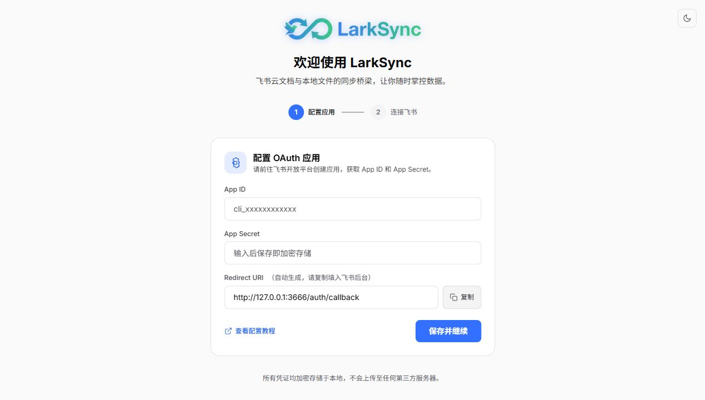
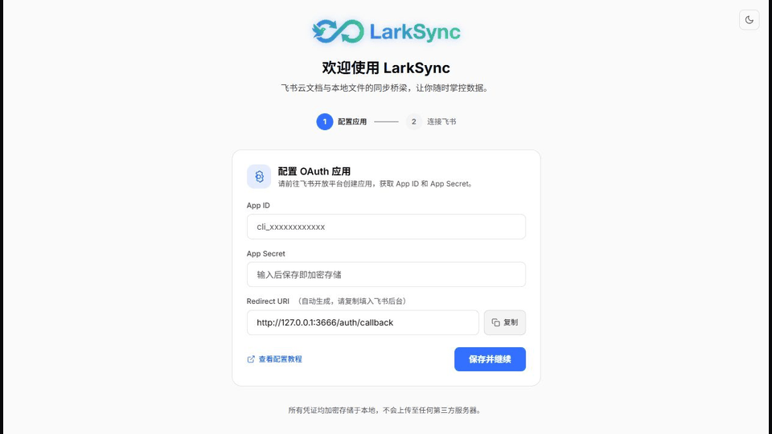
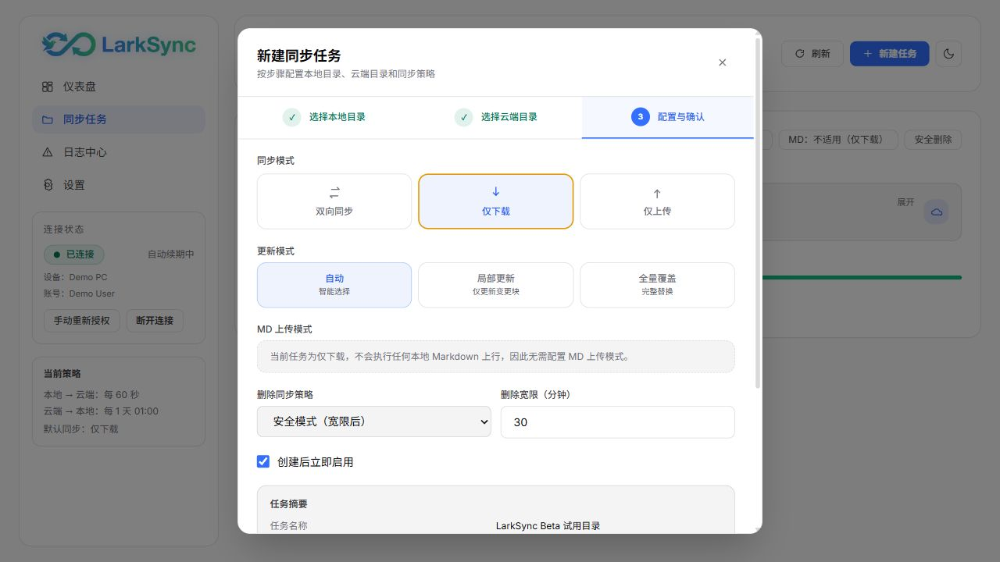
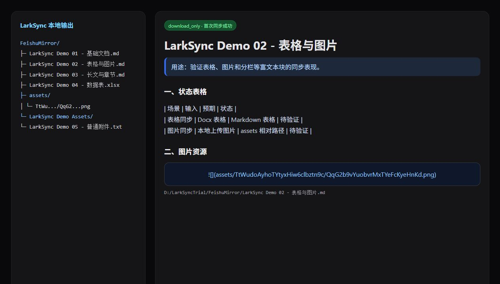
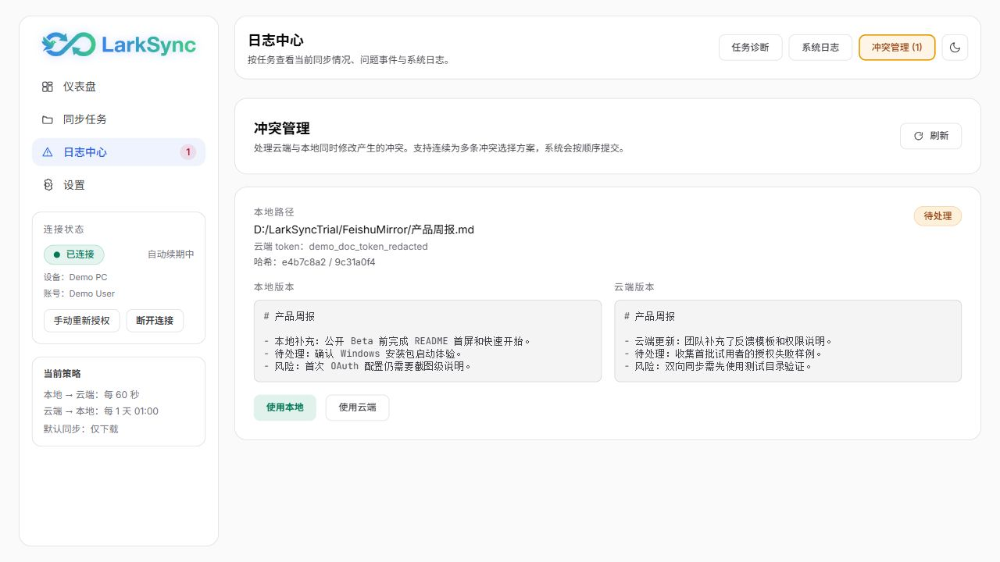

# LarkSync 快速开始

> v0.9 起，首次安装默认直接使用 Device Flow 扫码登录，无需先配置 OAuth 回调地址，也不要求安装`lark-cli`。本文后面的手动 OAuth 步骤仅作为组织禁止自动创建个人应用时的高级备用路径。

更新时间：2026-08-31

本文面向第一次试用 LarkSync 的用户。推荐先用小型测试目录和 `download_only` 模式完成一次闭环，再决定是否启用双向同步。

## 截图版流程

OAuth 配置到连接成功动图：

完整动图：

## 1. 下载安装包

1. 打开发布页：<https://github.com/gooderno1/LarkSync/releases>
2. Windows 下载 `LarkSync-Setup-*.exe`。
3. macOS 下载与你机器架构匹配的 `LarkSync-*.dmg`。
4. macOS 打开 DMG 后，将`LarkSync.app`拖入`Applications`。
5. 若 macOS 提示无法验证开发者：先尝试打开一次，再进入「系统设置 → 隐私与安全性」，在安全区域点击「仍要打开」并确认。
6. 启动 LarkSync，系统托盘或菜单栏会出现 LarkSync 图标。

安装后可进入“设置 → 当前设备”启用开机自启动。该开关会立即修改并回读当前系统账号的启动项，不需要点击页面右上角保存；托盘“更多 → 开机自启动”是同一状态的快捷入口。

如果你从源码运行，请参考 [使用教程](USAGE.md) 中的本地开发流程。

## 2. 扫码连接飞书账号（推荐）

1. 启动 LarkSync，点击“开始扫码连接”。
2. 第一次扫码确认创建 LarkSync 个人应用。
3. 第二次扫码确认当前飞书账号授权。
4. 页面自动进入总览，无需复制授权码或等待手机回调本机。

后续可从左侧账号区域添加更多账号。各账号会同时执行自己的同步任务；切换账号只改变当前页面的数据范围，不会停止其他账号。

## 2A. 手动准备飞书 OAuth（高级备用）

LarkSync 需要通过飞书开放平台访问你的云空间。首次使用前需要创建一个企业自建应用，并填写 App ID / App Secret。

最小路径：

1. 打开飞书开放平台控制台。
2. 创建企业自建应用。
3. 配置 OAuth 回调地址：`http://localhost:18765/auth/callback`。
4. 添加用户身份权限：
   - `drive:drive`
   - `docx:document`
   - `docx:document:readonly`
   - `docx:document.block:convert`
   - `drive:drive.metadata:readonly`
   - `contact:contact.base:readonly`
5. 回到 LarkSync 设置页，填写 App ID、App Secret、Redirect URI。
6. 点击“连接飞书”完成授权。

详细截图级步骤见 [OAuth 配置指南](OAUTH_GUIDE.md)。

## 3. 创建第一个同步任务

首次建议使用一个新建的飞书测试文件夹，里面放 2-5 份文档即可。

1. 打开 LarkSync 管理面板。
2. 进入“同步任务”。
3. 点击“新建任务”。
4. 选择本地测试目录，例如 `D:\LarkSyncTrial\FeishuMirror`。
5. 选择或填写飞书测试文件夹 token。
6. 同步模式选择 `download_only`。
7. 保存任务，并等待首次同步完成。

同步完成后，请检查：

- 本地目录是否出现飞书文档对应的 Markdown 文件。
- 图片是否落在文档旁边的资源目录中。
- 日志中心最近一次运行是否为成功。
- 文件修改时间是否接近云端修改时间。

## 4. 什么时候启用双向同步

满足以下条件后，再考虑双向同步：

- 已经用 `download_only` 验证过 OAuth、目录树、文档转 Markdown。
- 已经理解删除联动策略：`off` / `safe` / `strict`。
- 已经用测试目录验证过本地 Markdown 修改能正确回写云端。
- 确认这不是唯一副本，重要资料已有备份。

双向同步会修改云端或本地内容。正式使用前建议先对一个小目录做至少 1 天试运行。

如果双向同步中云端和本地同时修改了同一文件，LarkSync 会进入冲突管理页面，让你选择“使用本地”或“使用云端”：

## 5. 遇到问题先看这里

- 授权失败：检查回调地址是否完全一致，App ID / App Secret 是否正确。
- Access denied：检查飞书控制台是否添加了用户身份权限，并重新授权。
- 同步后看不到文件：先打开日志中心，查看最近一次运行是否有跳过、失败或权限错误。
- 安装后打不开：查看 [反馈与排障指南](FEEDBACK.md)，按模板提交系统版本、安装包版本和日志。

## 6. 后续阅读

- [使用教程](USAGE.md)
- [同步逻辑说明](SYNC_LOGIC.md)
- [安全与隐私说明](SECURITY_AND_PRIVACY.md)
- [反馈与排障指南](FEEDBACK.md)
