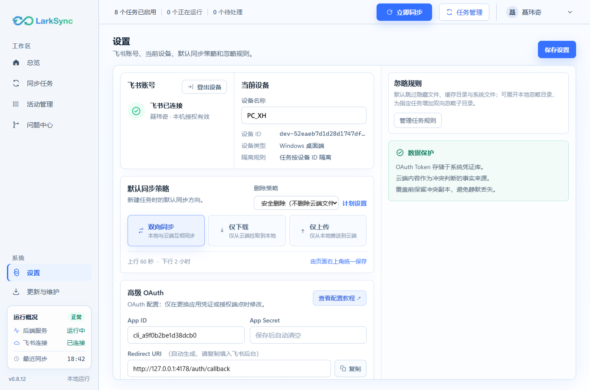
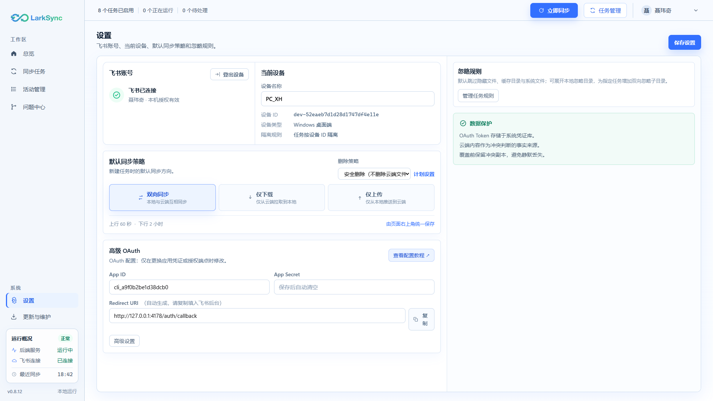
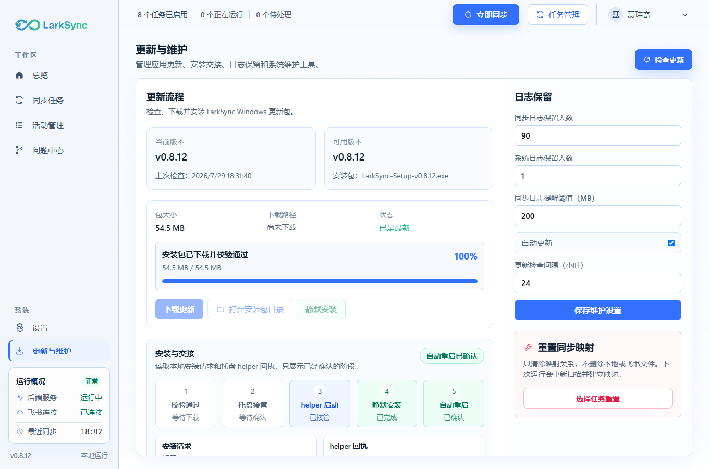
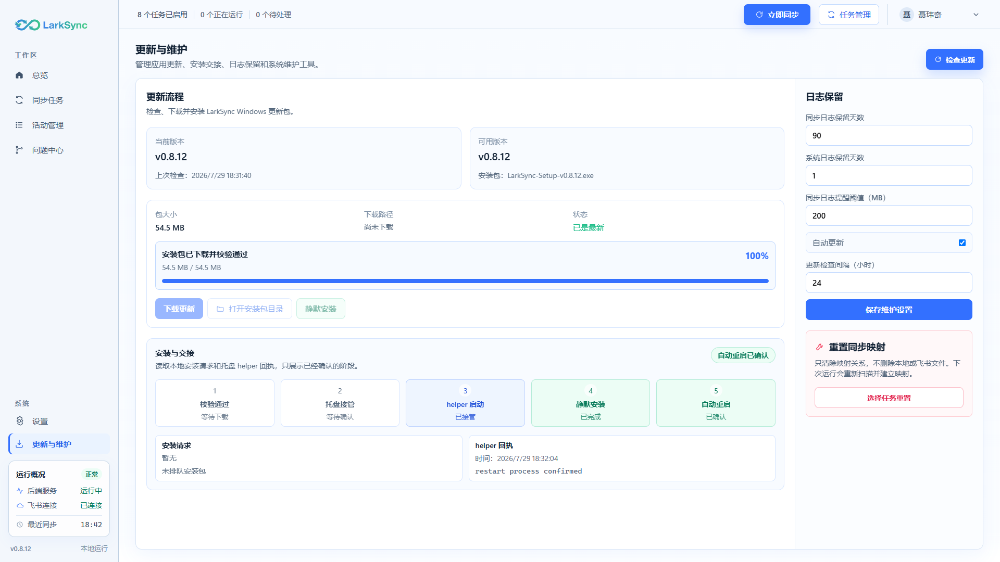

# LarkSync v0.8.13 设置与更新维护页面布局纠偏

## 1. 纠偏原因

- v0.8.12 在设置页和更新维护页根节点增加 `max-width: 1240px` 与水平居中。
- 桌面主内容区本身已经扣除侧栏、顶栏和 `32px` 左右内边距。
- 再限制页面宽度会在最大化时制造与其他页面不一致的空白带。
- 两页仍由桌面主内容区整体滚动，没有使用活动管理、问题中心和任务页的满高工作区骨架。
- 结果是横向缩窄与纵向长页面同时存在，信息密度、卡片比例和滚动位置均不自然。

## 2. 统一页面骨架

设置页和更新维护页统一采用：

1. 页面根节点占满桌面主内容区。
2. 第一行是页面标题和唯一主操作。
3. 第二行使用 `minmax(0, 1fr)` 填满剩余高度。
4. 第二行工作区自身裁切溢出。
5. 主列与侧列分别滚动，页面标题始终可见。
6. 不再设置页面级 `max-width` 或水平居中。

对应结构：

```text
页面（满宽、满高）
├─ 页面标题 / 页面主操作
└─ 工作区（填满剩余高度）
   ├─ 主内容（独立滚动）
   └─ 侧栏（独立滚动）
```

该骨架与以下生产页面一致：

- 活动管理：标题、摘要与满高事件工作区。
- 问题中心：标题、筛选与满高问题工作区。
- 任务管理：标题工具栏与满高任务表。
- 任务详情：标题与满高详情/检查器双栏。

## 3. 设置页

### 3.1 工作区比例

- 工作区使用两栏：
  - 左栏：`minmax(0, 1.16fr)`。
  - 右栏：`minmax(390px, 0.84fr)`。
- 比例直接复用仓库现有 `SettingsShowcasePage` 设计。
- 两栏之间使用单一分隔线，不把每组内容变成彼此悬浮的大卡片岛。

### 3.2 内容归属

- 左栏：
  - 飞书账号与当前设备。
  - 默认同步策略。
  - 高级 OAuth。
- 右栏：
  - 忽略规则。
  - 展开后的任务级忽略目录。
- 页面右上角保留唯一“保存设置”，与任务页“新建任务”、活动页“刷新”和问题中心“刷新”的主操作位置一致。

### 3.3 滚动

- 左栏内容超高时只滚动左栏。
- 右栏展开任务规则后只滚动右栏。
- 页面标题和保存按钮不随内容滚走。

## 4. 更新与维护页

### 4.1 工作区比例

- 主列：`minmax(0, 1fr)`。
- 侧栏：固定 `360px`。
- 恢复仓库现有 `MaintenanceShowcasePage` 的正式设计比例。

### 4.2 内容归属

- 主列：
  - 更新状态、下载和安装。
  - 下载进度。
  - 安装与交接。
- 侧栏：
  - 日志保留和自动更新设置。
  - 重置同步映射。
- “检查更新”恢复为页面右上角主操作。
  - 它是更新维护页的主要无副作用动作。
  - 位置与活动页、问题中心的“刷新”一致。
  - 更新卡片内只保留下载、打开目录和安装等阶段动作。

### 4.3 滚动

- 更新历史或交接内容超高时滚动主列。
- 展开重置任务列表时滚动侧栏。
- 页面标题和检查更新按钮保持可见。

## 5. 响应式与最大化

- 桌面画布仍由全局 `useDesktopViewportScale` 管理。
- 本次不另建第二套页面缩放或页面级断点。
- 最大化：工作区自然扩展；设置页按既定比例扩展两栏，维护页额外宽度分配给主列。
- 常规窗口：维持全局 1360×900 设计画布比例。
- 缩放窗口：跟随全局桌面画布缩放，不在页面内部重复压缩。
- 低高度：依靠两栏独立滚动，避免标题和主操作被滚走。

## 6. 验收

- 两页根节点均包含 `h-full / min-h-0`，不包含 `max-w-[1240px] / mx-auto`。
- 两页均采用 `grid-rows-[auto_minmax(0,1fr)]`。
- 设置工作区采用 `1.16fr / min 390px / 0.84fr`。
- 维护工作区采用主列加 `360px` 侧栏。
- 每个工作区恰有两个独立纵向滚动区域。
- “保存设置”和“检查更新”位于页面标题行。
- “检查更新”只出现一次。
- 展开策略、OAuth、忽略规则和重置任务列表时，不改变页面标题位置。

## 7. 非目标

- 不改变设置字段、保存接口或 OAuth 行为。
- 不改变更新检查、下载、校验、安装或交接状态机。
- 不改变日志保留和重置映射行为。
- 不操作用户当前正式版进程、配置或数据。

## 8. 最新实装截图

以下图片不是概念稿，而是前端连接当前正式后端只读接口后的真实页面截图。截图由隔离的无头浏览器生成，不操作用户正在使用的窗口。

### 8.1 设置页

1360×900：



1920×1080：



### 8.2 更新与维护页

1360×900：



1920×1080：



## 9. 图片更新记录

| 日期 | 版本 | 图片 | 更新原因 | 结论 |
| --- | --- | --- | --- | --- |
| 2026-07-29 | v0.8.13-dev.1 | 设置页 1360×900、1920×1080 | 验证满高双栏与内部表单重排 | 1360 下无竖排或断行；1920 下无 1240px 居中窄带 |
| 2026-07-29 | v0.8.13-dev.1 | 更新与维护页 1360×900、1920×1080 | 验证固定页头、360px 侧栏和独立滚动 | 两档窗口均与其他生产页面骨架一致 |
