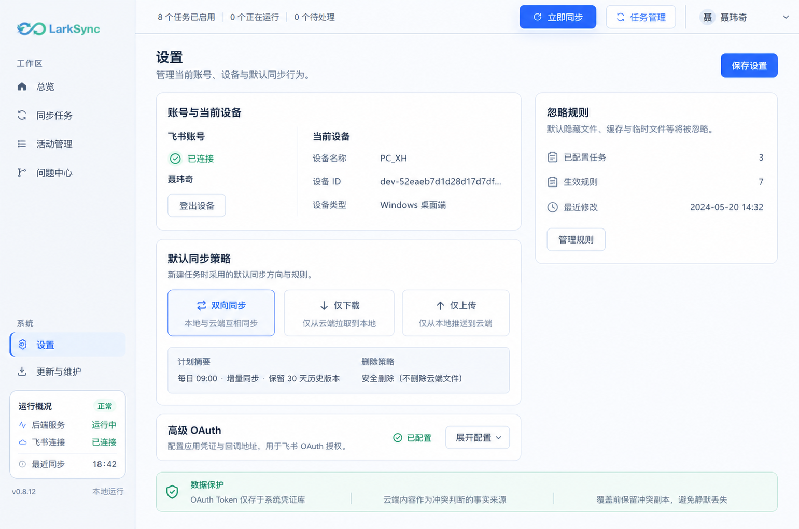
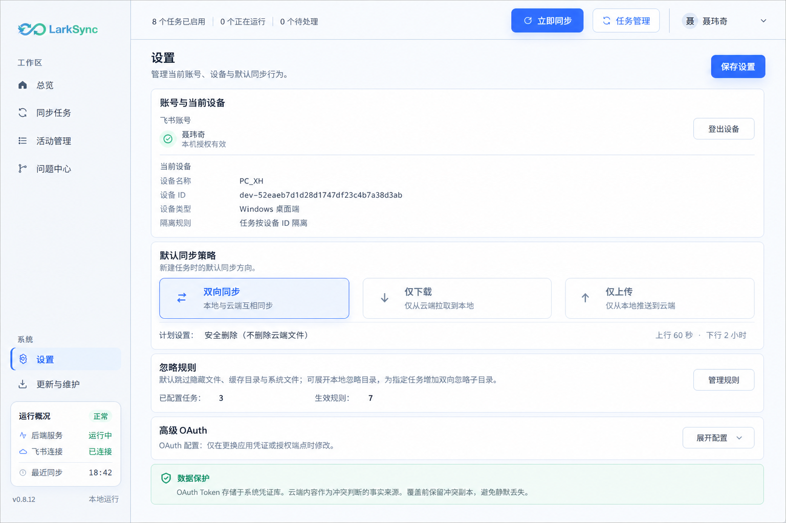
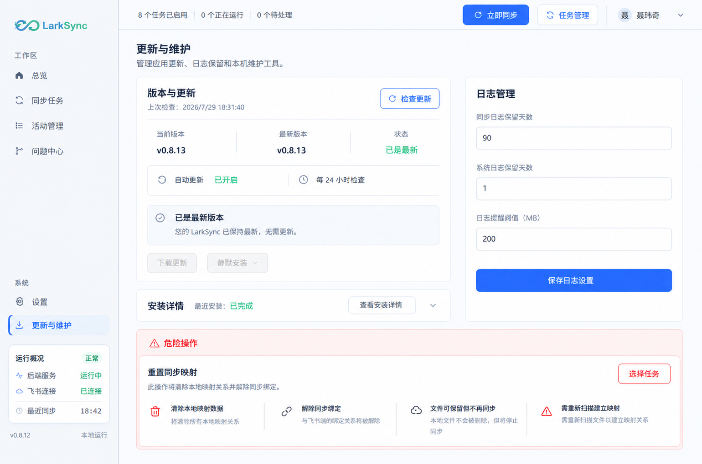
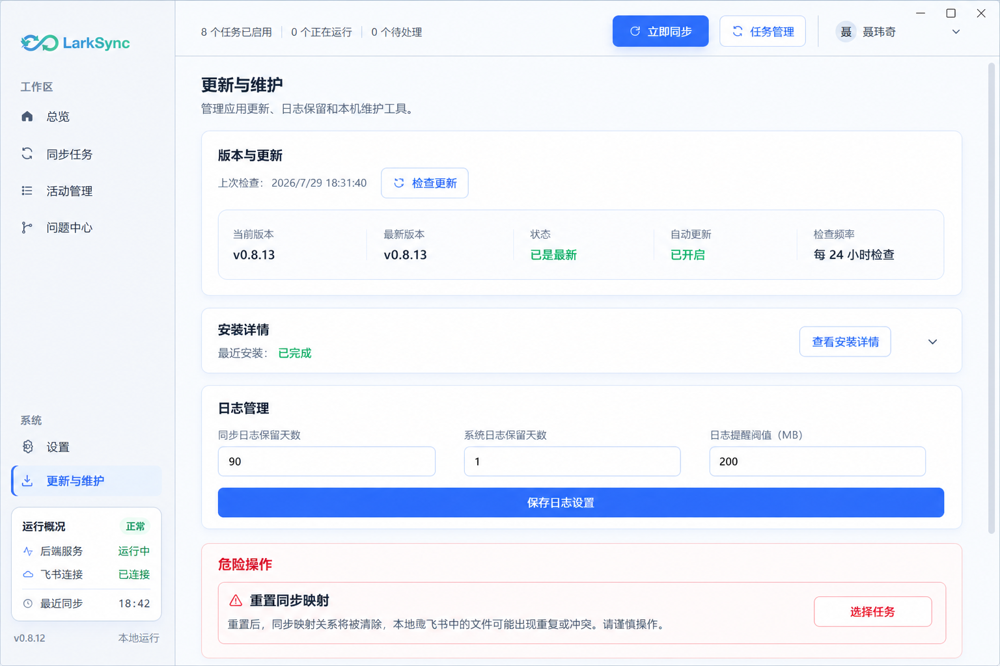

# LarkSync v0.8.14 设置与更新维护页面信息架构设计

> 状态：设计确认中，尚未进入开发  
> 日期：2026-07-29  
> 范围：设置页、更新与维护页  
> 本轮目标：先确认信息架构、动作归属、响应式排布和视觉设计，不修改业务代码

## 1. 设计结论

设置页和更新维护页不采用活动管理、问题中心那种三套明显不同的紧凑/标准/宽屏工作台。

原因：

- 两页是低频配置与状态页面，不是高密度列表—详情—操作工作台。
- 页面没有需要在宽屏新增的第三层主从关系。
- 过度改变栏数、内容位置和操作位置会增加学习成本。
- 同一功能在不同窗口中应保持相同顺序、相同名称和相同动作归属。

本方案采用：

- 一套信息架构。
- 两种排布状态：单栏、双栏。
- 宽屏沿用双栏，只调整容器宽度和留白，不产生第三套设计。
- 页面内部只有一个内容滚动区。
- 页面标题区和需要长期可达的页面级保存动作保持固定。

## 2. 当前设计问题

### 2.1 设置页

- 飞书账号、设备、同步策略、OAuth、忽略规则和数据保护被放在同一个满高工作区中，主次关系不明确。
- 左右两栏分别滚动，但页面内容量不足以支持两个独立滚动上下文。
- “保存设置”看起来覆盖页面全部内容，任务级忽略规则实际上通过独立接口保存，用户容易误判。
- OAuth 是低频高级设置，却长期占据主要区域。
- “数据保护”是说明信息，不应与可操作配置使用同等面积和视觉重量。
- 最大化时右侧忽略规则区域被横向拉宽，但规则内容并不需要这么长的阅读行。

### 2.2 更新与维护页

- “检查更新”位于页面标题右上角，暗示它作用于整个维护页面。
- 检查更新只影响版本与安装模块，与日志保留、自动更新和重置映射无关。
- 当前版本、可用版本、包大小、下载路径和状态被拆成多张卡片，信息重复且阅读路径长。
- 五阶段安装交接在没有活动安装时仍永久占据大量空间。
- 自动更新设置被混入日志保留区域，业务归属不正确。
- 双栏独立滚动让少量配置形成两个滚动条。
- 最大化时更新流程横向拉伸，五个步骤卡片过宽，信息密度反而下降。

## 3. 全局设计原则

### 3.1 保持桌面壳不变

以下区域不属于本次改版：

- Windows 原生标题栏。
- LarkSync 左侧导航栏。
- 顶部任务状态栏和账号区。
- 导航名称、导航顺序和侧栏状态摘要。
- 全局字体、颜色、圆角和阴影体系。

设计图必须复用当前生产桌面壳，不能自行修改侧栏或顶栏。

### 3.2 页面滚动

- 页面标题区固定在内容区顶部。
- 标题下方只有一个纵向内容滚动区。
- 双栏模式下左右内容共同随页面滚动。
- 不再让主栏和侧栏产生两个独立滚动条。
- 展开高级 OAuth、任务忽略规则或安装详情时，页面自然增高。

### 3.3 动作层级

动作分为三类：

| 层级 | 定义 | 位置 |
| --- | --- | --- |
| 页面级 | 影响页面多个普通配置区 | 页面标题右侧 |
| 模块级 | 只影响一个业务模块 | 对应模块标题右侧 |
| 对象级 | 只影响一条规则、一个任务或一个安装包 | 对象行或对象详情内 |

对应关系：

- 设置页“保存设置”：页面级。
- 飞书“登出设备 / 重新授权”：账号模块级。
- 忽略规则“管理规则”：忽略规则模块级。
- 忽略规则保存：规则管理面板级，不并入页面保存。
- “检查更新”：版本与更新模块级。
- “下载更新 / 打开目录 / 安装”：安装包对象级。
- “保存日志设置”：日志管理模块级。
- “重置映射”：任务对象级危险动作。

### 3.4 状态驱动展开

- 没有用户价值的空流程默认收起。
- 正在执行、失败或需要确认的状态自动展开。
- 展开不会移动模块主操作到其他区域。
- 用户手动展开的详情可再次收起。

## 4. 设置页信息架构

### 4.1 页面标题

- 标题：`设置`
- 说明：`管理当前账号、设备与默认同步行为。`
- 页面动作：`保存设置`
- 保存范围：
  - 设备显示名称。
  - 默认同步方向。
  - 上传与下载计划。
  - 删除策略。
  - OAuth 应用配置。
- 不包含：
  - 登出或重新授权。
  - 任务级忽略规则。

### 4.2 账号与当前设备

同一张卡片中分为两个语义区域：

1. 飞书账号
   - 连接状态。
   - 当前账号名称。
   - 授权有效性。
   - `登出设备` 或 `重新授权`。
2. 当前设备
   - 可编辑设备名称。
   - 只读设备 ID。
   - 设备类型。
   - 任务按设备 ID 隔离说明。

设计要求：

- 账号状态优先于技术标识。
- 设备 ID 使用等宽字体并允许复制或完整悬浮提示。
- 紧凑模式下两个区域上下排列。
- 双栏模式下两个区域左右排列。

### 4.3 默认同步策略

内容：

- 三个同步方向：双向同步、仅下载、仅上传。
- 当前生效方向明确高亮。
- 上行检查计划。
- 下行检查计划。
- 删除策略。
- `计划设置` 只展开详细计划，不直接保存。

设计要求：

- 同步方向始终保持三个并列选择项；极窄时允许三行排列，但不改变顺序。
- 计划和删除策略使用紧凑摘要行，不再在标题行右侧塞入完整下拉框。
- 页面顶部“保存设置”统一提交。

### 4.4 忽略规则

页面默认只展示摘要：

- 是否启用默认隐藏/缓存路径忽略。
- 已配置任务数。
- 当前有效规则数。
- 最近修改时间。
- `管理规则`。

点击“管理规则”后：

- 使用居中弹窗或页面内抽屉。
- 按任务展示本地根目录、已忽略子目录和新增目录入口。
- 每个任务的未保存状态清楚标识。
- 规则管理面板使用自己的`保存规则`。
- 关闭存在未保存修改的规则面板时要求确认。

页面级“保存设置”不会暗示保存任务规则。

### 4.5 高级 OAuth

- 默认折叠。
- 折叠态只显示：
  - `高级 OAuth`
  - 当前 App ID 的脱敏摘要。
  - Redirect URI 状态。
  - `展开配置`
- 展开后显示：
  - App ID。
  - App Secret。
  - Redirect URI 与复制动作。
  - 授权地址。
  - Token 地址。
  - Token 存储方式。
  - 配置教程入口。

约束：

- App Secret 保存后清空。
- Redirect URI 只读。
- 高级字段不挤占首屏主要空间。

### 4.6 数据保护说明

- 使用页面底部轻量信息条。
- 不作为右栏大卡片。
- 只说明三项稳定事实：
  - Token 存储于系统凭证库。
  - 云端为冲突判断事实来源。
  - 覆盖前保留冲突副本。

## 5. 更新与维护页信息架构

### 5.1 页面标题

- 标题：`更新与维护`
- 说明：`管理应用更新、日志保留和本机维护工具。`
- 页面标题右侧不放“检查更新”。
- 页面没有跨模块统一保存动作。

### 5.2 版本与更新

模块标题行：

- 标题：`版本与更新`
- 辅助信息：上次检查时间。
- 模块动作：`检查更新`。

默认摘要行：

- 当前版本。
- 最新版本。
- 更新状态。
- 自动更新开关。
- 检查间隔。

状态与动作：

| 状态 | 主文案 | 可用动作 |
| --- | --- | --- |
| 未检查 | 尚未检查更新 | 检查更新 |
| 检查中 | 正在检查更新 | 禁用重复检查 |
| 已是最新 | 当前已是最新版本 | 再次检查 |
| 发现更新 | 发现 vX.Y.Z | 下载更新 |
| 下载中 | 显示百分比、大小和速度 | 暂不提供重复下载 |
| 校验中 | 正在校验安装包 | 无 |
| 已下载 | 安装包已校验 | 安装、打开目录 |
| 失败 | 展示明确错误和失败阶段 | 重试、打开目录（如存在） |

自动更新归入本模块，不再放入日志管理。

### 5.3 安装详情

默认折叠为一行：

- 最近安装状态。
- 最近状态时间。
- `查看安装详情`。

以下情况自动展开：

- 安装请求已创建。
- helper 已接管。
- 正在安装。
- 安装失败。
- 自动重启未确认。

展开内容：

- 校验安装包。
- 托盘接管。
- helper 启动。
- 静默安装。
- 自动重启。
- 安装请求 ID。
- helper 回执。

设计要求：

- 常规窗口中五步横向展示。
- 紧凑窗口中改为纵向时间线。
- 已完成、当前、等待和失败四种状态必须可区分。
- 未确认状态不能显示为成功。

### 5.4 日志管理

独立卡片：

- 同步日志保留天数。
- 系统日志保留天数。
- 日志提醒阈值。
- 当前日志占用摘要。
- `保存日志设置`。

自动更新不属于该卡片。

### 5.5 危险操作

页面底部独立区域：

- 标题：`危险操作`
- 子项：`重置同步映射`
- 默认只显示风险说明和`选择任务`。
- 选择任务后再显示具体任务与`重置映射`。
- 必须经过二次确认。
- 明确说明：
  - 清除映射关系。
  - 不删除本地文件。
  - 不删除飞书文件。
  - 下次同步会重新扫描。

危险操作不与日志配置并排放在同一普通卡片中。

## 6. 响应式排布

### 6.1 模式定义

继续复用现有物理窗口断点和滞回：

- 紧凑：宽度小于 `1280px`，或高度小于 `760px`。
- 标准：未进入紧凑或宽屏。
- 宽屏：宽度至少 `1500px` 且高度至少 `820px`。

本方案只让断点决定排布，不改变信息架构。

### 6.2 紧凑模式

- 单栏。
- 内容顺序与标准模式一致。
- 页面标题和页面级保存动作保持可见。
- 不隐藏字段。
- 不引入新的 Tab 或主从页面。
- 安装五步改为纵向时间线。
- 表单控件使用整行宽度。

设置页顺序：

1. 账号与设备。
2. 默认同步策略。
3. 忽略规则摘要。
4. 高级 OAuth。
5. 数据保护说明。

维护页顺序：

1. 版本与更新。
2. 安装详情。
3. 日志管理。
4. 危险操作。

### 6.3 标准模式

设置页：

- 主列：账号与设备、默认同步策略、高级 OAuth。
- 辅助列：忽略规则摘要。
- 数据保护说明位于内容底部，跨越两列或归入主列底部。
- 建议列宽：`minmax(0, 1fr) / 360–400px`。

维护页：

- 主列：版本与更新、安装详情。
- 辅助列：日志管理。
- 危险操作位于两列下方并跨越内容宽度，避免与普通配置同层。
- 建议列宽：`minmax(0, 1fr) / 340–380px`。

### 6.4 宽屏模式

- 沿用标准双栏。
- 不增加第三栏。
- 不改变任何模块顺序和动作位置。
- 内容容器设置合理最大阅读宽度。
- 额外宽度优先增加模块间留白，不把表单输入框无限拉长。
- 建议最大内容宽度：`1360–1440px`。
- 容器在桌面主内容区内居中，但不再包裹一个空旷的满高白色大框。

### 6.5 低高度

- 标题区固定。
- 内容区单一滚动。
- 不建立左右独立滚动区。
- 折叠高级 OAuth 和空闲安装详情，优先保留主要配置。

## 7. 视觉规范

- 沿用当前浅色冷蓝灰桌面风格。
- 页面背景继续使用全局 `desktop-grid-surface`。
- 卡片为白色或极浅蓝灰，不使用深色面板。
- 普通边框：`#d7e4f5` 附近。
- 主操作：飞书蓝 `#3370ff`。
- 成功：绿色。
- 更新可用：琥珀色。
- 危险操作：红色，但只用于危险区和最终按钮。
- 页面标题保持 `text-xl`。
- 模块标题保持 `text-base` 或 `text-lg`。
- 正文与表单继续使用已经提升后的全局字阶，不新增 10px 以下文本。
- 卡片不强制等高，不为填满页面制造空白。

## 8. 交互与状态

### 8.1 保存反馈

- 保存中禁用重复提交。
- 成功使用 Toast，并恢复按钮默认状态。
- 失败在 Toast 中给出原因；相关模块保留未保存值。
- 后续实现建议增加脏状态：
  - 没有修改时页面保存按钮弱化或禁用。
  - 有修改时显示`保存设置`。
  - 保存成功后显示短暂`已保存`。

### 8.2 展开状态

- 高级 OAuth、安装详情和危险任务列表相互独立。
- 窗口变化不重置展开状态。
- 单栏/双栏切换不重置表单输入。
- 自动展开的安装详情允许在流程结束后收起。

### 8.3 键盘与无障碍

- 所有折叠按钮提供 `aria-expanded`。
- 检查、下载、校验和安装状态使用 `aria-live`。
- 下载进度保留 `role="progressbar"`。
- 弹窗支持 Esc 关闭。
- 存在未保存规则时，Esc 也必须先确认放弃。
- 危险操作确认框默认焦点不落在危险按钮。

## 9. 数据与接口边界

本设计不要求修改以下后端行为：

- OAuth 配置保存接口。
- 默认同步策略保存接口。
- 任务忽略目录接口。
- 更新检查、下载、校验、打开目录和安装接口。
- 日志保留配置接口。
- 重置映射接口。

需要在开发前确认：

- 页面级保存调用失败时是否允许部分配置已保存。
- 任务级忽略规则的批量保存能力。
- 当前日志占用是否已有可直接展示的数据字段。

若接口没有对应字段，设计实现时不伪造数据；可以暂不展示当前日志占用。

## 10. 验收标准

### 10.1 设置页

- 页面只有一个内容滚动区。
- 紧凑模式为单栏，标准与宽屏为同一双栏结构。
- 宽屏不新增第三栏。
- 页面级保存不暗示保存任务规则。
- OAuth 默认折叠。
- 忽略规则默认显示摘要，通过独立管理入口编辑。
- 数据保护使用轻量说明，不占据大侧栏卡片。

### 10.2 更新与维护页

- 页面标题右侧没有“检查更新”。
- “检查更新”只出现一次，位于版本与更新模块标题行。
- 自动更新属于版本与更新模块。
- 安装详情默认折叠，在活动、失败或未确认状态自动展开。
- 日志管理使用自己的保存动作。
- 危险操作位于普通配置之后，并具有明确风险说明和二次确认。
- 紧凑模式五步安装流程使用纵向时间线。

### 10.3 响应式

- 1080×720：单栏，无横向溢出，文字和按钮不竖排。
- 1360×900：双栏，主次清晰，页面只有一个滚动条。
- 1920×1080：保持同一双栏，表单不无限拉长，不出现满高空白大框。
- 三档切换不丢失输入、选择和展开状态。

## 11. 设计图计划

本轮使用 imagegen 生成以下高保真 UI 设计图：

1. 设置页标准模式，1360×900。
2. 设置页紧凑模式，1080×720。
3. 更新与维护页标准模式，1360×900。
4. 更新与维护页紧凑模式，1080×720。

宽屏不单独设计第三套页面；确认标准图后，宽屏仅作为同一双栏结构的延展验证图。

设计图必须：

- 复用当前 LarkSync 桌面壳。
- 不改变侧栏和顶栏。
- 使用本文规定的信息顺序和动作位置。
- 标注为设计稿，不代表已经实现。

## 12. 图片版本与更新记录

| 日期 | 版本 | 图片 | 状态 | 说明 |
| --- | --- | --- | --- | --- |
| 2026-07-29 | v0.8.14-design-v1 | 设置页标准、设置页紧凑 | 最新 | 验证页面级保存、双栏/单栏、规则摘要、OAuth 折叠和轻量数据保护 |
| 2026-07-29 | v0.8.14-design-v1 | 维护页标准 v1 | 已废弃 | 初稿错误地把更新检查间隔放入日志管理，未进入最新版设计 |
| 2026-07-29 | v0.8.14-design-v1.1 | 维护页标准修正版 | 最新 | 移除日志卡片中的更新检查间隔，自动更新与检查频率只属于版本与更新 |
| 2026-07-29 | v0.8.14-design-v1 | 维护页紧凑 | 最新 | 验证单栏、模块内检查更新、空闲安装详情折叠、日志独立保存和危险区置底 |

## 13. 最新设计图

以下图片由内置 imagegen 生成，以 v0.8.13 真实生产页面截图作为桌面壳参考。

图片用于确认信息架构、层级、动作位置和排布，不代表页面已经实现。图片中的版本号、时间、任务数量和示例内容属于设计数据，实际开发必须读取真实后端。

imagegen 会将输出规范化为接近 `3:2` 的画布，因此文件像素并不等同于目标物理窗口；“标准”和“紧凑”表示布局语义及目标窗口条件：

- 标准：目标 `1360×900`。
- 紧凑：目标 `1080×720`。

### 13.1 设置页标准模式

设计检查：

- 页面右上角只有页面级`保存设置`。
- 主列承载账号设备、同步策略和折叠 OAuth。
- 辅助列只展示忽略规则摘要。
- `管理规则`与页面保存动作分离。
- 数据保护使用跨栏轻量说明条。
- 没有满高白色大框，也没有左右独立滚动区。

### 13.2 设置页紧凑模式

设计检查：

- 与标准模式保持相同内容顺序。
- 所有模块改为单栏。
- 账号与设备在同一卡片内上下排列。
- 三种同步方向仍保持清晰可比较。
- 忽略规则和 OAuth 不隐藏，只收敛为摘要与折叠入口。

### 13.3 更新与维护页标准模式

设计检查：

- 页面标题右侧没有局部动作。
- `检查更新`位于`版本与更新`卡片标题行。
- 自动更新和检查频率属于更新卡片。
- 日志卡片只保留三个日志字段与`保存日志设置`。
- 空闲安装详情默认折叠。
- 危险操作位于普通配置之后并跨越内容宽度。

### 13.4 更新与维护页紧凑模式

设计检查：

- 版本更新、安装详情、日志管理、危险操作按相同顺序单栏排列。
- 页面只出现一个纵向滚动条。
- `检查更新`仍在更新卡片内。
- 日志管理不包含自动更新或检查间隔。
- 危险区保持最后出现，不与普通配置混排。

## 14. 本轮视觉复核结论

### 14.1 已解决

- 不再为低信息量页面制造三套完全不同的设计。
- 不再用双独立滚动区承载少量表单。
- 检查更新回归版本与安装业务上下文。
- 自动更新与日志保留完成业务拆分。
- 安装交接由永久大流程改为状态驱动的折叠详情。
- 忽略规则由完整编辑器收敛为摘要入口，避免与页面保存语义冲突。
- 宽屏不再新增第三栏或横向拉长五步流程。

### 14.2 需要用户确认

1. 设置页是否保留页面右上角统一`保存设置`。
2. 忽略规则是否采用摘要卡片加独立管理弹窗。
3. 高级 OAuth 是否默认折叠。
4. 自动更新和检查频率是否完全归入`版本与更新`。
5. 安装详情是否在空闲时折叠，只在活动、失败或未确认状态自动展开。
6. 危险操作是否固定置于页面最后并跨越内容宽度。

## 15. imagegen 提示词摘要

使用方式：内置 imagegen，`ui-mockup`。

共同约束：

- 当前生产截图作为桌面壳参考。
- 保留左侧导航、顶部状态栏、Logo、字体和配色。
- 只修改页面内容区。
- 标准使用双栏，紧凑使用单栏。
- 不新增第三栏。
- 不使用左右独立滚动。
- 不改变动作归属。
- 不使用概念艺术、插画、暗色主题或水印。

设置页提示重点：

- 页面级`保存设置`。
- 账号与设备。
- 默认同步策略。
- 忽略规则摘要与`管理规则`。
- 默认折叠的高级 OAuth。
- 轻量数据保护说明。

维护页提示重点：

- 页面标题无动作。
- `检查更新`位于`版本与更新`标题行。
- 自动更新与检查频率只属于更新卡片。
- 空闲安装详情折叠。
- 日志管理只有三个日志字段。
- 危险操作置底。
