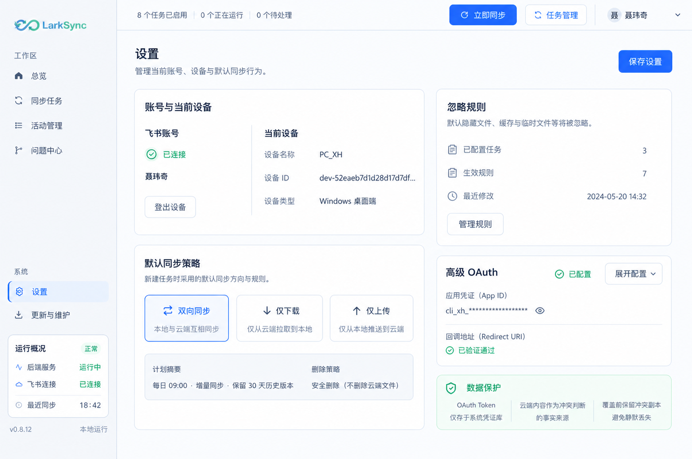
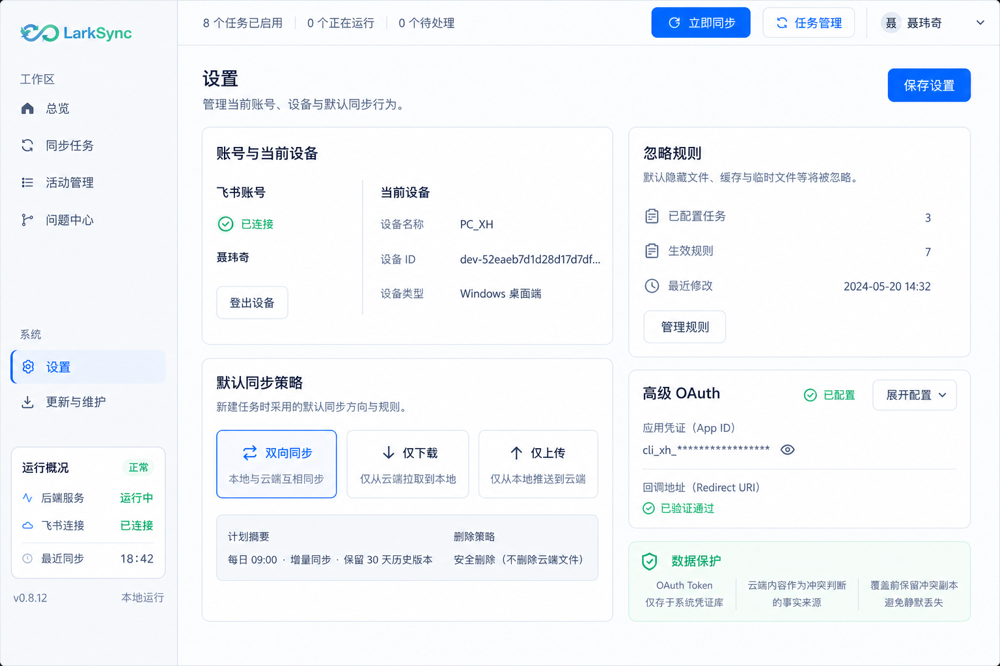
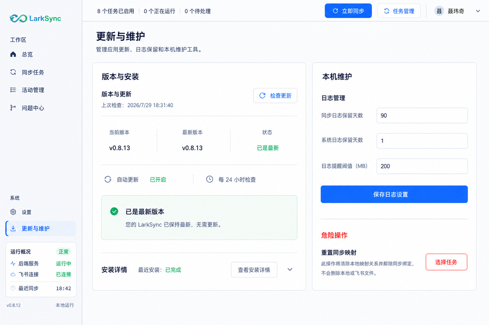
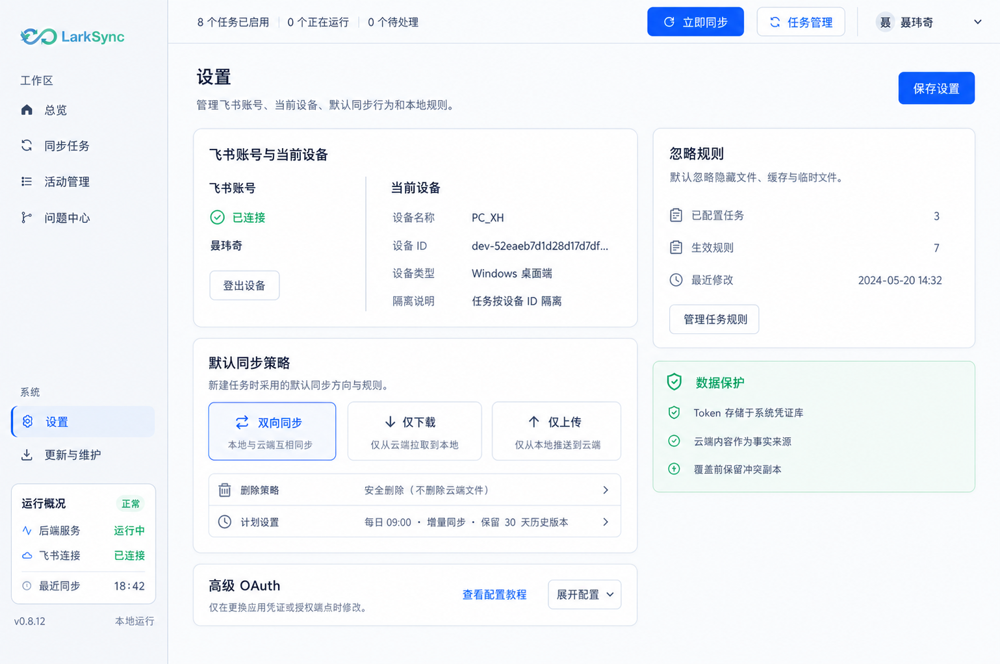

# LarkSync v0.8.14 设置与更新维护页面信息架构设计

> 状态：v0.8.16-design-v1 自然高度双栏方案与两张设计图已完成，等待用户确认后再修改业务页面
> 日期：2026-07-30
> 范围：设置页、更新与维护页  
> 本轮目标：先确认信息架构、动作归属、响应式排布和视觉设计，不修改业务代码

## 1. 设计结论

设置页和更新维护页不采用活动管理、问题中心那种三套明显不同的紧凑/标准/宽屏工作台。

原因：

- 两页是低频配置与状态页面，不是高密度列表—详情—操作工作台。
- 页面没有需要在宽屏新增的第三层主从关系。
- 过度改变栏数、内容位置和操作位置会增加学习成本。
- 同一功能在不同窗口中应保持相同顺序、相同名称和相同动作归属。

本方案采用：

- 一套信息架构。
- 正常桌面支持范围内始终保持同一双栏结构。
- 紧凑、标准和宽屏只改变整体缩放、列宽与留白，不改变模块栏位。
- 仅在非桌面环境或逻辑内容宽度低于约 `900px` 时提供单栏安全兜底。
- 页面内部只有一个内容滚动区。
- 页面标题区和需要长期可达的页面级保存动作保持固定。
- 设置页继续使用 v2 的稳定双栏卡片组合。
- 更新与维护页改为两张顶底对齐的主面板，消除两列独立堆卡形成的瀑布流感。

## 2. 当前设计问题

### 2.1 设置页

- 飞书账号、设备、同步策略、OAuth、忽略规则和数据保护被放在同一个满高工作区中，主次关系不明确。
- 左右两栏分别滚动，但页面内容量不足以支持两个独立滚动上下文。
- “保存设置”看起来覆盖页面全部内容，任务级忽略规则实际上通过独立接口保存，用户容易误判。
- OAuth 是低频高级设置，却长期占据主要区域。
- “数据保护”是说明信息，不应与可操作配置使用同等面积和视觉重量。
- 最大化时右侧忽略规则区域被横向拉宽，但规则内容并不需要这么长的阅读行。

### 2.2 更新与维护页

- “检查更新”位于页面标题右上角，暗示它作用于整个维护页面。
- 检查更新只影响版本与安装模块，与日志保留、自动更新和重置映射无关。
- 当前版本、可用版本、包大小、下载路径和状态被拆成多张卡片，信息重复且阅读路径长。
- 五阶段安装交接在没有活动安装时仍永久占据大量空间。
- 自动更新设置被混入日志保留区域，业务归属不正确。
- 双栏独立滚动让少量配置形成两个滚动条。
- 最大化时更新流程横向拉伸，五个步骤卡片过宽，信息密度反而下降。
- v2 虽然已经恢复双栏，但左右仍是两组独立卡片堆叠，顶部和底部边界不一致，页面缺少完整的双面板秩序。
- v2 的危险操作使用红色外框包裹白色内框，形成重复容器；已是最新状态仍保留不可用的下载、安装按钮，视觉噪音偏大。

## 3. 全局设计原则

### 3.1 保持桌面壳不变

以下区域不属于本次改版：

- Windows 原生标题栏。
- LarkSync 左侧导航栏。
- 顶部任务状态栏和账号区。
- 导航名称、导航顺序和侧栏状态摘要。
- 全局字体、颜色、圆角和阴影体系。

设计图必须复用当前生产桌面壳，不能自行修改侧栏或顶栏。

### 3.2 页面滚动

- 页面标题区固定在内容区顶部。
- 标题下方只有一个纵向内容滚动区。
- 双栏模式下左右内容共同随页面滚动。
- 不再让主栏和侧栏产生两个独立滚动条。
- 展开高级 OAuth、任务忽略规则或安装详情时，页面自然增高。

### 3.3 动作层级

动作分为三类：

| 层级 | 定义 | 位置 |
| --- | --- | --- |
| 页面级 | 影响页面多个普通配置区 | 页面标题右侧 |
| 模块级 | 只影响一个业务模块 | 对应模块标题右侧 |
| 对象级 | 只影响一条规则、一个任务或一个安装包 | 对象行或对象详情内 |

对应关系：

- 设置页“保存设置”：页面级。
- 飞书“登出设备 / 重新授权”：账号模块级。
- 忽略规则“管理规则”：忽略规则模块级。
- 忽略规则保存：规则管理面板级，不并入页面保存。
- “检查更新”：版本与更新模块级。
- “下载更新 / 打开目录 / 安装”：安装包对象级。
- “保存日志设置”：日志管理模块级。
- “重置映射”：任务对象级危险动作。

### 3.4 状态驱动展开

- 没有用户价值的空流程默认收起。
- 正在执行、失败或需要确认的状态自动展开。
- 展开不会移动模块主操作到其他区域。
- 用户手动展开的详情可再次收起。

## 4. 设置页信息架构

### 4.1 页面标题

- 标题：`设置`
- 说明：`管理当前账号、设备与默认同步行为。`
- 页面动作：`保存设置`
- 保存范围：
  - 设备显示名称。
  - 默认同步方向。
  - 上传与下载计划。
  - 删除策略。
  - OAuth 应用配置。
- 不包含：
  - 登出或重新授权。
  - 任务级忽略规则。

### 4.2 账号与当前设备

同一张卡片中分为两个语义区域：

1. 飞书账号
   - 连接状态。
   - 当前账号名称。
   - 授权有效性。
   - `登出设备` 或 `重新授权`。
2. 当前设备
   - 可编辑设备名称。
   - 只读设备 ID。
   - 设备类型。
   - 任务按设备 ID 隔离说明。

设计要求：

- 账号状态优先于技术标识。
- 设备 ID 使用等宽字体并允许复制或完整悬浮提示。
- 正常桌面窗口中两个区域始终左右排列。
- 只有单栏安全兜底被触发时，两个区域才上下排列。

### 4.3 默认同步策略

内容：

- 三个同步方向：双向同步、仅下载、仅上传。
- 当前生效方向明确高亮。
- 上行检查计划。
- 下行检查计划。
- 删除策略。
- `计划设置` 只展开详细计划，不直接保存。

设计要求：

- 同步方向始终保持三个并列选择项；极窄时允许三行排列，但不改变顺序。
- 计划和删除策略使用紧凑摘要行，不再在标题行右侧塞入完整下拉框。
- 页面顶部“保存设置”统一提交。

### 4.4 忽略规则

页面默认只展示摘要：

- 是否启用默认隐藏/缓存路径忽略。
- 已配置任务数。
- 当前有效规则数。
- 最近修改时间。
- `管理规则`。

点击“管理规则”后：

- 使用居中弹窗或页面内抽屉。
- 按任务展示本地根目录、已忽略子目录和新增目录入口。
- 每个任务的未保存状态清楚标识。
- 规则管理面板使用自己的`保存规则`。
- 关闭存在未保存修改的规则面板时要求确认。

页面级“保存设置”不会暗示保存任务规则。

### 4.5 高级 OAuth

- 默认折叠。
- 折叠态只显示：
  - `高级 OAuth`
  - 当前 App ID 的脱敏摘要。
  - Redirect URI 状态。
  - `展开配置`
- 展开后显示：
  - App ID。
  - App Secret。
  - Redirect URI 与复制动作。
  - 授权地址。
  - Token 地址。
  - Token 存储方式。
  - 配置教程入口。

约束：

- App Secret 保存后清空。
- Redirect URI 只读。
- 高级字段不挤占首屏主要空间。

### 4.6 数据保护说明

- 位于右侧辅助列底部。
- 使用轻量信息条或紧凑说明卡，不作为大面积状态面板。
- 只说明三项稳定事实：
  - Token 存储于系统凭证库。
  - 云端为冲突判断事实来源。
  - 覆盖前保留冲突副本。

## 5. 更新与维护页信息架构

### 5.1 页面标题

- 标题：`更新与维护`
- 说明：`管理应用更新、日志保留和本机维护工具。`
- 页面标题右侧不放“检查更新”。
- 页面没有跨模块统一保存动作。

### 5.2 左侧主面板：版本与安装

左栏只使用一张外层主面板，标题为`版本与安装`。面板内部依次包含`版本与更新`和`安装详情`两个语义区，不再把安装详情做成悬浮在下方的独立卡片。

#### 5.2.1 版本与更新

模块标题行：

- 标题：`版本与更新`
- 辅助信息：上次检查时间。
- 模块动作：`检查更新`。

默认摘要行：

- 当前版本。
- 最新版本。
- 更新状态。
- 自动更新开关。
- 检查间隔。

状态与动作：

| 状态 | 主文案 | 可用动作 |
| --- | --- | --- |
| 未检查 | 尚未检查更新 | 检查更新 |
| 检查中 | 正在检查更新 | 禁用重复检查 |
| 已是最新 | 当前已是最新版本 | 再次检查 |
| 发现更新 | 发现 vX.Y.Z | 下载更新 |
| 下载中 | 显示百分比、大小和速度 | 暂不提供重复下载 |
| 校验中 | 正在校验安装包 | 无 |
| 已下载 | 安装包已校验 | 安装、打开目录 |
| 失败 | 展示明确错误和失败阶段 | 重试、打开目录（如存在） |

自动更新归入本模块，不再放入日志管理。

动作显隐规则：

- 未检查和已是最新状态不显示下载、打开目录、安装等对象级动作。
- 检查中只保留不可重复触发的检查状态。
- 发现更新后才显示`下载更新`。
- 已下载且校验通过后才显示`安装`和`打开目录`。
- 失败时只显示与失败阶段相关的`重试`，已存在安装包目录时才显示`打开目录`。
- 不使用一排长期禁用按钮占据面板底部。

#### 5.2.2 安装详情

安装详情位于左侧主面板内部底部，通过分隔线与版本区连接。默认折叠为一行：

- 最近安装状态。
- 最近状态时间。
- `查看安装详情`。

以下情况自动展开：

- 安装请求已创建。
- helper 已接管。
- 正在安装。
- 安装失败。
- 自动重启未确认。

展开内容：

- 校验安装包。
- 托盘接管。
- helper 启动。
- 静默安装。
- 自动重启。
- 安装请求 ID。
- helper 回执。

设计要求：

- 常规窗口中五步横向展示。
- 紧凑窗口中仍保持紧凑横向步骤条，不改变信息顺序。
- 已完成、当前、等待和失败四种状态必须可区分。
- 未确认状态不能显示为成功。
- 空闲折叠态不增加独立外框，不形成第三张主卡片。
- 活动、失败或未确认时允许左侧主面板自然增高；右侧主面板按同一网格行同步获得最小高度，避免底边错位。

### 5.3 右侧主面板：本机维护

右栏只使用一张外层主面板，标题为`本机维护`。面板内部上半区为日志管理，下半区为危险操作，两区共享一个外层边界，通过分隔线、留白和语义色区分，不再垂直堆放两张互不对齐的卡片。

#### 5.3.1 日志管理

日志管理位于面板上部：

- 同步日志保留天数。
- 系统日志保留天数。
- 日志提醒阈值。
- 当前日志占用摘要。
- `保存日志设置`。

自动更新不属于该卡片。

#### 5.3.2 危险操作

危险操作位于同一主面板底部：

- 标题：`危险操作`
- 子项：`重置同步映射`
- 默认只显示风险说明和`选择任务`。
- 选择任务后再显示具体任务与`重置映射`。
- 必须经过二次确认。
- 明确说明：
  - 清除映射关系。
  - 不删除本地文件。
  - 不删除飞书文件。
  - 下次同步会重新扫描。

视觉与布局规则：

- 危险操作保持独立语义，不并入日志表单的保存范围。
- 使用单层风险语义表达危险操作；可采用浅红背景，或以红色标题、图标和最终按钮表达风险，不再使用“红色外框 + 白色内框”的双重嵌套。
- `选择任务`是进入危险流程的入口；没有选择任务时不展示最终`重置映射`按钮。
- 危险区通过面板内部横向分隔线与日志区隔开。
- 在正常空闲状态下，危险区锚定在右侧主面板底部，使左右主面板顶边和底边对齐。
- 日志内容增长时页面自然增高，不创建面板内部滚动条。

## 6. 响应式排布

### 6.1 设计画布前提

桌面壳使用 `1360×900` 设计画布和统一缩放：

- `1360×900` 及以上时按 `1:1` 渲染。
- `1080×720` 时整体缩放到约 `0.794`。
- 紧凑窗口虽然物理像素减少，页面仍保留接近 1360px 的逻辑设计宽度。

因此，这两个低信息量页面没有必要在正常桌面范围内切换为单栏。

### 6.2 稳定双栏结构

设置页：

- 左侧主列约 `60%`：
  - 账号与当前设备。
  - 默认同步策略。
- 右侧辅助列约 `40%`：
  - 忽略规则摘要。
  - 默认折叠的高级 OAuth。
  - 数据保护说明。
- 建议逻辑列宽：`minmax(0, 1fr) / 380–420px`。

更新与维护页：

- 左侧主列约 `60%`：单一`版本与安装`主面板。
- 右侧辅助列约 `40%`：单一`本机维护`主面板。
- 建议逻辑列宽：`minmax(0, 1fr) / 400–440px`。
- 两张外层主面板处于同一 CSS Grid 行，顶边和底边对齐。
- 左面板内部自上而下为版本更新区、安装详情区。
- 右面板内部自上而下为日志管理区、危险操作区。
- 内部语义区使用分隔线，不再形成四张相互独立的外层卡片。

两页共同规则：

- 所有正常桌面窗口保持同一栏位和模块顺序。
- 左右两栏共同随页面唯一滚动区滚动。
- 不建立左右独立滚动区。
- 不为宽屏增加第三栏。
- 不在紧凑窗口移动模块或改变动作位置。

### 6.3 紧凑窗口

- 仍保持双栏。
- 依靠桌面画布整体缩放适配 `1080×720`。
- 适当减小栏间距和卡片内边距，但不降低基础字号。
- 账号和设备继续左右排列。
- 三种同步方向继续并列。
- 安装五步在展开后继续使用紧凑横向步骤条。
- 页面标题和页面级保存动作保持可见。
- 维护页仍保持两张主面板，危险区仍位于右面板底部，不因为窗口变小拆成独立卡片。

### 6.4 标准窗口

- 使用完整双栏间距和卡片内边距。
- 设置页主列优先保证同步策略可读宽度。
- 维护页左主面板优先保证下载进度与安装步骤可读宽度，右主面板保证三个日志字段不拥挤。
- 辅助列维持稳定阅读宽度，不随主内容等比例无限增宽。

### 6.5 宽屏窗口

- 沿用相同双栏。
- 不增加第三栏。
- 不改变任何模块顺序和动作位置。
- 内容容器最大阅读宽度建议为 `1360–1440px`。
- 容器在桌面主内容区内居中。
- 额外宽度转化为页面外留白和适度栏间距，不把表单输入框无限拉长。
- 不包裹空旷的满高白色大框。

### 6.6 单栏安全兜底

只有以下情况才允许单栏：

- 非桌面浏览器环境绕过桌面最小窗口约束。
- 逻辑内容宽度低于约 `900px`。
- 系统缩放或嵌入环境导致双栏发生真实横向溢出。

安全兜底不属于正常产品模式，也不需要单独设计图。触发后按主列、辅助列顺序堆叠，不隐藏字段。

### 6.7 低高度

- 标题区固定。
- 内容区单一滚动。
- 不建立左右独立滚动区。
- 高级 OAuth 和空闲安装详情保持折叠，优先保留主要配置。

## 7. 视觉规范

- 沿用当前浅色冷蓝灰桌面风格。
- 页面背景继续使用全局 `desktop-grid-surface`。
- 卡片为白色或极浅蓝灰，不使用深色面板。
- 普通边框：`#d7e4f5` 附近。
- 主操作：飞书蓝 `#3370ff`。
- 成功：绿色。
- 更新可用：琥珀色。
- 危险操作：红色，但只用于危险区和最终按钮。
- 页面标题保持 `text-xl`。
- 模块标题保持 `text-base` 或 `text-lg`。
- 正文与表单继续使用已经提升后的全局字阶，不新增 10px 以下文本。
- 卡片不强制等高，不为填满页面制造空白。
- 上一条适用于设置页的一般卡片；维护页的两张外层主面板作为页面骨架，需要共享同一网格行最小高度并对齐顶底边。
- 维护页主面板内部不重复使用完整卡片边框；语义区以标题、分隔线和背景层次划分。
- 危险区只使用一层风险容器，禁止红色外框内再嵌套第二个完整边框。

## 8. 交互与状态

### 8.1 保存反馈

- 保存中禁用重复提交。
- 成功使用 Toast，并恢复按钮默认状态。
- 失败在 Toast 中给出原因；相关模块保留未保存值。
- 后续实现建议增加脏状态：
  - 没有修改时页面保存按钮弱化或禁用。
  - 有修改时显示`保存设置`。
  - 保存成功后显示短暂`已保存`。

### 8.2 展开状态

- 高级 OAuth、安装详情和危险任务列表相互独立。
- 窗口变化不重置展开状态。
- 窗口缩放或极窄安全兜底切换不重置表单输入。
- 自动展开的安装详情允许在流程结束后收起。

### 8.3 键盘与无障碍

- 所有折叠按钮提供 `aria-expanded`。
- 检查、下载、校验和安装状态使用 `aria-live`。
- 下载进度保留 `role="progressbar"`。
- 弹窗支持 Esc 关闭。
- 存在未保存规则时，Esc 也必须先确认放弃。
- 危险操作确认框默认焦点不落在危险按钮。

## 9. 数据与接口边界

本设计不要求修改以下后端行为：

- OAuth 配置保存接口。
- 默认同步策略保存接口。
- 任务忽略目录接口。
- 更新检查、下载、校验、打开目录和安装接口。
- 日志保留配置接口。
- 重置映射接口。

需要在开发前确认：

- 页面级保存调用失败时是否允许部分配置已保存。
- 任务级忽略规则的批量保存能力。
- 当前日志占用是否已有可直接展示的数据字段。

若接口没有对应字段，设计实现时不伪造数据；可以暂不展示当前日志占用。

## 10. 验收标准

### 10.1 设置页

- 页面只有一个内容滚动区。
- 紧凑、标准与宽屏均保持同一双栏结构。
- 左栏固定承载账号设备和同步策略；右栏固定承载忽略规则、OAuth 和数据保护。
- 宽屏不新增第三栏。
- 页面级保存不暗示保存任务规则。
- OAuth 默认折叠。
- 忽略规则默认显示摘要，通过独立管理入口编辑。
- 数据保护使用轻量说明，不占据大侧栏卡片。

### 10.2 更新与维护页

- 页面标题右侧没有“检查更新”。
- “检查更新”只出现一次，位于版本与更新模块标题行。
- 自动更新属于版本与更新模块。
- 左栏只有一张`版本与安装`外层主面板；版本更新和安装详情是面板内部语义区。
- 安装详情默认以内部分隔区折叠，在活动、失败或未确认状态自动展开。
- 日志管理使用自己的保存动作。
- 右栏只有一张`本机维护`外层主面板；日志管理和危险操作是面板内部语义区。
- 危险操作位于右主面板底部，具有明确风险说明和二次确认，且没有双重红色边框。
- 已是最新状态不显示无意义的禁用下载、安装按钮。
- 左右主面板顶边、底边对齐；紧凑、标准与宽屏不改变内部顺序。
- 展开后的五步安装流程使用紧凑横向步骤条。

### 10.3 响应式

- 1080×720：双栏整体缩放，无横向溢出，文字和按钮不竖排。
- 1360×900：同一双栏 1:1 渲染，主次清晰，页面只有一个滚动条。
- 1920×1080：保持同一双栏，表单不无限拉长，不出现满高空白大框。
- 三档窗口不移动模块、不改变操作位置，不丢失输入、选择和展开状态。
- 只有逻辑内容宽度低于约 900px 时允许进入单栏安全兜底。

## 11. 设计图计划

本设计使用 imagegen 维护高保真 UI 设计图。设置页 v2 已确认保留，本轮 v3 只重画维护页：

1. 更新与维护页标准对齐双面板，目标 1360×900。
2. 更新与维护页紧凑缩放对齐双面板，目标 1080×720。

两张图必须保持完全相同的栏位、面板边界和内部模块顺序。紧凑图不是单栏变体，而是同一双栏在较小物理窗口中的缩放效果。

宽屏不单独设计第三套页面；确认标准图后，宽屏仅作为相同双栏的最大阅读宽度验证。

设计图必须：

- 复用当前 LarkSync 桌面壳。
- 不改变侧栏和顶栏。
- 使用本文规定的信息顺序和动作位置。
- 左右两张外层主面板顶底对齐。
- 不把内部语义区重新画成四张独立卡片。
- 标注为设计稿，不代表已经实现。

## 12. 图片版本与更新记录

| 日期 | 版本 | 图片 | 状态 | 说明 |
| --- | --- | --- | --- | --- |
| 2026-07-29 | v0.8.14-design-v1 | 设置页标准、设置页紧凑 | 已废弃 | 旧方案在紧凑窗口切换单栏，不再作为实现依据 |
| 2026-07-29 | v0.8.14-design-v1 | 维护页标准 v1 | 已废弃 | 初稿错误地把更新检查间隔放入日志管理，未进入最新版设计 |
| 2026-07-29 | v0.8.14-design-v1.1 | 维护页标准修正版 | 已废弃 | 字段归属正确，但危险操作跨栏且紧凑图为单栏 |
| 2026-07-29 | v0.8.14-design-v1 | 维护页紧凑 | 已废弃 | 旧方案使用单栏，不再作为实现依据 |
| 2026-07-30 | v0.8.14-design-v2 | 设置页标准双栏、紧凑缩放双栏 | 已废弃 | 右栏比例偏大，OAuth 位置与 v0.8.15 实装不一致，且重复维护标准/紧凑图 |
| 2026-07-30 | v0.8.14-design-v2 | 维护页标准双栏 | 已废弃 | 双栏归属正确，但左右仍是两组独立堆卡，顶底边界不一致 |
| 2026-07-30 | v0.8.14-design-v2 | 维护页紧凑双栏 v2 初稿 | 已废弃 | 页面内容正确，但 imagegen 遗漏顶栏“立即同步 / 任务管理” |
| 2026-07-30 | v0.8.14-design-v2.1 | 维护页紧凑缩放双栏修正版 | 已废弃 | 恢复完整生产桌面顶栏，但仍保留独立堆卡和重复危险容器 |
| 2026-07-30 | v0.8.14-design-v3 | 维护页标准对齐双面板 | 已废弃 | 强制等高与底部锚定会把页面底部留白转移到面板内部 |
| 2026-07-30 | v0.8.14-design-v3 | 维护页紧凑缩放对齐双面板 | 已废弃 | 与标准图信息结构相同，仅等比例缩放，维护价值不足 |
| 2026-07-30 | v0.8.16-design-v1 | 设置页自然高度主辅双栏 | 最新 | 主栏承载账号设备、同步策略和折叠 OAuth；辅助栏固定 380–420px，仅承载忽略规则与数据保护 |
| 2026-07-30 | v0.8.16-design-v1 | 更新与维护页自然高度双栏 | 最新 | 两栏顶部对齐但不强制等高；安装详情与危险操作紧随所属模块，不再锚定面板底部 |

## 13. 最新设计图

以下图片是当前最新版设计，由内置 imagegen 生成。设置页继续使用已确认的 v2；更新与维护页使用 v3，以 v2 页面作为桌面壳和视觉语言参考。

图片用于确认信息架构、层级、动作位置和排布，不代表页面已经实现。图片中的版本号、时间、任务数量和示例内容属于设计数据，实际开发必须读取真实后端。

imagegen 会将输出规范化为接近 `3:2` 的画布，因此文件像素并不等同于目标物理窗口；“标准”和“紧凑”表示目标物理窗口条件。两者使用完全相同的双栏结构：

- 标准：目标 `1360×900`。
- 紧凑：目标 `1080×720`。

### 13.1 设置页标准双栏

设计检查：

- 页面右上角只有页面级`保存设置`。
- 左栏固定承载账号设备和同步策略。
- 右栏固定承载忽略规则、折叠 OAuth 和数据保护。
- `管理规则`与页面保存动作分离。
- 数据保护使用右栏轻量说明卡。
- 没有满高白色大框，也没有左右独立滚动区。

### 13.2 设置页紧凑缩放双栏

设计检查：

- 与标准模式保持完全相同的左右栏位。
- 账号与设备继续在卡片内部左右排列。
- 三种同步方向继续并列。
- 忽略规则、OAuth 和数据保护继续位于右栏。
- 紧凑窗口只通过画布缩放和间距微调适配，不移动功能。

### 13.3 更新与维护页标准对齐双面板

设计检查：

- 页面标题右侧没有局部动作。
- 左右各只有一张外层主面板，顶边和底边严格对齐。
- 左主面板标题为`版本与安装`，`检查更新`位于内部`版本与更新`标题行。
- 自动更新和检查频率属于左主面板，已是最新状态不展示禁用下载、安装动作。
- 空闲安装详情折叠在左主面板底部，不再形成独立卡片。
- 右主面板标题为`本机维护`，日志管理只保留三个日志字段与`保存日志设置`。
- 危险操作位于右主面板底部，通过分隔线与日志区区分，不使用红色双重嵌套容器。

### 13.4 更新与维护页紧凑缩放对齐双面板

设计检查：

- 与标准模式保持完全相同的两张主面板、内部顺序和动作位置。
- 版本更新与安装详情保持在左主面板，日志与危险操作保持在右主面板。
- `检查更新`仍在更新卡片内。
- 日志管理不包含自动更新或检查间隔。
- 危险区保持在右主面板底部，不拆成独立卡片。
- 仅缩小栏间距和内边距，文字仍保持可读。
- 完整保留生产桌面顶栏的`立即同步`、`任务管理`、用户区和窗口控制。

## 14. 本轮视觉复核结论

### 14.1 已解决

- 不再为低信息量页面制造三套完全不同的设计。
- 正常桌面范围内不再切换单栏，模块位置保持稳定。
- 不再用双独立滚动区承载少量表单。
- 检查更新回归版本与安装业务上下文。
- 自动更新与日志保留完成业务拆分。
- 安装交接由永久大流程改为状态驱动的折叠详情。
- 忽略规则由完整编辑器收敛为摘要入口，避免与页面保存语义冲突。
- 宽屏不再新增第三栏或横向拉长五步流程。
- 极窄单栏只作为逻辑宽度低于约 900px 的安全兜底，不作为产品布局模式。
- 维护页从“左右两组独立堆卡”收敛为“两张对齐主面板”，页面骨架更稳定。
- 安装详情和危险操作回归各自主面板内部，减少悬浮小卡片和重复边框。
- 已是最新状态移除不可用的下载、安装按钮，状态与动作严格对应。

### 14.2 需要用户确认

1. 维护页左右两张主面板顶底对齐后，整体视觉比例是否确认。
2. 右主面板将危险操作锚定到底部、使用单层风险语义是否确认。
3. 紧凑版保持相同结构、只压缩间距是否确认。

## 15. imagegen 提示词摘要

使用方式：内置 imagegen，`ui-mockup`。

共同约束：

- 当前生产截图作为桌面壳参考。
- 保留左侧导航、顶部状态栏、Logo、字体和配色。
- 只修改页面内容区。
- 标准与紧凑均使用相同双栏。
- 紧凑图表示同一 1360 设计画布缩放到 1080×720。
- 不新增第三栏。
- 不使用左右独立滚动。
- 不改变动作归属。
- 不使用概念艺术、插画、暗色主题或水印。

设置页提示重点：

- 页面级`保存设置`。
- 左栏固定账号设备与默认同步策略。
- 右栏固定忽略规则摘要、默认折叠的高级 OAuth 和轻量数据保护说明。
- 标准与紧凑图不改变栏位。

维护页提示重点：

- 页面标题无动作。
- 左右各只有一张顶底对齐的外层主面板。
- 左主面板标题`版本与安装`；内部依次为版本更新和折叠安装详情。
- `检查更新`位于内部`版本与更新`标题行。
- 自动更新与检查频率只属于左主面板。
- 已是最新状态不显示禁用下载、安装按钮。
- 右主面板标题`本机维护`；内部依次为日志管理和危险操作。
- 日志管理只有三个日志字段与自己的保存动作。
- 危险操作锚定右主面板底部，使用单层风险语义，不使用嵌套卡片。
- 标准与紧凑图不改变栏位。

### 15.1 v3 图片产物

- 标准图：`docs/design/assets/v0.8.14-design-v3-maintenance-standard-aligned-panels.png`
- 紧凑图：`docs/design/assets/v0.8.14-design-v3-maintenance-compact-aligned-panels.png`
- 生成方式：内置 imagegen。
- 用例类型：`ui-mockup`。
- 标准图参考：`v0.8.14-design-v2-maintenance-standard-dual.png`，用于锁定生产桌面壳和视觉语言。
- 紧凑图参考：v3 标准生成图与`v0.8.14-design-v2-maintenance-compact-dual.png`，前者锁定页面内容，后者锁定紧凑窗口壳。
- 标准图生成尺寸：`1538×1022`；紧凑图生成尺寸：`1536×1024`。图片尺寸为 imagegen 规范化输出，目标窗口条件仍分别为`1360×900`和`1080×720`。

### 15.2 v3 提示词关键约束

标准图：

- 复用参考图完整桌面壳，只修改页面内容区。
- 使用`60% / 40%`两张等高外层主面板。
- 左侧展示`版本与安装`，右侧展示`本机维护`。
- 内部模块只用标题、留白和分隔线分区，不画成四张外层卡片。
- 已是最新时隐藏下载和安装动作。
- 安装详情折叠在左面板底部，危险操作锚定右面板底部。

紧凑图：

- 以标准图锁定内容结构，以旧紧凑图锁定桌面壳。
- 保持两张主面板、模块顺序、动作归属和顶底对齐完全不变。
- 只缩小间距与内边距，不堆叠、不移动模块、不删除顶栏动作。

## 16. v0.8.14-dev.4 实装记录

### 16.1 实现范围

- 实现文件：`apps/frontend/src/pages/MaintenancePage.tsx`。
- 测试文件：`apps/frontend/src/pages/MaintenancePage.test.tsx`。
- 设置页未修改。
- 后端更新、配置、任务与重置映射接口未修改。
- 未启动、停止或连接用户当前运行的正式版。

### 16.2 页面结构

- 页面标题区只保留标题与说明，不再承载`检查更新`。
- 内容区使用`3fr / 2fr`稳定双栏；逻辑宽度低于`900px`时才进入单栏安全兜底。
- 左侧`版本与安装`和右侧`本机维护`处于同一 CSS Grid 行。
- 两张主面板使用拉伸对齐，内容较少的一侧不会形成独立短卡片。
- 页面依赖桌面主内容区的唯一滚动，不再建立左右内部滚动区。
- 内容容器最大宽度为`1440px`。

### 16.3 模块与动作

- `检查更新`只位于`版本与更新`标题行。
- 自动更新和检查间隔移入左主面板。
- 为保持现有配置可编辑能力，左主面板增加模块级`保存更新设置`。
- `保存更新设置`只提交`auto_update_enabled`和`update_check_interval_hours`。
- `保存日志设置`只提交三个日志字段，不再同时保存更新配置。
- 下载、打开目录和静默安装动作由更新状态决定是否渲染。
- `up_to_date`状态不渲染下载、打开目录或静默安装按钮。
- `available`状态显示下载动作。
- `downloaded`且存在有效路径时显示打开目录和静默安装动作。
- 下载或安装进行中时只禁用当前仍有意义的动作，不生成一排长期禁用按钮。

### 16.4 安装详情与危险操作

- 安装详情位于左主面板内部底部，空闲或已确认重启时默认折叠。
- 存在安装请求、安装进行中、安装失败或重启未确认时自动展开。
- 自动展开后仍允许人工收起；请求 ID 或 handoff 阶段变化时重新允许自动展开。
- 五步安装流程保持横向步骤条。
- 危险操作位于右主面板内部底部，只使用一层风险语义。
- 任务列表默认不渲染；点击`选择任务`后才展示任务与最终`重置映射`动作。
- 展开任务列表不建立内部滚动区，页面自然增高。

### 16.5 验证结果

- `npm run typecheck`：通过。
- `npm run lint`：通过，无 ESLint 警告。
- `npm test`：35 个测试文件、111 项测试全部通过。
- `npm run build`：通过，Vite 生产构建成功。
- `python scripts/build_installer.py --nsis`：通过，生成`dist/LarkSync-Setup-v0.8.14-dev.4.exe`。
- 1360×900 隔离预览：
  - 桌面缩放为`1.000`。
  - 左右主面板实际高度均为`566px`。
  - 两张面板实际底边均为`720px`。
  - 页面无横向溢出。
- 1080×720 隔离预览：
  - 桌面缩放为`0.794`。
  - 左右主面板实际高度均为`450px`。
  - 两张面板实际底边均为`572px`。
  - 页面无横向溢出。
- 紧凑窗口展开安装详情与任务列表后：
  - 两张主面板实际高度均为`620px`。
  - 页面主滚动区自然增长到`903px`。
  - 内部维护滚动区数量为`0`。
- 验证使用端口`3669`的独立 Vite 服务和端口`18766`的内存模拟接口；验证完成后均已关闭。
- 安装包仅用于本地构建验证，未执行安装、启动或发布。

## 17. v0.8.15-dev.1 默认窗口尺寸修订

### 17.1 实测问题

- 测试窗口：`1280×720`物理像素，桌面逻辑画布为`1600×900`。
- 设置页左栏可用高度为`724px`，内容高度为`795px`，超出`71px`。
- 设置页左右栏分别建立`overflow-y-auto`，因此即使页面整体仍有空间，左栏也必然出现独立滚动条。
- 设置页原右栏约占工作区`42%`，超过辅助信息所需宽度；外层白色满高容器进一步放大右侧空白。
- `高级 OAuth`虽然标为高级项，但 App ID、App Secret 和 Redirect URI 默认始终渲染，仅授权端点受折叠状态控制。
- 更新与维护页双面板自然高度约为`546px`，桌面主工作区逻辑高度为`844px`，页面底部约有`200px`未被工作区使用。

### 17.2 修订规则

- 设置页使用自然高度双栏，不建立左栏、右栏独立滚动区。
- 设置页辅助栏固定为`380–420px`，主栏使用全部剩余宽度。
- 设置页取消包裹两栏的满高白色外框；各功能卡片独立表达边界。
- OAuth 默认只展示标题、说明、教程和`展开配置`动作。
- 展开 OAuth 后一次性展示 App ID、App Secret、Redirect URI、授权端点和 Token 存储方式。
- 更新与维护页使用`标题区 + minmax(0, 1fr)`两行结构。
- 更新与维护双面板占满标题下方的剩余工作区，底部只保留桌面主内容区的标准边距。
- 安装详情继续锚定左面板底部，危险操作继续锚定右面板底部，避免动作位置随上方表单长度漂移。

### 17.3 验收口径

- 默认窗口下，设置页桌面主滚动区`scrollHeight`必须等于`clientHeight`。
- 设置页不得存在`data-settings-scroll-region`或独立`overflow-y-auto`栏。
- OAuth 折叠状态下不得渲染 App Secret 和 Redirect URI。
- 更新与维护页左右面板必须同高、同底边。
- 更新与维护页双面板底边与桌面主工作区底边只保留标准页面边距。
- 两页不得新增横向滚动。

### 17.4 实装验证

- 默认窗口物理尺寸：`1280×720`。
- 设置页桌面主滚动区：`clientHeight=844`，`scrollHeight=844`，无页面滚动。
- 设置页主栏物理宽度：`697.6px`。
- 设置页辅助栏物理宽度：`336px`，对应`420px`逻辑宽度。
- 设置页 OAuth 折叠状态：App Secret 与 Redirect URI 均未渲染。
- 更新与维护左右面板物理高度：均为`580.8px`。
- 更新与维护左右面板物理底边：均为`700.8px`。
- 桌面主内容区物理底边：`720px`；面板底部保留`19.2px`标准边距。
- `npm run typecheck`、`npm run lint`、`npm test`和`npm run build`全部通过。
- NSIS 安装包构建通过，产物为`dist/LarkSync-Setup-v0.8.15-dev.1.exe`。

## 18. v0.8.16-design-v1 自然高度双栏最终方案

### 18.1 本轮边界

- 本轮只修改设计文档与 imagegen 设计图。
- 不修改`SettingsPage.tsx`、`MaintenancePage.tsx`或后端接口。
- 不创建安装包，不发布正式版本。
- 旧图保留为历史证据，不覆盖、不删除。
- 最新设计只保留设置页一张、更新与维护页一张。
- 不再为标准、紧凑和宽屏分别维护不同信息架构。

### 18.2 共同设计原则

- 保留现有生产桌面壳：左侧导航、顶部状态栏、立即同步、任务管理、用户区和窗口控制均不改。
- 页面内容采用自然高度，不强制铺满桌面主工作区。
- 双栏只要求顶部对齐，不要求底边对齐。
- 功能卡片高度由真实内容决定，不使用`height: 100%`、`minmax(0, 1fr)`或`mt-auto`制造空白。
- 页面只有桌面主内容区一个纵向滚动来源。
- 左右栏不得各自建立`overflow-y-auto`。
- 正常桌面范围内保持双栏和模块顺序稳定，不因窗口小幅变化移动模块。
- 宽屏只增加页面外侧留白，内容最大宽度保持`1440px`。
- 逻辑内容宽度低于`900px`时才进入单栏安全兜底；桌面壳整体缩放后的`1080×720`物理窗口不等同于逻辑宽度低于`900px`。

### 18.3 设置页信息架构

页面标题区：

- 左侧：`设置`和说明`管理飞书账号、当前设备、默认同步行为和本地规则。`
- 右侧：唯一页面级主动作`保存设置`。

主栏：

1. `飞书账号与当前设备`
   - 卡片内部左右分区。
   - 左区展示授权状态、当前账号和`登出设备`。
   - 右区展示设备名称、设备 ID、设备类型和隔离规则。
2. `默认同步策略`
   - 三个同步方向保持横向选择：双向同步、仅下载、仅上传。
   - 删除策略与计划入口保留在模块内。
   - 不增加模块级保存按钮。
3. `高级 OAuth`
   - 默认折叠。
   - 折叠态只展示标题、用途说明、`查看配置教程`和`展开配置`。
   - 展开后在当前位置自然增高，展示 App ID、App Secret、Redirect URI、授权地址、Token 地址和 Token 存储方式。
   - 展开不建立内部滚动，不推动辅助栏模块换位。

辅助栏：

1. `忽略规则`
   - 展示规则用途摘要。
   - 只保留`管理任务规则`入口。
   - 不在设置首页展开任务级编辑器。
2. `数据保护`
   - 轻量绿色说明卡。
   - 展示系统凭证库存储、云端事实来源和冲突副本三条说明。

尺寸：

- 主栏使用全部剩余宽度。
- 辅助栏理想宽度`400px`。
- 辅助栏允许在`380–420px`之间连续变化。
- 栏间距标准值`20px`，较窄逻辑画布降为`16px`。
- 卡片垂直间距`16px`。

### 18.4 更新与维护页信息架构

页面标题区：

- 只展示`更新与维护`与说明`管理应用更新、日志保留和本机维护工具。`
- 页面标题区不放操作按钮。

左栏`版本与安装`：

1. `版本与更新`
   - 标题行右侧放唯一`检查更新`动作。
   - 展示上次检查时间、当前版本、最新版本和状态。
   - 自动更新开关、检查间隔与`保存更新设置`紧随版本摘要。
   - 状态反馈紧随更新设置，不使用额外大面积占位。
2. `安装详情`
   - 位于版本模块下方，使用分隔线区分。
   - 空闲时折叠为一行摘要与`查看安装详情`。
   - 安装进行中、失败或重启未确认时在当前位置自然展开。
   - 不锚定左栏底部。

右栏`本机维护`：

1. `日志管理`
   - 三个日志字段和`保存日志设置`。
2. `危险操作`
   - 紧随日志管理后的分隔线。
   - 展示`重置同步映射`说明与`选择任务`。
   - 不锚定右栏底部，不制造日志区与风险区之间的空洞。
   - 任务选择展开后页面自然增高。

尺寸：

- 左右栏比例约`3:2`。
- 栏间距标准值`20px`，较窄逻辑画布降为`16px`。
- 两栏顶部对齐，底边允许不同。
- 主面板不得使用相同高度约束。
- 模块间仅使用`20–24px`节奏和分隔线，不通过大块空白表达层级。

### 18.5 连续响应规则

| 逻辑内容宽度 | 设置页 | 更新与维护页 | 变化范围 |
| --- | --- | --- | --- |
| `>= 1200px` | 主栏 + `400–420px`辅助栏 | `3:2`自然高度双栏 | 页面外侧留白增加，模块不移动 |
| `900–1199px` | 主栏 + `380px`辅助栏 | `minmax(0,3fr) / minmax(360px,2fr)` | 栏间距降至`16px`，卡片内边距可由`20px`降至`16px` |
| `< 900px` | 单栏安全兜底 | 单栏安全兜底 | 仅用于异常窄逻辑画布；按原左右顺序纵向排列 |

字体、控件与交互：

- 正常桌面范围不缩小基础字号。
- 标题、正文、辅助文字和按钮维持全局既有字阶。
- 控件不因窗口变窄低于既有最小高度。
- 文本过长优先截断并提供 title，不通过缩小字号强行容纳。
- 页面结构切换只依赖逻辑内容宽度，不依赖全屏、最大化或设备名称。

### 18.6 状态与交互验收

设置页：

- 默认窗口下不出现左右内部滚动条。
- OAuth 折叠时不得显示 App Secret 或 Redirect URI。
- OAuth 展开后仅页面主滚动区自然增长。
- 保存设置始终只有一个页面级入口。
- 辅助栏不得因主栏展开而被强制拉高。

更新与维护页：

- 已是最新时不显示下载或安装按钮。
- 存在更新时在状态区展示下载动作和真实进度。
- 安装详情展开时只增加左栏自然高度。
- 危险任务展开时只增加右栏自然高度。
- 两栏允许不同高度，不得使用空白补齐底边。
- 页面下方允许出现桌面背景留白，但卡片内部不得出现为了对齐制造的大块空洞。

### 18.7 最新设计图

以下两张图使用内置 imagegen 的`ui-mockup`模式生成。图片中的版本号、时间、账号和任务数量均为设计数据，开发时必须读取真实状态。

设置页：

- 文件：`docs/design/assets/v0.8.16-design-v1-settings-natural-dual.png`
- 生成尺寸：`1539×1022`。
- 状态：最新版候选，已完成视觉复核。

更新与维护页：

- 文件：`docs/design/assets/v0.8.16-design-v1-maintenance-natural-dual.png`
- 生成尺寸：`1541×1021`。
- 状态：最新版候选，已完成视觉复核。

### 18.8 imagegen 生成约束

- 使用旧标准图作为桌面壳、品牌颜色、字体、线框与阴影参考。
- 旧图仅作为参考，不沿用其强制等高、底部锚定或 OAuth 右栏位置。
- 只修改桌面主内容区。
- 生成高保真中文 Windows 桌面应用截图。
- 不生成浏览器地址栏、手机壳、概念艺术、透视设备模型、水印或说明性标注。
- 所有可见文字使用本文给出的中文，不添加与功能无关的模块。
- 图像必须明确表现自然高度卡片和页面背景留白。

### 18.9 图片生成与迭代记录

设置页：

- 生成方式：内置 imagegen。
- 用例类型：`ui-mockup`。
- 桌面壳参考：`v0.8.14-design-v2-settings-standard-dual.png`。
- 关键变化：
  - 主栏固定为账号设备、默认同步策略和折叠 OAuth。
  - 辅助栏只保留忽略规则和数据保护。
  - 辅助栏明显窄于主栏。
  - OAuth 折叠态不展示 App ID、App Secret 或 Redirect URI。
  - 左右卡片按内容自然结束，辅助栏不跟随主栏拉高。
- 迭代次数：一次生成后通过，无需二次编辑。

更新与维护页：

- 生成方式：内置 imagegen。
- 用例类型：首次`ui-mockup`，第二次`precise-object-edit`。
- 桌面壳参考：`v0.8.14-design-v3-maintenance-standard-aligned-panels.png`。
- 初稿结果：
  - 日志管理与危险操作之间的大空洞已消除。
  - 左右面板因内容长度接近而仍然碰巧同底边，容易被误解为等高约束。
- 第二次定向修订：
  - 只压缩右侧本机维护面板的垂直节奏。
  - 左面板、桌面壳、文字、栏宽和交互均保持不变。
  - 右面板底边最终明确高于左面板，直接表达“顶部对齐、底边可不同”。
- 迭代次数：一次生成、一次定向编辑。

### 18.10 视觉复核结论

- 设置页主栏与辅助栏比例清晰，辅助栏没有无效宽度。
- 设置页折叠 OAuth 只占一行，不再把低频凭证表单长期暴露在首页。
- 设置页辅助栏卡片自然结束，页面下方留白属于桌面背景，不属于卡片内部空洞。
- 更新与维护页左栏略高于右栏，已经取消等高视觉暗示。
- 日志管理与危险操作连续排列，中间只有分隔线和正常模块间距。
- 安装详情紧随更新状态，不再悬挂在左面板底部。
- 两图完整保留现有左侧导航和顶部动作，没有设计新桌面壳。
- 图片中的`v0.8.12`、示例账号、日期和任务数量只用于视觉占位，不构成产品字段值。

### 18.11 开发前确认项

1. 设置页按新图固定为“主栏配置 + 辅助栏规则说明”，OAuth 保持主栏底部默认折叠。
2. 更新与维护页取消满高容器、等高面板和底部锚定。
3. 正常桌面窗口只使用连续尺寸响应，不再建立标准、紧凑、宽屏三套页面模式。
4. 用户确认本节与两张最新版图后，才进入实际页面修改与正式版本发布。
