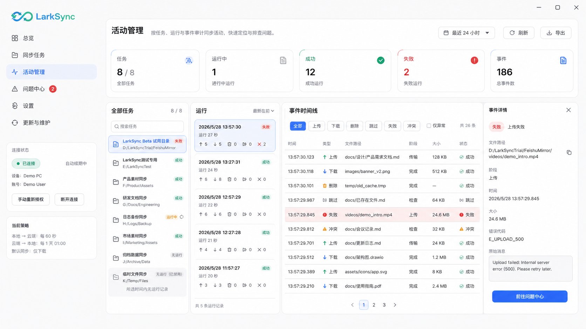
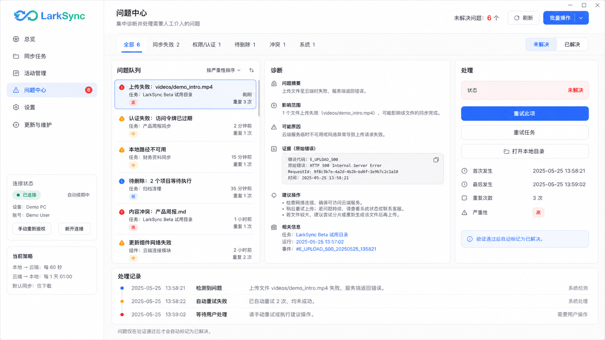

# 活动管理与问题中心改版方案

版本：v0.8.2 方案稿
日期：2026-07-22
状态：已完成方案与 v1 设计图，暂不进入页面实现

当前最新版设计：`v1`（2026-07-22）

## 0. 设计版本说明

- 本文同时保存产品方案、最新版设计图和历史图片更新记录。
- 当前实现基准以“最新版设计”小节和最新图片记录为准。
- 后续图片不得覆盖旧文件；使用 `页面名-vN-YYYYMMDD.png` 新增版本。
- 图片只能表达视觉与布局意图。字段口径、交互规则、状态机和验收要求仍以本文文字为准。
- 设计图由内置 `imagegen` 生成，现有浅色桌面壳作为视觉参考，旧活动页和冲突页作为信息参考。

## 1. 背景与结论

当前“活动与问题”同时承担运行审计、事件浏览和故障诊断，信息目标混杂；“冲突处理”只覆盖冲突这一种问题，无法承接权限失败、删除异常、认证失效、路径不可用等需要人工处理的情况。

后续建议把两个入口重构为：

1. **活动管理**：回答“所有任务最近做了什么、每次运行发生了什么”。
2. **问题中心**：回答“现在有哪些问题需要处理、原因是什么、下一步怎么做”。冲突是问题类型之一，原有版本对比和解决队列完整保留。

两页通过任务、运行和事件标识互相跳转，但不重复承担对方职责。

## 2. 已确认的当前问题

### 2.1 活动页未显示全部任务

- 后端 `/sync/tasks/overview` 已返回全部任务。
- 当前真实数据有 8 个任务，页面默认“仅关注”规则过滤了 3 个全零或无近期动作的任务。
- 页面没有把过滤口径和隐藏数量放在足够明显的位置，用户会理解为数据丢失。

### 2.2 当前信息架构混杂

- 运行记录、普通成功事件、失败诊断和冲突决策处于同一工作区。
- 用户做完整审计时会被“仅关注”默认过滤干扰。
- 用户排障时又需要在大量普通事件中寻找真正需要处理的条目。
- “冲突处理”的名称和能力范围过窄，无法形成统一待办入口。

## 3. 导航与职责边界

| 页面 | 核心对象 | 默认范围 | 允许操作 | 不承担的职责 |
| --- | --- | --- | --- | --- |
| 活动管理 | 任务、同步运行、文件事件 | 全部任务、最近活动 | 搜索、筛选、查看详情、导出/复制、从失败事件跳转问题 | 不直接做冲突决策，不把普通活动标成问题 |
| 问题中心 | 可操作问题、诊断、处理记录 | 未解决问题 | 重试、忽略/确认、打开目录、重新授权、冲突版本决策 | 不展示完整成功流水，不替代运行审计 |

侧栏建议使用“活动管理”和“问题中心”。原 `#activity` 路由可继续兼容并指向活动管理；原 `#conflicts` 路由兼容跳转到问题中心，并自动带上 `type=conflict` 筛选，避免旧托盘入口和收藏失效。

## 4. 活动管理详细设计

### 4.1 页面目标

- 默认明确展示全部任务，不再静默隐藏无动作任务。
- 先选任务，再选运行，最后查看该运行的事件流水。
- 成功、跳过、删除、失败、冲突等事件使用同一审计口径。
- 从失败事件一键跳转到问题中心的对应问题。

### 4.2 页面结构

1. 页头：标题、时间范围、刷新、导出。
2. 汇总条：任务总数、运行中、成功、失败、事件总数，并明确显示当前时间范围。
3. 左栏“任务”：默认“全部任务”；展示 `8 / 8` 这类可核对计数。筛选条件改变后显示“命中 5 / 全部 8”。
4. 中栏“运行”：按时间倒序；包含开始时间、耗时、结果、上传/下载/删除/跳过/失败数量。
5. 右侧主区“事件”：连续时间线或表格；支持类型、状态、方向和关键字筛选。
6. 详情抽屉：文件路径、阶段、时间、结果、错误码、原始消息、关联问题入口。

建议宽度：左栏 260px，中栏 320px，主区自适应且不小于 520px。低于 1280px 时把运行列表折叠为主区顶部选择器，详情继续使用右侧抽屉，避免三栏同时压缩。

### 4.2.1 最新版设计：活动管理 v1

设计图确认的关键行为：

- 默认显示 `8 / 8` 全部任务，停用或无运行任务也保留在任务栏中。
- 信息顺序固定为“任务 → 运行 → 事件”，事件详情使用右侧抽屉，不与运行列表争夺主区宽度。
- “仅异常”是显式筛选，不再作为默认隐藏规则。
- 失败事件提供“前往问题中心”，但活动管理本身不执行问题处理动作。
- 图片中的演示日期、任务名称、路径、计数和错误码仅用于布局评审，不作为产品默认数据。

### 4.3 默认筛选规则

- 任务：默认全部，启用/停用都展示；停用任务使用中性状态标记。
- 时间：默认最近 24 小时，并提供 7 天、30 天、自定义。
- 运行：默认全部结果。
- 事件：默认全部类型；“仅异常”是显式快捷筛选，不作为默认值。
- 无近期运行的任务仍展示，并标注“所选时间内无运行记录”。

筛选条件写入 URL 查询参数，刷新和跨页返回后保持。页面必须同时显示“当前命中数”和“全部数”，不能只显示过滤后的数量。

### 4.4 状态与交互

- 加载：三块区域各自骨架，任务列表先返回即可交互。
- 空数据：区分“系统没有任务”“时间范围内无运行”“筛选无命中”。
- 失败：任务概览失败不阻塞页壳；运行或事件加载失败只影响对应区域，并提供局部重试。
- 实时更新：正在运行的任务通过现有 WebSocket/查询刷新更新；列表位置保持稳定，不抢走用户当前选择。
- 跳转问题：若事件已有对应问题则定位该问题；没有则按任务、运行和事件上下文打开问题中心筛选结果。

## 5. 问题中心详细设计

### 5.1 问题范围

问题中心统一承接以下类别：

- 同步失败：上传、下载、转换、删除失败。
- 权限与认证：Token 失效、权限不足、OAuth 配置异常。
- 任务配置：本地路径不可用、云端目录不可访问、同步策略冲突。
- 待确认操作：待删除、需要人工确认的高风险动作。
- 内容冲突：本地与云端同时修改、版本分叉。
- 系统问题：后端、数据库、文件监听或更新组件异常。

普通成功、跳过和无动作运行不进入问题中心。

### 5.2 问题状态模型

- `open`：新问题，尚未处理。
- `in_progress`：正在重试、重新授权或执行冲突决策。
- `waiting`：任务忙、等待外部授权或等待用户确认。
- `resolved`：系统验证问题已消失或处理成功。
- `ignored`：用户明确忽略；保留原因和操作记录。

“已解决”不能仅靠按钮点击设置。需要后端动作成功或下一次验证通过后更新；失败时回到 `open` 并记录失败原因。

### 5.3 页面结构

1. 页头：未解决总数、刷新、批量操作入口。
2. 快速分类：全部、失败、权限/认证、待删除、冲突、系统。
3. 左栏“问题队列”：按严重级别和最近发生时间排序；显示任务、对象、类别、首次/最近发生、重复次数。
4. 中区“诊断”：用户可读摘要、影响范围、可能原因、建议步骤、原始证据。
5. 右栏“处理”：根据问题类型展示动作。冲突展示本地/云端版本对比与“使用本地/使用云端/保留双方”；权限问题展示重新授权；可重试失败展示重试任务或重试单项。
6. 底部“处理记录”：按时间列出状态变更、动作、结果和失败原因。

无未解决问题时展示健康空状态，同时允许切换“已解决”查看历史，不能用空白页替代。

### 5.3.1 最新版设计：问题中心 v1

设计图确认的关键行为：

- 问题中心只展示需要人工介入或等待验证的问题，不混入普通成功流水。
- 冲突与同步失败、权限/认证、待删除、系统异常并列为问题类型。
- 页面固定为“问题队列 → 诊断 → 处理”，底部保留完整处理记录。
- “已解决”必须由动作成功和后续验证共同确认，不能只靠用户点击按钮完成。
- 图片中的演示日期、任务名称、路径、计数、RequestId 和错误码仅用于布局评审，不作为接口字段样例。

### 5.4 冲突能力迁移

- 复用现有 `/conflicts`、解决接口和 `useConflictResolutionQueue` 串行队列。
- 冲突列表转换为问题队列中的 `conflict` 类型，不删除现有冲突实体和保全副本。
- 任务运行中时继续显示“等待任务空闲”，不把排队误报为失败。
- 版本预览加载失败时仍允许查看元数据，但决策按钮保持禁用并说明原因。
- 每次决策前明确覆盖影响；处理成功后保留一条可审计记录。

## 6. 数据与接口方案

### 6.1 第一阶段复用现有数据

- 任务及概览：现有任务列表与 `/sync/tasks/overview`。
- 运行：现有 `sync_runs` 摘要接口。
- 活动事件：现有同步事件/日志明细接口。
- 冲突：现有冲突查询、预览和解决接口。
- 实时状态：现有托盘状态和 WebSocket 更新。

第一阶段不引入第三方飞书 API 新字段，也不改变同步核心状态机。

### 6.2 建议新增内部问题聚合层

后端增加只读“问题聚合”服务，把已有失败事件、冲突、待删除和运行环境异常规范化成统一问题 DTO。建议提供：

- 问题列表：分页、任务、类别、状态、严重级别和时间范围筛选。
- 问题详情：诊断、证据、建议动作、关联任务/运行/事件。
- 问题动作：按 `action_key` 路由到现有重试、授权或冲突处理能力。
- 处理历史：记录操作者、时间、动作、结果和错误。

问题标识必须稳定；同一根因重复发生时增加发生次数和最近发生时间，不能每次刷新生成新问题。具体 DTO 字段在实现前由后端现有实体反推并补充 schema 测试，不猜测飞书返回字段。

## 7. 性能方案

- 活动页首屏只请求任务概览和选中任务最近运行，不扫描完整事件日志。
- 事件明细在选择运行后分页加载，默认每页 100 条。
- 问题列表使用服务端分页与聚合，前端不拉取全量日志后自行归类。
- 任务、运行和问题查询使用独立 query key；切换筛选取消过期请求。
- 目标：本机已有 100 个任务、10 万条历史事件时，首屏可交互不超过 1 秒；翻页和筛选反馈不超过 500ms。

## 8. 测试与验收

### 8.1 活动管理

- 真实库有 8 个任务时，默认显示 `8 / 8`，包括无近期动作和停用任务。
- 切换“仅异常”后显示命中数与全部数，清除筛选恢复 8 个任务。
- 任务无运行、运行无事件、接口失败分别出现正确状态。
- 运行中实时更新不改变当前选中项。
- 从失败事件可跳转并定位问题中心。

### 8.2 问题中心

- 失败、权限、待删除、冲突和系统问题能正确分类。
- 同一根因重复事件合并，次数和最近时间更新。
- 冲突连续处理仍严格串行；任务忙时进入等待而非失败。
- 重试失败保留原问题和错误证据；验证成功后才进入已解决。
- 零问题时显示健康空状态，已解决历史仍可查询。

### 8.3 视觉与窗口尺寸

- 验证 1080×720、1360×900、1536×960、1920×1080。
- 文字、行高、卡片密度与现有 v0.8.1 桌面壳一致。
- 1280px 以下不同时挤压三栏；详情抽屉可完整滚动。

## 9. 实施顺序与预估

1. **数据口径与测试（1 天）**：固定全部任务、运行、事件和问题的统计口径，补后端 schema/聚合测试。
2. **活动管理（1.5～2 天）**：改名、默认全量、任务/运行/事件分层、筛选与跳转。
3. **问题聚合层（2～3 天）**：统一问题 DTO、去重、状态与处理历史。
4. **问题中心（2～3 天）**：诊断区、类型动作、迁移冲突队列。
5. **真实数据与视觉验收（1～2 天）**：使用隔离只读 Profile 验证全部任务、长历史和真实异常，再做安装包体验测试。

预计总计 7.5～11 个开发日。页面实现应单独版本交付，避免与 v0.8.2 的托盘启动修复和端口迁移耦合。

## 10. 本次版本边界

v0.8.2 仅保存本方案，不修改 `ActivityIssuesPage`、`ConflictResolutionPage`、侧栏名称、页面路由或问题数据接口。后续开始页面开发前，再按本方案拆分任务并确认最终文案。

## 11. 设计图片维护规则

### 11.1 最新版判定

- 本文顶部“当前最新版设计”必须与图片更新记录中的最高有效版本一致。
- 每个页面可以独立递增版本；若只更新一个页面，另一个页面继续沿用其最近有效版本。
- 被否决的图片仍保留文件，但更新记录状态标为“废弃”，不得继续作为实现基准。
- 新图片生成后必须同步更新：图片文件、本文嵌入位置、关键行为说明和图片更新记录。
- 若新版改变信息架构、字段口径或交互状态，必须先修改本文方案，再生成图片。

### 11.2 图片更新记录

| 日期 | 设计版本 | 页面 | 文件 | 状态 | 更新原因 | 结果与实现基准 |
| --- | --- | --- | --- | --- | --- | --- |
| 2026-07-22 | v1 | 活动管理 | `assets/activity-problem-center/activity-management-v1-20260722.png` | 最新 | 将“活动与问题”拆为完整运行审计页，纠正默认隐藏部分任务的问题 | 采用全任务、运行和事件三层结构；详情抽屉只承载事件证据和问题跳转 |
| 2026-07-22 | v1 | 问题中心 | `assets/activity-problem-center/problem-center-v1-20260722.png` | 最新 | 将单一冲突处理扩展为统一人工问题入口 | 采用问题队列、诊断、处理与处理记录结构；冲突保留为问题类型之一 |

## 12. imagegen 生成口径

### 12.1 活动管理 v1

- 用例：`ui-mockup`。
- 参考：现有浅色仪表盘的品牌与壳层；旧活动页的信息内容。
- 核心提示：LarkSync 浅色 Windows 桌面应用，228px 侧栏、56px 顶栏；全部任务 `8 / 8`；任务、运行、事件三栏；失败事件详情抽屉；提供“前往问题中心”。
- 约束：不使用暗色模式、不静默隐藏任务、不把处理动作塞入活动页、不使用图表和浏览器外框。

### 12.2 问题中心 v1

- 用例：`ui-mockup`。
- 参考：现有浅色仪表盘的品牌与壳层；旧冲突页的版本决策信息。
- 核心提示：统一承接同步失败、权限/认证、待删除、冲突和系统问题；问题队列、诊断、处理三栏；底部处理记录；验证成功后才进入已解决。
- 约束：不展示普通成功流水、不把冲突当作全部问题、不使用暗色模式、图表和浏览器外框。
