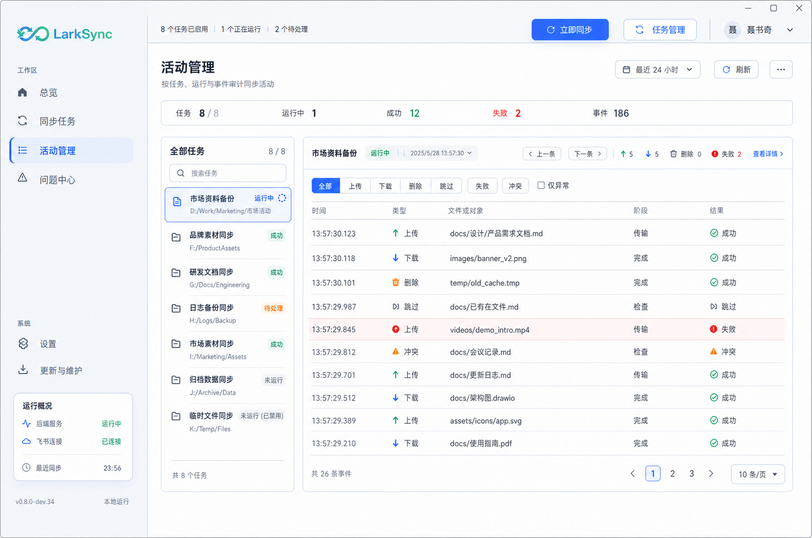
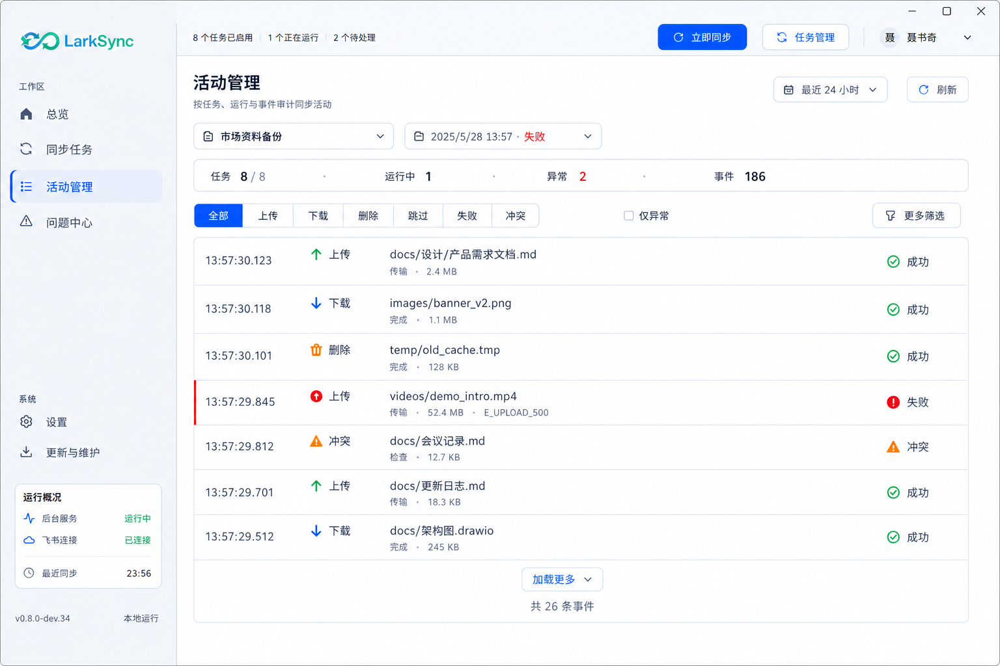
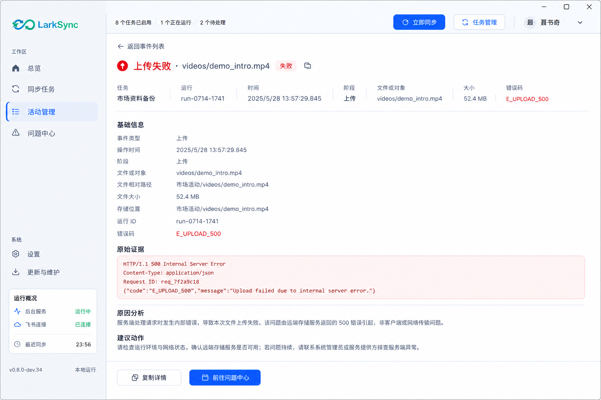
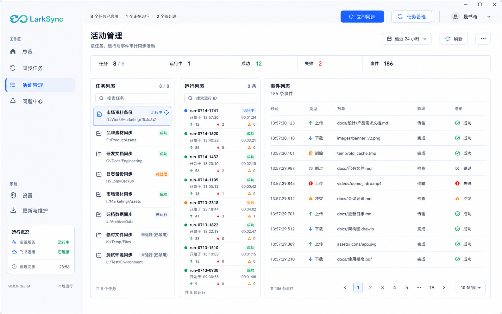
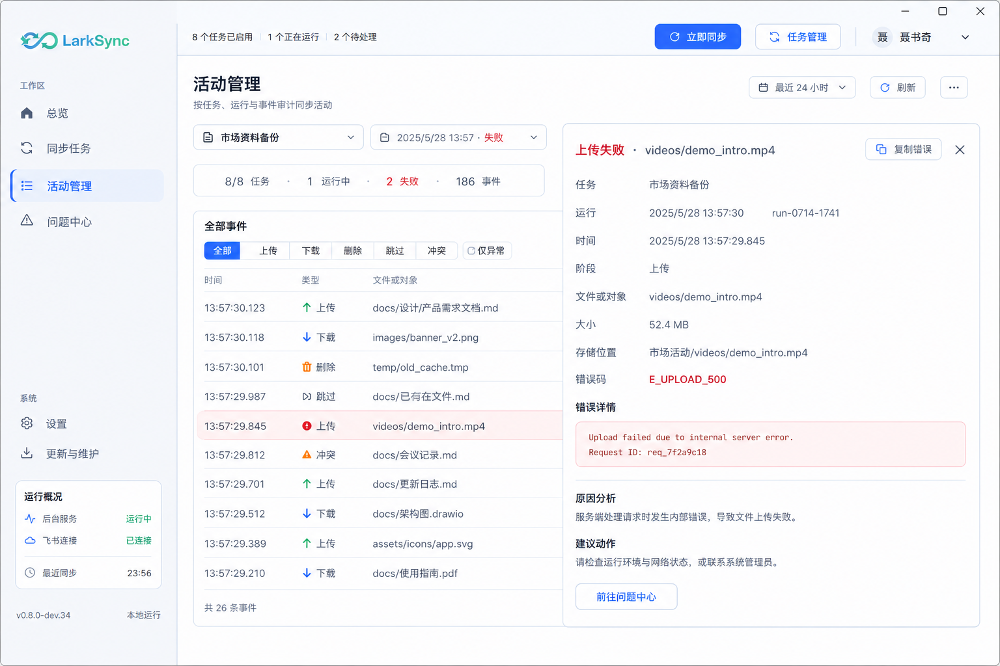
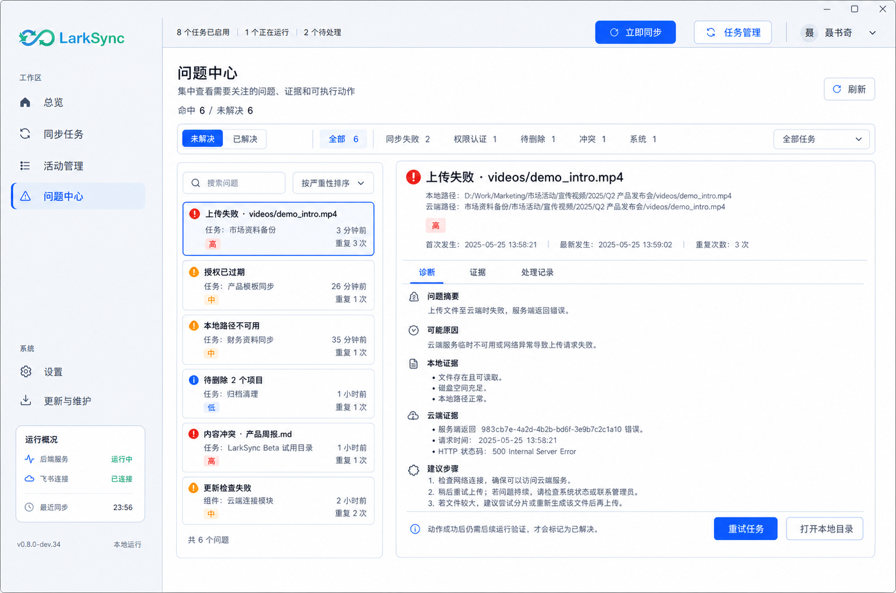
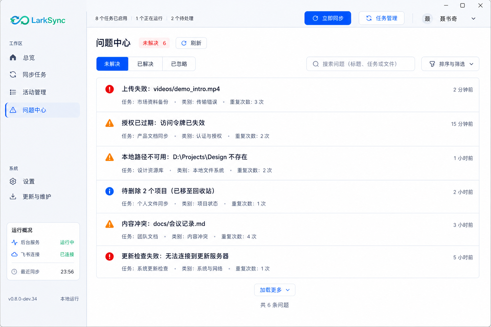
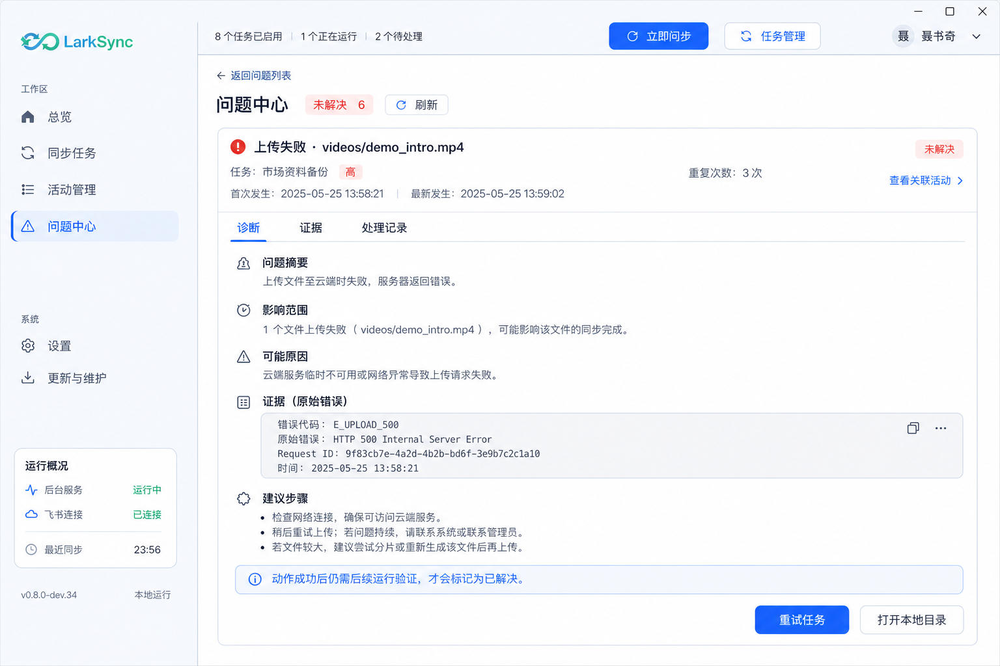
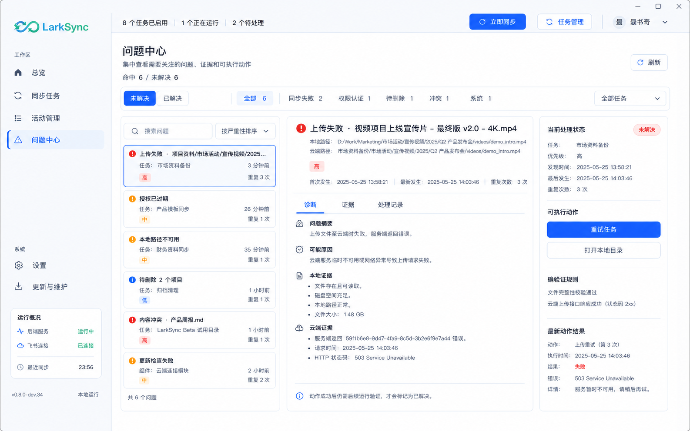
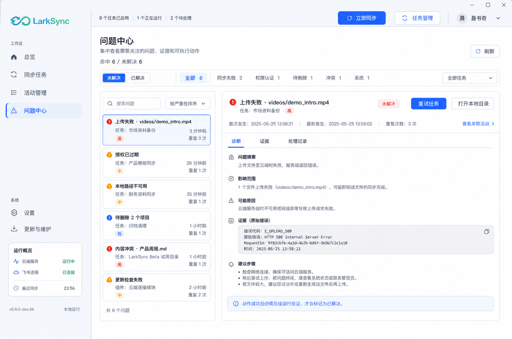

# 活动管理与问题中心产品、交互与视觉设计方案

版本：v0.8.3 设计方案稿 v3

日期：2026-07-22

状态：三档窗口布局、交互响应与状态规格已展开，等待用户确认后再进入开发

当前最新版设计：活动标准 v2、活动紧凑/宽屏 v3；问题标准/紧凑列表/宽屏 v3、问题紧凑详情 v2

## 0. 文档定位与决策

本文是“活动管理”和“问题中心”的产品、数据、交互、响应式布局与设计图片单一基线。页面开发开始前必须再次取得用户确认。

本轮已作出以下决策：

1. v1 图片降级为概念稿，只保留信息架构参考价值，不作为实现基准。
2. 活动管理不再在默认窗口同时展示任务、运行、事件和详情四个区域。
3. 问题中心的视觉目标可以实现，但完整语义依赖统一问题模型、稳定去重、状态流转和动作历史，不能只做前端拼装。
4. 不修改现有全局侧栏和顶栏的结构、尺寸与职责。仅允许调整导航名称、路由兼容和问题数量角标。
5. 页面布局按物理窗口尺寸切换。禁止通过继续缩小字体把更多列塞入窗口。
6. 本项目采用人机协作 AI Coding，不使用传统人力工期估算；后续规划只描述阶段、依赖、验收门和可并行关系。

## 1. 产品职责

### 1.1 活动管理

回答三个问题：

- 哪些任务在指定时间范围内运行过？
- 某次运行做了哪些上传、下载、删除、跳过、冲突或失败动作？
- 某个事件的真实证据是什么，是否关联待处理问题？

活动管理是运行审计页，不执行冲突决策，也不维护通用问题状态。

### 1.2 问题中心

回答四个问题：

- 当前有哪些需要用户关注或系统继续验证的问题？
- 问题影响了哪个任务、运行、文件或系统组件？
- 已知原因、证据和可执行动作是什么？
- 动作执行后是否经过验证，问题最终如何结束？

问题中心不展示普通成功流水。冲突只是问题类型之一，但保留现有本地/云端版本决策能力。

## 2. 现状证据与设计边界

### 2.1 实际桌面壳

当前安装版默认窗口为 `1360×900`：

- 侧栏：228px。
- 全局顶栏：56px。
- 主内容区：1132px。
- 页面左右内边距各 32px 后，可用宽度约 1068px。
- 全局顶栏固定展示任务范围、立即同步、任务管理和账号入口。
- 侧栏固定展示工作区/系统导航和紧凑运行概况。

v1 活动设计建议的 `260 + 320 + 520 = 1100px` 在计算间距和详情前已经超过 1068px，因此默认窗口无法成立。

当前桌面壳在 `1080×720` 下按约 `0.794` 整体缩放。12–14px 逻辑字体的视觉大小约为 9.5–11.1px。新版页面必须减少同时可见区域，并在紧凑模式提高页面内部字号与行高，不能继续缩小。

### 2.2 全局壳层不可变规则

- 保留现有 Logo、228px 侧栏、56px 顶栏、运行概况和账号区。
- 顶栏不放页面标题、时间筛选、刷新、导出、批量操作或未解决问题数。
- 页面级标题和动作全部位于顶栏下方的页面内容区。
- 侧栏仅将“活动与问题”改名为“活动管理”，将“冲突处理”改名为“问题中心”。
- 原 `#activity` 路由继续兼容活动管理。
- 原 `#conflicts` 路由兼容跳转问题中心，并携带 `type=conflict`。
- 全局壳层若需要改变，必须另立设计任务并对全部页面回归，不得夹带在本次两页改版中。

## 3. 三档窗口系统与全局响应契约

### 3.1 物理窗口、逻辑画布和模式来源

当前桌面壳以 `1360×900` 为设计画布，小窗口会整体缩放。布局模式如果只读取缩放后的逻辑宽度，`1080×720` 仍会被误判为 1360px，紧凑布局永远无法触发。因此必须同时维护：

- `physicalWidth / physicalHeight`：桌面宿主或 `window.innerWidth/innerHeight` 的真实物理 viewport。
- `desktopScale`：当前固定画布缩放比例。
- `logicalWidth / logicalHeight`：页面排版使用的逻辑尺寸。
- `layoutMode`：只由物理 viewport 和高度门槛计算。

建议页面根节点接收：

```text
data-window-layout="compact | standard | wide"
data-window-low-height="true | false"
data-desktop-scale="0.794 | 1.000"
```

浏览器 fallback 没有桌面宿主时仍使用真实 viewport 计算，不能默认写死 `standard`。

### 3.2 模式判定

| 模式 | 进入条件 | 退出条件（16px 回滞） | 页面主结构 |
| --- | --- | --- | --- |
| `compact` | 宽 `< 1280` 或高 `< 760` | 宽 `>= 1296` 且高 `>= 776` | 单主区或主从切换 |
| `standard` | 不满足 compact，且宽 `< 1500` 或高 `< 820` | 进入 compact 或 wide | 两栏 |
| `wide` | 宽 `>= 1500` 且高 `>= 820` | 宽 `< 1484` 或高 `< 804` | 三栏 |

回滞用于避免用户拖动窗口停在阈值附近时反复切换。布局计算使用 120ms 节流，但最终一次 resize 必须立即结算。

高度优先级高于宽度：例如 `1600×740` 仍按 compact 处理，因为横向虽宽，纵向无法同时容纳页头、筛选、列表标题和固定动作。

### 3.3 壳层与页面可用尺寸

| 目标窗口 | 缩放 | 侧栏物理宽 | 顶栏物理高 | 页面逻辑可用宽 | 页面策略 |
| --- | --- | --- | --- | --- | --- |
| 1080×720 | 约 0.794 | 约 181px | 约 44px | 约 1068px，但整体缩小 | compact，减少区域并提高逻辑字号 |
| 1360×900 | 1.000 | 228px | 56px | 约 1068px | standard，两栏 |
| 1536×960 | 1.000 | 228px | 56px | 约 1244px | wide，三栏 |
| 1920×1080 | 1.000 | 228px | 56px | 约 1628px | wide，主区扩展但不增加第四栏 |

“页面逻辑可用宽”已经扣除页面左右各 32px 内边距。页面不得假设大窗口会整体放大；大窗口只增加工作区宽度。

### 3.4 通用垂直结构

页面主体采用固定四段式结构：

1. 页面页头：标准/宽屏 56px；紧凑 60px 逻辑高度。
2. 上下文与筛选：按页面 40–48px；可换行时整体高度有上限。
3. 主工作区：`minmax(0, 1fr)`，承担全部剩余高度。
4. 页面内动作栏：仅详情场景出现，标准/紧凑 56–64px；不得挤出主工作区边界。

主页面本身禁止纵向滚动。每个可变长区域独立滚动；固定页头、筛选、页签和动作栏不能随内容滚走。

### 3.5 通用字号、控件和文本降级

| 项 | standard / wide | compact 逻辑值 | 说明 |
| --- | --- | --- | --- |
| 页面标题 | 20px / 28px 行高 | 22px / 30px | compact 经缩放后仍可读 |
| 列表主文字 | 14px / 20px | 16px / 24px | 不允许 12px 主文字 |
| 次级文字 | 13px / 18px | 15px / 22px | 路径、时间、说明 |
| 按钮高度 | 32–36px | 40px | 紧凑补偿整体缩放 |
| 列表行高 | 44–56px | 64–72px | compact 使用双行结构 |

文本优先级：对象名称 > 状态 > 时间 > 路径 >工程字段。空间不足时依次执行：

1. 隐藏可从详情读取的工程字段。
2. 路径单行省略并保留 tooltip/复制。
3. 次要动作收入“更多”。
4. 切换为双行列表。
5. 绝不缩小主文字或制造页面横向滚动。

### 3.6 模式切换时的状态迁移

布局切换只改变视图表达，不改变查询和业务状态：

- 保留 `taskId / runId / eventId / problemId`。
- 保留时间范围、分类、关键字、状态和“仅异常”等筛选。
- 每个列表独立记录滚动锚点，以实体 ID 而不是像素位置恢复。
- `standard/wide -> compact`：打开的抽屉或详情转换为内容区接管视图；焦点移动到详情标题。
- `compact -> standard/wide`：内容区详情恢复为抽屉或主区详情；返回前一列表滚动锚点。
- 切换不重新发起已有 query；只有新模式需要尚未加载的数据时才增量请求。
- 正在执行的动作不因布局切换取消；按钮状态从共享 mutation 状态恢复。

### 3.7 焦点、键盘与可访问性

- `Tab` 顺序遵循页面页头 → 筛选 → 主列表 → 详情/动作。
- 列表使用 roving tabindex；上下方向键移动，Enter 打开，Home/End 到首尾。
- `Escape` 依次关闭“更多”菜单、筛选浮层、详情抽屉；compact 内容区详情使用明确返回按钮，Escape 也等价返回。
- 打开详情后焦点落在详情标题；关闭后回到触发列表项。
- 状态变化使用 `aria-live="polite"`，严重失败才使用 assertive。
- 颜色不作为唯一状态信息；所有圆点必须同时有文案或图标语义。

### 3.8 加载、失败和离线共性

- 页壳和已缓存内容优先显示，局部查询各自承担骨架和错误。
- 局部加载不得用整页遮罩；用户可以继续查看已加载的其他栏。
- 刷新失败保留旧数据并标记“数据可能不是最新”，不能清空列表。
- 后端离线时冻结写动作，保留筛选、复制和查看缓存详情。
- 授权失效只影响需要飞书访问的动作，不应让本地历史活动消失。

## 4. 活动管理完整设计

### 4.1 数据层级与默认选择

固定层级：

`时间范围 -> 任务 -> 运行 -> 事件 -> 事件详情/关联问题`

默认规则：

- 任务默认全部，启用、停用、无近期运行都展示。
- 时间默认最近 24 小时，可选 7 天、30 天和自定义。
- 首次进入默认选中“最近有运行的任务”，但列表仍按用户选定排序，不把它强行置顶。
- 选中任务后默认选中时间范围内最新运行。
- 事件默认全部类型；“仅异常”必须由用户显式开启。
- 列表始终同时显示命中数和全部数，例如“8 / 8”。
- 无近期运行任务显示“所选时间内无运行”，不从任务列表消失。

### 4.2 活动页共同区域

#### 页面页头

- 左侧：标题“活动管理”和一句用途说明。
- 右侧：时间范围、刷新、更多。
- “导出当前结果”位于更多菜单；运行中刷新时按钮显示旋转图标但不改变宽度。
- 时间范围变化立即更新 URL；自定义时间只有点击“应用”后生效。

#### 紧凑摘要条

- 固定字段：命中任务/全部任务、运行中、成功运行、失败运行、事件数。
- compact 只保留“任务、运行中、异常、事件”四项。
- 摘要数字与当前时间范围一致；不允许混入全生命周期总数。
- 任一统计不可得时显示 `—`，不得用 0 冒充未采集。

### 4.3 标准模式 `1360×900`

#### 横向布局

页面可用宽约 1068px：

| 区域 | 宽度 | 最小宽度 | 行为 |
| --- | --- | --- | --- |
| 任务栏 | 248px | 232px | 固定，不被事件区挤压 |
| 间距 | 16px | 16px | 不压缩 |
| 运行与事件工作区 | 804px | 720px | 吸收剩余宽度 |
| 事件详情抽屉 | 400px 覆盖 | 360px | 覆盖工作区右侧，不参与列宽计算 |

#### 垂直布局

- 页面页头：56px。
- 摘要条：40px；与上下各 12px 间距。
- 主工作区：剩余高度，约 676px。
- 任务栏内部：标题 44px、搜索 40px、任务列表 `1fr`、底部计数 36px。
- 右侧内部：运行上下文 64px、事件筛选 44px、表头 36px、事件滚动区 `1fr`、分页 40px。

#### 任务栏

- 每个任务 58–64px，两行显示任务名和本地目录尾段。
- 右侧仅显示一个主状态；“停用”和“所选时间无运行”使用中性色。
- 搜索只过滤任务，不影响事件关键字。
- 任务切换先更新选中样式，再加载运行；旧事件区显示轻量 loading，不闪空白。

#### 运行上下文

- 不常驻运行列表，只显示当前运行选择器、前一条/后一条和上传/下载/删除/失败摘要。
- 长 run ID 使用短码，完整值通过 tooltip 和复制获取。
- 前后切换以当前排序为准；到边界禁用对应按钮并提供说明。
- 运行选择器下拉最多显示 8 条，继续滚动按页加载。

#### 事件表格

建议列宽：时间 112px、类型 72px、对象 `minmax(240px,1fr)`、阶段 104px、结果 80px。

- 文件对象列显示相对路径；绝对路径只进入详情。
- 选中事件使用浅蓝背景；失败使用左侧 3px 红色状态线，避免整行大红底。
- 双击与 Enter 都打开详情；单击只选择，防止用户滚动时误开抽屉。
- 分页默认 100 条；切页后滚动回表头，但任务和运行选择保持。

#### 详情抽屉

- 从工作区右侧覆盖 400px，不压缩事件表和任务栏。
- 抽屉有独立滚动；标题、关闭按钮和底部动作固定。
- 打开抽屉后事件表仍可见但不可横向滚动；点击遮罩或 Escape 关闭。
- 仅“复制详情”和“前往问题中心”是固定动作；不存在稳定问题上下文时后者改为“在问题中心筛选”。

### 4.4 紧凑模式 `1080×720`

#### 基础列表态

- 移除常驻任务栏和运行栏。
- 页面页头下使用两行上下文：第一行任务 Combobox + 运行 Combobox；第二行事件类型、仅异常、关键字和更多筛选。
- 时间范围与刷新保留在页头；导出收入更多。
- 摘要条使用四项等宽文本，不放图标大卡。

事件区不使用五列表格，改为双行事件列表：

```text
第一行：13:57:29  [上传]  videos/demo_intro.mp4             [失败]
第二行：传输阶段 · 52.4 MB · E_UPLOAD_500
```

- 每行逻辑高度 68px；主文字 16px，次文字 15px。
- 路径占据主行剩余空间并单行省略。
- 第二行最多三个补充字段；更多信息进入详情。
- 顶部显示“共 26 条”；底部使用“加载更多”，不显示紧凑分页数字。

#### 详情接管态

- 选择事件后，详情接管顶栏下的整个页面内容区；不保留半宽事件表。
- 顶部显示“返回事件列表”、事件结论和关闭/复制入口。
- 内容按“基础信息 → 原始证据 → 原因 → 建议”单列排列。
- 底部固定“复制详情 / 前往问题中心”；正文独立滚动。
- 返回后恢复列表筛选、已加载页数和实体滚动锚点。

#### 紧凑筛选浮层

- 类型快捷项保留“全部、上传、下载、删除、跳过、失败、冲突”。
- 阶段、状态和关键字进入底部浮层；浮层最多占内容区 70% 高度。
- 点击“应用”一次提交组合筛选；“重置”只重置浮层内条件，不改变任务和时间范围。

### 4.5 宽屏模式 `>=1500×820`

以 `1536×960` 为最低宽屏验收点，可用宽约 1244px：

| 区域 | 宽度 | 内容 |
| --- | --- | --- |
| 任务栏 | 248px | 全部任务、搜索和状态 |
| 间距 | 16px | 固定 |
| 运行栏 | 288px | 运行搜索、状态筛选、运行列表 |
| 间距 | 16px | 固定 |
| 事件区 | 约 676px 起 | 筛选、表格、分页 |

- 运行栏首屏展示 6–8 条，行高 70px，包含开始时间、状态、耗时和动作计数。
- 事件表保持标准五列；对象列吸收 1920px 下的额外宽度。
- 不增加第四栏。详情继续使用 420px 覆盖抽屉。
- 1920px 下任务栏和运行栏仍保持固定宽度，额外空间全部给事件区。
- 用户手动关闭运行栏的需求本轮不实现，避免产生额外布局状态。

### 4.6 活动页选择、筛选与实时响应

#### 选择依赖

- 切换任务：重置运行和事件选择；优先恢复该任务上次选择，否则选最新运行。
- 切换运行：清除事件选择并关闭详情；事件筛选保持。
- 切换时间范围：若当前运行仍在范围内则保留，否则选最新并显示“原运行不在当前范围”。
- 事件筛选把当前详情排除时，详情继续保留并标记“当前筛选已隐藏此事件”；关闭后返回筛选结果。

#### 实时事件

- 查看正在运行任务且列表位于顶部时，新事件直接插入并保持当前选中项。
- 用户已向下滚动时不自动跳动，顶部出现“3 条新事件”按钮；点击后合并并回到顶部。
- 新运行出现时任务状态和摘要实时更新，但不自动抢走当前运行选择。
- 运行结束后更新状态和计数；事件详情若仍打开只更新关联状态，不自动关闭。

#### 删除、停用和过期对象

- 任务被停用：保留历史，状态变为停用；查看不受影响。
- 任务被删除：当前缓存详情保留，并显示“任务已删除，仅可查看历史”；返回后从任务列表移除。
- 运行或事件被历史清理：详情显示“记录已归档或清理”，提供返回，不跳到另一条记录。

### 4.7 活动页加载、空态与错误态

| 区域 | 加载 | 空态 | 错误 |
| --- | --- | --- | --- |
| 任务 | 6 行骨架 | “尚未创建同步任务”+进入任务管理 | 保留旧列表+局部重试 |
| 运行 | 4–6 行骨架 | “所选时间内无运行” | 不影响任务栏 |
| 事件 | 表格/双行骨架 | “该运行没有事件”或“筛选无命中” | 保留运行信息+局部重试 |
| 详情 | 详情骨架 | “事件已清理” | 显示可复制的错误和关闭入口 |

“无任务、无运行、无事件、筛选无命中”必须使用不同文案和动作，不能共用一个空白页。

### 4.8 活动页字段可见性矩阵

| 字段/控件 | compact | standard | wide |
| --- | --- | --- | --- |
| 常驻任务列表 | 否，Combobox | 是 | 是 |
| 常驻运行列表 | 否，Combobox | 否，顶部上下文 | 是 |
| 五列表格 | 否，双行列表 | 是 | 是 |
| 运行动作计数 | 选择器摘要 | 顶部摘要 | 每条运行卡 |
| 详情形态 | 内容区接管 | 400px 覆盖抽屉 | 420px 覆盖抽屉 |
| 分页 | 加载更多 | 页码 | 页码 |
| 导出 | 更多菜单 | 更多菜单 | 可直接显示 |

### 4.9 活动页几何验收

- compact 基础态和详情态都只能有一个主滚动区。
- standard 任务栏 248px，事件工作区不得小于 720px。
- wide 事件区不得小于 640px；不足时降级 standard，不能压缩三栏。
- 任何模式打开详情后页面 `scrollWidth == clientWidth`。
- 1080×720 下事件主文字视觉高度不得低于约 12.5px。
- 所有固定底部动作、分页和“加载更多”完整可见，不出现半行卡片。

## 5. 问题中心数据与可实现性

### 5.1 当前已有数据

| 来源 | 当前字段/能力 | 可直接支撑 |
| --- | --- | --- |
| `sync_runs` | 运行状态、时间、上传/下载/删除/失败/冲突计数、最后错误 | 运行级问题入口和影响任务 |
| `sync_run_events` | 任务、运行、时间、状态、路径、消息 | 问题线索、证据和最近发生时间 |
| `conflicts` | 本地/云端版本、预览、解决动作、解决时间 | 完整冲突决策和已解决记录 |
| `sync_tombstones` | 删除来源、状态、原因、检测/到期/执行时间 | 待删除和删除结果 |
| 桌面聚合状态 | 后端、授权、任务、更新和最近同步状态 | 认证与系统级健康线索 |
| 前端 `eventManagement` | 权限、删除、冲突、失败等规则分类 | 展示规则原型，不是持久化问题事实 |

### 5.2 当前不能直接宣称的能力

以下能力没有统一后端模型，开发前必须补齐：

- 跨运行稳定合并同一问题。
- 通用 `open / in_progress / waiting / resolved / ignored` 状态。
- 通用忽略、确认和批量处理。
- 单文件重试。
- 动作执行历史和失败历史。
- 重试后自动验证问题是否真正消失。
- 稳定严重级别、影响范围和根因。
- 将更新组件问题与同步问题放入同一状态体系。

设计图可以表达最终工作台结构，但页面只能显示后端明确返回的字段和动作能力。禁止前端根据按钮点击直接伪造“已解决”。

## 6. 统一问题模型规划

### 6.1 问题分类

建议内部类别：

- `auth_permission`：授权过期、scope 或对象权限不足。
- `upload`：上传或云端写入失败。
- `download`：下载或本地写入失败。
- `conversion`：Markdown/Docx/Sheet 转换失败或降级。
- `deletion`：待删除、删除失败、删除状态失效。
- `conflict`：本地与云端版本冲突。
- `task_config`：本地路径、云端目录或任务策略无效。
- `network_remote`：网络、限流、飞书临时错误。
- `local_io`：文件占用、权限、磁盘或路径错误。
- `system`：后端、数据库、watcher、调度器异常。
- `updater`：更新检查、下载、安装或重启问题；是否默认并入由后续产品确认决定。

### 6.2 严重级别

- `critical`：存在数据丢失风险、数据库不可用或全部同步中断。
- `high`：单任务核心链路中断，需要人工处理。
- `medium`：部分对象失败，系统可继续运行。
- `low`：提示、待确认或有自动恢复路径。

严重级别由后端分类器输出，并保存分类版本。前端不得只凭颜色或消息关键词重新计算。

### 6.3 持久化实体

建议新增三个内部实体：

```text
ProblemRecord
- id
- fingerprint
- category
- severity
- state
- title
- summary
- task_id
- object_kind
- object_key
- object_path
- first_seen_at
- last_seen_at
- occurrence_count
- latest_run_id
- latest_event_id
- classifier_version
- resolution_verification
- resolved_at
- ignored_reason

ProblemOccurrence
- id
- problem_id
- source_kind
- source_id
- run_id
- event_id
- occurred_at
- evidence_json

ProblemActionRecord
- id
- problem_id
- action_key
- requested_at
- started_at
- finished_at
- result
- error_code
- error_message
- verification_result
```

### 6.4 稳定去重指纹

建议由以下字段组成后计算 hash：

`source_kind + task_id + category + stage + normalized_error_code + object_key`

规则：

- 排除时间戳、Request ID、重试次数和自由文本中的随机值。
- 路径作为对象键时需统一大小写、斜杠和任务根目录相对路径。
- 冲突继续使用现有冲突实体 ID，并映射到统一问题记录。
- 分类器版本变化不应静默改写历史；需要记录重新分类事件。

### 6.5 状态机

```text
open -> in_progress -> waiting -> resolved
  |          |            |
  +----------+------------+-> open（动作失败或验证失败）
open/waiting -> ignored（必须记录原因）
ignored -> open（再次出现且策略要求重新打开）
```

- `resolved` 只允许由动作成功后的验证或明确的源实体终态触发。
- 冲突解决接口成功可直接验证冲突记录已 resolved。
- 通用同步失败需要至少一次后续成功运行或对象级验证。
- `waiting` 必须保存等待原因，例如等待授权、任务空闲或用户确认。

## 7. 问题动作能力矩阵

| 问题类型 | 当前已存在 | 统一问题模型后 | 页面规则 |
| --- | --- | --- | --- |
| 冲突 | 使用本地、使用云端、串行等待任务空闲 | 动作历史、统一验证 | 可直接显示真实按钮 |
| 任务级同步失败 | 重试整个任务、打开本地目录 | 稳定问题状态、验证闭环 | 当前仅显示已有动作 |
| 权限/认证 | 跳转重新授权 | 等待授权回调、验证权限恢复 | 未返回授权动作时不显示按钮 |
| 待删除 | 查看宽限状态 | 确认、取消或恢复策略动作 | 当前以说明为主 |
| 单文件失败 | 无通用单项重试 | 对象级动作路由 | 未实现前不得显示“重试此项” |
| 通用问题忽略 | 无 | 忽略原因、重新打开规则 | 未实现前不得显示“忽略” |
| 批量处理 | 无 | 同动作同前置条件批处理 | 未实现前不得显示“批量操作” |

后端问题详情必须返回 `available_actions`。前端完全按返回值渲染动作；没有动作时显示诊断与建议，不使用禁用的装饰按钮冒充能力。

## 8. 问题中心完整页面设计

### 8.1 信息层级和默认状态

固定层级：

`问题范围 -> 问题队列 -> 问题详情 -> 可用动作 -> 动作结果 -> 后续验证`

默认规则：

- 首次进入默认状态为“未解决”。
- 默认分类为“全部”，排序为严重级别降序、最近发生时间降序。
- 默认选择队列第一条，但绝不自动执行动作或展开确认。
- URL 带 `problem_id` 时定位该问题；若不在当前筛选，显示一条“定位结果不属于当前筛选”提示并临时展示。
- 分类数量来自服务端 summary；未加载时显示 `—`，不得由当前页列表长度代替。
- 普通成功、跳过和无动作运行不进入问题队列。

### 8.2 页面共同区域

#### 页面页头

- 左侧：标题“问题中心”和用途说明。
- 右侧：命中数/全部未解决数、刷新。
- 不提供批量处理入口；未来只有多个问题返回相同 `action_key`、相同前置条件且后端支持原子/可恢复批处理时才重新设计。

#### 状态与分类筛选

- 第一层状态：未解决、已解决、已忽略。
- 第二层分类：全部、同步失败、权限/认证、待删除、冲突、系统。
- 第三层高级筛选：任务、严重级别、时间范围、关键字。
- standard/wide 第一、二层常驻；第三层放筛选浮层。
- compact 只常驻状态和“筛选”按钮，分类/任务/严重级别进入浮层。
- 每次只允许一个状态，分类可单选；任务和严重级别可多选。

### 8.3 标准模式 `1360×900`

#### 横向布局

| 区域 | 宽度 | 最小宽度 | 说明 |
| --- | --- | --- | --- |
| 问题队列 | 288px | 272px | 固定 |
| 间距 | 16px | 16px | 固定 |
| 问题工作区 | 764px | 680px | 诊断、证据和记录 |

标准模式不常驻第三个处理栏，避免诊断区缩到 400px 左右。

#### 垂直布局

- 页面页头：56px。
- 状态/分类筛选：44px；上下间距各 12px。
- 主工作区：剩余约 700px。
- 队列内部：搜索/排序 44px，问题列表 `1fr`，底部计数 36px。
- 详情内部：问题摘要 96–112px，页签 44px，正文 `1fr`，固定动作栏 64px。

#### 问题队列

- 每条 82–92px，显示标题、任务/组件、严重级别、最近时间和重复次数。
- 标题最多两行；路径不进入队列主标题，避免长路径撑高。
- 状态、严重级别和类别最多显示两个小胶囊，其余信息进入详情。
- 选中项蓝色边框；严重问题只用左侧色线和图标，不使用整卡红底。
- 实时重复次数更新时保持卡片位置，避免用户点击目标移动。

#### 问题摘要

- 第一行：标题、状态、严重级别。
- 第二行：任务/组件、首次发生、最近发生、重复次数。
- “查看关联活动”位于第二行末尾或更多菜单，不与动作按钮争宽。
- 长标题优先换两行；摘要区域最大 112px，超过后在详情正文显示完整对象路径。

#### 诊断、证据和处理记录

- “诊断”：问题摘要、影响范围、可能原因、建议步骤。
- “证据”：结构化错误码/HTTP 状态/Request ID、最近 10 次 occurrence、原始消息。
- “处理记录”：状态变更、动作、动作结果和验证结果，默认 50 条分页。
- 切换页签保留各自滚动位置。
- 原始消息默认折叠到 8 行；展开后在正文滚动区内显示，不增高页面根节点。

#### 固定动作栏

- 动作栏位于详情底部，和问题标题分离，解决长标题挤压按钮的问题。
- 左侧显示动作前置条件或“暂无可执行动作”；右侧按 `available_actions` 显示按钮。
- 最多直接显示 2 个动作；第 3 个及以后进入“更多处理”。
- 主动作由后端 action metadata 指定，不由前端按按钮顺序猜测。
- 复制诊断不是问题动作，放在更多菜单，不写入动作状态机。

### 8.4 紧凑模式 `1080×720`

紧凑模式采用真正的主从切换，存在两个互斥视图。

#### 问题列表态

- 页面页头：标题、未解决计数、刷新。
- 状态分段控件常驻；“分类/任务/严重级别”合并为筛选按钮并显示已选数量。
- 搜索与排序同一行；搜索占剩余宽度。
- 问题使用双行卡片，逻辑高度 84px：

```text
第一行：[高] 上传失败 · demo_intro.mp4                     3 分钟前
第二行：市场资料备份 · 同步失败 · 重复 3 次
```

- 底部使用“加载更多”，不显示页码。
- 选择问题进入详情，并把队列滚动锚点写入导航状态。

#### 问题详情态

- 顶部首个控件必须是“返回问题列表”，后接标题、状态和严重级别。
- 诊断/证据/处理记录页签固定。
- 正文单列滚动；操作栏固定在内容区底部。
- “查看关联活动”放在摘要中，不挤占底部动作。
- 返回列表恢复筛选、搜索、已加载页数和滚动锚点。

#### 紧凑冲突详情

- 不并排显示完整本地/云端版本。
- 首先展示差异摘要和“本地版本 / 云端版本”页签；用户可逐一查看。
- 点击“使用本地”或“使用云端”后，确认框并排展示关键影响摘要，不展示完整长文本。
- 任务忙时动作进入 waiting，并允许用户返回队列；处理继续在后台队列执行。

#### 紧凑授权详情

- “重新授权”是唯一主动作；“查看权限要求”和复制诊断为次级入口。
- 启动外部浏览器后状态变为 waiting，页面显示“等待浏览器授权”，保留取消等待/重新打开授权页。
- OAuth 回调成功后触发验证，不直接因扫码完成标记 resolved。

### 8.5 宽屏模式 `>=1500×820`

以 `1536×960` 为最低验收点，可用宽约 1244px：

| 区域 | 宽度 | 最小宽度 | 内容 |
| --- | --- | --- | --- |
| 问题队列 | 288px | 280px | 搜索、筛选结果、问题列表 |
| 间距 | 16px | 16px | 固定 |
| 诊断工作区 | `minmax(520px,1fr)` | 520px | 摘要、页签、正文 |
| 间距 | 16px | 16px | 固定 |
| 处理栏 | 320px | 304px | 状态、动作、等待/验证信息 |

- 1536px 下诊断区约 604px；1920px 下额外宽度全部给诊断区。
- 处理栏常驻但不显示处理历史；历史仍在中间页签。
- 处理栏上部固定当前状态和可用动作，下部显示首次/最近发生、重复次数、验证规则和最近动作结果。
- 没有 `available_actions` 时处理栏显示原因和建议，不放禁用的假按钮。
- 不增加第四栏，也不把处理记录放到底部常驻。

#### 宽屏冲突子视图

- 中间诊断区切为“本地版本 / 云端版本 / 差异”三页签，默认差异。
- 右侧处理栏显示覆盖影响、使用本地、使用云端和当前队列状态。
- 现有实现没有“保留双方”动作，因此不得展示该按钮。
- 版本预览加载失败时决策按钮禁用，并明确说明缺少预览证据；只读元数据继续可见。

### 8.6 问题选择和筛选响应

- 切换状态或分类：如果选中问题仍命中则保留，否则选择新列表第一条；compact 返回列表态，不直接跳到新详情。
- 修改关键字：300ms 防抖；正在查看详情时不关闭详情，只标记是否仍命中。
- 清除筛选：恢复默认未解决/全部，保留当前任务范围为空。
- URL 定位问题：临时展示不匹配项后提供“清除筛选并查看同类问题”。
- 列表为空时不保留旧问题详情，显示对应空态。

### 8.7 实时问题更新和排序稳定

- 新问题到达时不抢焦点；列表顶部显示“2 个新问题”。
- 点击提示或手动刷新后才把新项合并到当前排序；critical 问题可立即插入，但仍不自动选择。
- 已有问题重复发生时更新重复次数和最近时间，但在当前交互会话内保持卡片原位置；下一次用户刷新再按排序重排。
- 当前问题被后台解决时，详情保留并显示“已验证解决”；关闭/返回后从未解决列表移除。
- 当前问题被重新打开时状态实时变为 open，并追加 occurrence，不丢失旧动作记录。

### 8.8 动作交互和并发规则

#### 通用动作

1. 用户点击动作。
2. 若动作有覆盖、删除或退出影响，打开确认框。
3. 请求成功接收后状态进入 `in_progress` 或 `waiting`。
4. 页面允许切换问题；动作在共享队列继续执行。
5. 动作完成后显示“动作成功，等待验证”或明确失败。
6. 验证通过才进入 resolved；验证失败回到 open 并保留证据。

- 同一问题同一 action 在进行中不能重复排队。
- 不同问题是否并发由后端 action metadata 决定；冲突队列继续严格串行。
- 网络错误必须显示在动作栏/处理栏，不只依赖 Toast。
- 用户切换页面后返回，动作状态从后端记录恢复，不能因组件卸载丢失。

#### 当前能力限制

- 任务级失败只能“重试任务”，不得改写成“重试此文件”。
- 待删除当前只读展示，不出现确认/取消按钮。
- 通用忽略与批量处理未实现，不出现入口。
- 冲突只提供“使用本地 / 使用云端”。
- 授权问题只有后端返回 reauthorize action 时显示“重新授权”。

### 8.9 敏感信息和证据展示

- Authorization、access token、refresh token、App Secret 永不显示、复制或导出。
- Request ID、错误码和 HTTP 状态可以展示。
- 本地绝对路径默认只显示到任务根目录下的相对路径；用户点击“显示完整路径”后本机可见。
- 云端 token 默认脱敏；诊断复制使用同一脱敏规则。
- 原始证据必须标注来源和采集时间，避免把规则推断写成服务端事实。

### 8.10 问题中心加载、空态和错误态

| 场景 | 页面响应 |
| --- | --- |
| 首次加载 | 筛选骨架 + 6 条队列骨架；详情区独立骨架 |
| 未解决为 0 | 健康空态、“查看已解决历史”，不显示空白三栏 |
| 当前分类为 0 | “此分类暂无问题”，保留清除分类动作 |
| 搜索无结果 | 显示关键字和清除搜索，不改变分类统计 |
| summary 失败 | 分类数字显示 `—`；队列仍可用 |
| 队列失败 | 保留缓存、显示数据陈旧和局部重试 |
| 详情失败 | 队列继续可选；详情区显示重试和复制 problem ID |
| 动作失败 | 保留问题 open、错误证据和再次操作入口 |
| 后端离线 | 查看缓存和复制可用；所有写动作冻结 |

### 8.11 问题字段可见性矩阵

| 字段/控件 | compact | standard | wide |
| --- | --- | --- | --- |
| 常驻问题队列 | 列表态有，详情态无 | 是 | 是 |
| 常驻处理栏 | 否 | 否，底部动作栏 | 是，320px |
| 诊断/证据/记录 | 详情页签 | 工作区页签 | 工作区页签 |
| 分类标签 | 筛选浮层 | 常驻 | 常驻 |
| 高级筛选 | 浮层 | 浮层 | 浮层/展开区 |
| 冲突版本 | 页签切换 | 专用子视图 | 中间三页签 + 右侧决策 |
| 分页 | 加载更多 | 页码 | 页码 |

### 8.12 问题中心几何验收

- compact 列表态和详情态分别只有一个主滚动区。
- standard 队列 288px，详情工作区不得低于 680px。
- wide 诊断区不得低于 520px，处理栏不得低于 304px；不足即降级 standard。
- 标准模式标题换两行后，固定动作栏仍完整可见。
- 任意模式切换页签不改变页面外层高度。
- 长路径、长错误、10 次 occurrence 和 50 条动作记录不产生页面级横向滚动。

## 9. 跨页交互契约

活动管理跳转问题中心时携带：

```text
#problems?task_id=<id>&run_id=<id>&event_id=<id>
```

- 存在稳定 `problem_id` 时增加 `problem_id` 并直接定位。
- 页面跳转前把活动页状态保存为 history state：任务、运行、事件、筛选、已加载页数和滚动锚点。
- 问题中心的“查看关联活动”优先复用该 history state；从外部深链进入时再按 URL 重建活动上下文。
- 问题中心返回活动管理时恢复原任务、运行、事件和滚动位置；恢复失败时定位到关联运行并解释原事件已清理。
- compact 模式跨页后使用内容区详情，不先闪现列表态；返回时直接恢复 compact 原视图。
- standard/wide 返回后重新打开原事件抽屉，但不得自动重新请求已缓存证据。
- 冲突旧入口使用 `#problems?type=conflict`。
- 所有查询参数均为内部标识，不在 URL 中放 token、完整本地绝对路径或错误原文。
- 浏览器后退/前进必须与页面内“返回”产生相同状态；禁止维护另一套只能通过按钮返回的内存栈。
- 若动作正在执行，跨页不会取消动作；目标页面通过共享 action 状态显示进行中或等待。

## 10. 数据接口规划

### 10.1 活动管理

- 复用 `/sync/tasks/overview` 获取全部任务。
- 增加运行分页或扩展诊断接口，避免一次返回全部运行。
- 事件按运行、时间、类型和关键字服务端分页，默认 100 条。
- 详情可复用事件对象；原始证据过大时按事件 ID 单独获取。

### 10.2 问题中心

建议内部接口：

| 方法 | 路径 | 作用 |
| --- | --- | --- |
| GET | `/problems` | 分页、分类、状态、严重级别、任务和时间筛选 |
| GET | `/problems/summary` | 分类与状态聚合数量 |
| GET | `/problems/{id}` | 诊断、证据、关联对象和可用动作 |
| GET | `/problems/{id}/history` | 出现记录、状态和动作历史 |
| POST | `/problems/{id}/actions` | 按 `action_key` 执行动作 |
| POST | `/problems/{id}/verify` | 触发允许的验证动作 |

本文只定义 LarkSync 内部 DTO，不新增或猜测飞书 API 字段。

## 11. 性能与真实数据验证

- 活动页首屏只取任务概览和当前选中任务的最近运行。
- 事件和问题均使用服务端分页；前端不扫描完整 JSONL 做全量聚合。
- 查询切换取消过期请求；任务、运行、事件、问题使用独立 query key。
- 实时更新只增量刷新当前对象，不抢走选择、不重置滚动。
- 任务列表超过 100、问题超过 500 或单次运行事件超过 1000 时使用虚拟列表；虚拟化不得破坏实体滚动锚点和键盘导航。
- compact 双行列表和 standard/wide 表格共享同一事件 DTO，不能分别维护两套统计和筛选逻辑。
- resize 只切换布局组件，不触发任务/运行/问题全量 refetch；连续拖动期间每秒网络请求数不得增加。
- 缓存数据超过后台返回的 `updated_at` 时才合并；较旧响应不能覆盖实时新状态。
- 使用 `live_readonly` 或脱敏快照验证全部任务、长路径、无运行任务、10 万事件和重复问题。
- 动作验证仅在专用 `live_bidirectional` 测试目录进行，不操作用户正式目录。
- 窗口验收至少覆盖 `1080×720`、`1360×900`、`1536×960`、`1920×1080`。
- 每个窗口档必须验证：基础列表、详情打开、筛选浮层、长文本、加载、空态、局部失败和实时新增。

## 12. 开发阶段与确认门

不使用传统人力工期估算。每个阶段满足验收门后再进入下一阶段：

1. **设计确认**：本文、三档窗口设计图、详情交互状态、窗口切换规则和能力矩阵由用户确认。
2. **问题数据基线**：建立统一问题 schema、分类器版本、指纹和状态机测试。
3. **活动管理实现**：全任务、运行分页、事件审计、响应式模式和跨页跳转。
4. **问题聚合实现**：问题记录、出现记录、动作历史、现有冲突映射和服务端聚合。
5. **问题中心实现**：按 `available_actions` 渲染，完成诊断、历史、冲突子视图和状态验证。
6. **真实数据验收**：只读正式数据验证展示；专用测试目录验证写动作；完成四档窗口截图。
7. **版本交付**：质量门、文档、变更记录、安装包和用户确认后再发布。

活动管理前端可与问题 schema 的后端测试并行；问题中心前端不得早于问题详情 DTO 和动作契约稳定。

## 13. v2/v3 设计图与合理性复核

图片表达布局与视觉层级；字段、状态和动作仍以本文为准。详细推演后的结论：

- 活动标准 v2 的“两栏 + 顶部运行上下文”成立，继续作为标准模式基准。
- 活动紧凑 v2 仍使用五列表格和半宽详情抽屉，不符合 compact 的单主区与字号要求，降级为废弃稿并生成 v3 列表态、详情态。
- 活动宽屏此前没有设计图，新增 v3 三栏稿。
- 问题标准 v2 把长标题与动作按钮放在同一行，存在标题/路径挤压风险，降级为废弃稿并生成带固定底部动作栏的 v3。
- 问题紧凑 v2 详情态符合主从切换规则，继续保留；补充 v3 列表态。
- 问题宽屏此前没有设计图，新增 v3 三栏稿。

### 13.1 活动管理

标准窗口：



紧凑窗口列表态：



紧凑窗口详情态：



宽屏窗口：



废弃的紧凑 v2：



### 13.2 问题中心

标准窗口：



紧凑窗口列表态：



紧凑窗口详情态（v2 继续有效）：



宽屏窗口：



废弃的标准 v2：



## 14. 设计图片维护规则

- 图片不得覆盖旧版本。
- 被否决图片保留并标记“废弃”，不得继续作为实现基准。
- 新图片必须同步更新嵌入位置、关键行为、生成提示和图片记录。
- 图片改变信息架构或动作能力前，必须先更新本文。
- 设计图片中的演示日期、任务、路径、计数、错误码和 Request ID 只用于版式评审，不作为接口样例。

### 14.1 图片更新记录

| 日期 | 版本 | 页面/窗口 | 文件 | 状态 | 更新原因 | 实现基准 |
| --- | --- | --- | --- | --- | --- | --- |
| 2026-07-22 | v1 | 活动管理 | `activity-management-v1-20260722.png` | 废弃 | 默认窗口无法容纳任务、运行、事件和详情；壳层不真实 | 仅保留“任务→运行→事件”概念 |
| 2026-07-22 | v1 | 问题中心 | `problem-center-v1-20260722.png` | 废弃 | 画入未实现动作、常驻三栏和历史区，并修改全局壳层 | 仅保留统一问题入口概念 |
| 2026-07-22 | v2 | 活动管理/1360 | `activity-management-v2-standard-1360x900-20260722.png` | 最新 | 默认窗口改为两栏，运行改为顶部选择器，详情覆盖 | 标准模式基准 |
| 2026-07-22 | v2 | 活动管理/1080 | `activity-management-v2-compact-1080x720-20260722.png` | 废弃 | 仍保留五列表格和半宽抽屉，实际缩放后列表与详情同时过窄 | 不作为实现基准 |
| 2026-07-22 | v2 | 问题中心/1360 | `problem-center-v2-standard-1360x900-20260722.png` | 废弃 | 长标题、状态和两个动作同排，扩展动作后必然挤压 | 不作为实现基准 |
| 2026-07-22 | v2 | 问题中心/1080 详情 | `problem-center-v2-compact-1080x720-20260722.png` | 有效 | 采用内容区详情、固定页签和底部动作 | 紧凑详情态基准 |
| 2026-07-22 | v3 | 活动管理/1080 列表 | `activity-management-v3-compact-list-1080x720-20260722.png` | 最新 | 使用任务/运行选择器与双行事件列表 | 紧凑基础态基准 |
| 2026-07-22 | v3 | 活动管理/1080 详情 | `activity-management-v3-compact-detail-1080x720-20260722.png` | 最新 | 详情接管整个内容区，不保留半宽表格 | 紧凑详情态基准 |
| 2026-07-22 | v3 | 活动管理/1536 | `activity-management-v3-wide-1536x960-20260722.png` | 最新 | 增加任务、运行、事件三栏，禁止第四栏 | 宽屏基准 |
| 2026-07-22 | v3 | 问题中心/1360 | `problem-center-v3-standard-1360x900-20260722.png` | 最新 | 动作移入固定底栏，长标题不再与按钮争宽 | 标准模式基准 |
| 2026-07-22 | v3 | 问题中心/1080 列表 | `problem-center-v3-compact-list-1080x720-20260722.png` | 最新 | 补充 compact 主从切换的列表起点 | 紧凑列表态基准 |
| 2026-07-22 | v3 | 问题中心/1536 | `problem-center-v3-wide-1536x960-20260722.png` | 最新 | 增加问题队列、诊断、处理三栏，历史仍在页签 | 宽屏基准 |

## 15. imagegen 生成提示基线

全部图片均使用内置 imagegen，分类为 `ui-mockup`。共同约束：

- Windows 浅色桌面应用，保留原生标题栏。
- 精确复用当前 LarkSync 壳层：左侧 228px 浅蓝侧栏，顶部 56px 全局命令栏。
- 顶栏只显示任务范围、立即同步、任务管理和账号，不出现页面标题或页面动作。
- 侧栏只显示 Logo、六个导航、紧凑运行概况和版本，不出现大块连接状态或同步策略卡。
- 页面标题和筛选位于内容区。
- 使用清晰中文、13–16px 视觉正文、克制蓝绿状态色、细蓝灰边框。
- 不使用浏览器外框、营销插画、图表、大面积渐变、暗色模式或不存在的批量动作。

单图差异：

- 活动标准：1360×900，两栏，248px 全部任务 + 事件工作区，顶部运行选择器，紧凑摘要条，详情抽屉关闭态。
- 活动紧凑列表：1080×720，任务与运行均为选择器，事件使用 68px 双行列表，不使用表格。
- 活动紧凑详情：1080×720，详情接管完整内容区，顶部返回列表，底部只保留复制和问题跳转。
- 活动宽屏：1536×960，248px 任务 + 288px 运行 + 自适应事件三栏，详情关闭态。
- 问题标准：1360×900，288px 问题队列 + 诊断工作区，动作位于固定底栏，不与标题同排。
- 问题紧凑列表：1080×720，只显示双行问题队列、状态筛选、搜索和筛选浮层入口。
- 问题紧凑详情：1080×720，问题详情主视图，顶部返回列表，页签和底部真实动作；不并排展示三个区域。
- 问题宽屏：1536×960，288px 队列 + 不小于 520px 诊断 + 320px 处理三栏，处理记录仍在诊断页签。
