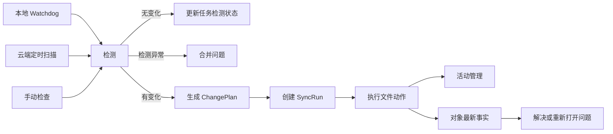
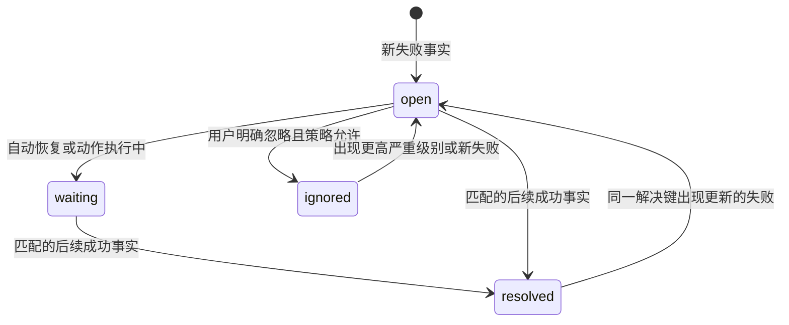

# LarkSync 活动检测、执行运行与问题生命周期设计

版本：v0.8.4 设计基线  
日期：2026-07-22  
状态：v0.8.4-dev.1 已按本设计实装  
适用范围：活动管理、同步调度器、运行摘要、统一问题模型、问题中心

## 1. 文档目标

本设计解决两个已经在正式版真实数据中复现的问题：

1. 活动管理存在真实事件但页面显示为空，同时大量“检查后无变化”的运行挤占运行列表。
2. 问题中心只记录历史失败，不使用同一对象后续成功事实自动结案，导致已恢复问题长期处于未解决状态。

本文是 v0.8.4 相关实现、测试、迁移和验收的工程基线。页面视觉与三档窗口规则继续遵循 `docs/design/v0.8.2-activity-problem-center-plan.md`；本文只补充活动语义、数据生命周期和当前缺陷修复，不修改全局侧栏、顶栏或窗口模式。

## 2. 现状证据

### 2.1 正式版只读统计

2026-07-22 通过正式版本机回环 API 读取，未刷新问题源、未触发同步、未修改数据库：

| 指标 | 数值 | 结论 |
| --- | ---: | --- |
| 同步任务 | 8 | 样本覆盖当前全部任务 |
| 最近运行样本 | 400 | 每个任务最近 50 次 |
| 无实际动作运行 | 208（52%） | 检测和执行混用造成明显噪声 |
| 有动作或问题运行 | 192 | 活动数据真实存在 |
| 最新为空但更早有活动的任务 | 3 | 默认选最新运行会隐藏真实活动 |
| 同步事件总数 | 2,503,930 | 活动页为空不是后端无数据 |
| 未解决问题 | 3,084 | 问题队列明显积压 |
| 已解决问题 | 11 | 自动恢复能力不足 |
| 删除类未解决 | 1,073 | 其中 1,069 条只是安全删除等待 |

任务级粗筛显示，3,084 条未解决问题均存在更晚的成功运行，3,067 条存在更晚的实际动作运行。该统计不能直接用于结案，因为必须进一步匹配同一任务、同一对象和同一操作族；它只用于证明历史问题存在大量已恢复候选。

### 2.2 已确认缺陷

#### ACT-BUG-01：事件查询被页签重置关闭

活动页挂载时将详情模式设置为 `events`；异步选中任务后，通用诊断 Hook 又将模式重置为 `overview`。事件查询的 `enabled` 条件要求模式必须为 `events`，因此请求被关闭。

修正规则：

- 页面用途决定初始和持续详情模式，通用 Hook 不得在任务变化时覆盖页面模式。
- 切换任务只重置运行和事件选择，不改变页面自身的活动模式。
- 查询被禁用、查询中、无运行、无事件、筛选无命中和请求失败必须使用不同状态文案。

#### ACT-BUG-02：默认选择最新空运行

当前选择逻辑直接回退到 `recentRuns[0]`，没有判断运行是否包含上传、下载、删除、冲突、失败或待处理动作。

修正规则：

- 用户已明确选中的运行始终优先。
- 否则默认选择时间范围内最近的“有活动运行”。
- 没有有活动运行时才选择最新检测兼容记录，并明确标注“本次检查无变化”。
- 新运行到达不得抢走用户当前选择。

#### ACT-BUG-03：运行时间过滤口径错误

当前运行范围使用 `started_at`。跨越时间边界但在范围内仍有事件的运行会被隐藏。

修正规则：运行是否命中时间范围使用 `last_event_at ?? finished_at ?? started_at`。

#### PROBLEM-BUG-01：问题只消费失败，不消费恢复事实

问题回填只读取 `failed / delete_failed / delete_pending / cancelled`，后续 `uploaded / downloaded / deleted / success` 不参与结案。手动验证仅按“同一任务存在更晚成功运行”判断，粒度过粗且不会自动执行。

修正规则：

- 问题创建和问题恢复必须消费同一条有序事件流。
- 恢复匹配必须至少包含任务、对象和操作族。
- 无变化检测成功不得解决文件级问题。
- 其他对象或其他任务成功不得解决当前问题。

#### PROBLEM-BUG-02：正常等待状态被当成问题

`delete_pending` 表示安全删除宽限期，属于正常工作流状态，不是故障。它当前产生 1,069 条未解决问题，且没有任何可执行动作。

修正规则：

- `delete_pending` 从问题分类器输入中移除。
- 待删除继续在任务状态和活动事件中展示。
- 只有 `delete_failed`、宽限期过期后状态不一致或无法确认目标状态时创建问题。

## 3. 领域边界

### 3.1 检测 Check

检测回答：“本地或云端是否出现需要处理的变化？”

检测可以高频发生，但通常没有动作。检测结果分为：

- `no_change`：没有变化，只更新任务检测状态。
- `changes_found`：产生非空变化计划，进入执行。
- `check_failed`：检查本身失败，更新任务健康状态并按去重规则创建或更新问题。

检测不是活动。无变化检测不创建活动运行，也不写普通活动事件。

### 3.2 变化计划 ChangePlan

变化计划是检测和执行之间的边界，至少包含：

- `task_id`
- `trigger_source`
- 待执行对象集合
- 每个对象的操作族：`upload / download / delete / conflict_resolution`
- 计划生成时间

v0.8.4 不把完整计划永久保存为新表；计划只在执行前存在于内存中。只有非空计划才创建 `SyncRun`。如执行前应用退出，下次检测会依据 SQLite 同步状态重新生成计划，不依赖内存计划恢复。

### 3.3 执行运行 SyncRun

运行回答：“系统实际尝试了哪些同步动作，结果如何？”

创建条件：

- 变化计划非空。
- 用户执行冲突解决等明确写动作。
- 手动同步在检测后确实存在动作。

不创建条件：

- 定时检查无变化。
- Watchdog 周期唤醒但没有静默期结束的变动。
- 手动检查无变化。

运行结束后继续保存文件级事件和计数，作为活动管理和问题生命周期的事实来源。

### 3.4 活动 Activity

活动是对 `SyncRun + SyncRunEvent` 的审计视图，只展示实际执行或执行失败。

任务最近检测状态以紧凑摘要展示，不与活动列表混排。历史 v0.8.3 空运行保留在数据库中，但默认从活动选择和统计中排除，可通过“显示历史检查记录”兼容入口查看。

### 3.5 问题 Problem

问题回答：“当前最新事实仍然异常，是否需要系统继续恢复或用户处理？”

问题不是历史错误日志。历史失败在恢复后必须保留审计记录，但默认不再出现在未解决队列。

## 4. 检测与执行流程



### 4.1 本地上传检测

现有 Watchdog、静默窗口和待上传路径队列继续使用：

- 没有就绪路径且没有待处理 tombstone 时立即返回。
- 此时不得创建 `SyncRun`。
- 存在就绪路径或需要执行的 tombstone 时生成计划，再创建运行。

### 4.2 云端下载检测

当前下载调度先创建运行再扫描。调整为：

1. 执行云端目录和本地同步状态比对。
2. 收集需要下载、重命名、删除或冲突处理的对象。
3. 无变化时更新任务检测状态并结束。
4. 有变化时创建运行并执行计划。

检测阶段复用现有飞书目录遍历和元数据响应，不新增或猜测飞书 API 字段。若现有响应不足以把“识别变化”和“执行下载”安全拆开，实施时必须停在接口边界并补充真实响应样例，不得臆造字段。

### 4.3 检测状态持久化

新增 `sync_task_check_states`，每个任务最多一行：

| 字段 | 类型 | 规则 |
| --- | --- | --- |
| `task_id` | string PK | 关联同步任务 |
| `state` | string | `idle / checking / no_change / changes_found / failed` |
| `trigger_source` | string | 最近检测来源 |
| `started_at` | float nullable | 最近检测开始时间 |
| `finished_at` | float nullable | 最近检测结束时间 |
| `last_change_at` | float nullable | 最近发现变化时间 |
| `change_count` | int | 最近检测发现的计划对象数量 |
| `consecutive_no_change` | int | 连续无变化次数，发生变化或失败时归零 |
| `last_error` | text nullable | 脱敏后的检测错误 |
| `updated_at` | float | 最近更新时间 |

不为每次无变化检测新增历史行，避免把高频心跳换一种表继续无限增长。

### 4.4 兼容字段

`SyncRun` 增加：

- `run_kind`：`activity / legacy_check`，新运行默认 `activity`。
- `has_activity`：根据真实文件动作、问题或执行错误确定。

历史记录迁移规则：

- 动作计数、失败数、冲突数和删除异常均为 0 的旧运行标记为 `legacy_check`、`has_activity=false`。
- 其他旧运行标记为 `activity`、`has_activity=true`。
- 不删除旧运行和事件。

## 5. 活动管理数据与交互

### 5.1 查询口径

- 任务列表继续展示全部任务。
- 默认运行查询增加 `has_activity=true`。
- 用户启用“显示历史检查记录”后返回活动运行和 `legacy_check`。
- 活动统计不包含 `legacy_check`。
- 时间范围按 `last_event_at ?? finished_at ?? started_at`。

### 5.2 默认选择优先级

1. URL 或用户当前明确选择且仍存在的运行。
2. 时间范围内最近的有活动运行。
3. 启用兼容开关时最近的历史检查记录。
4. 无运行。

### 5.3 页面状态

| 状态 | 展示 |
| --- | --- |
| 任务加载中 | 任务骨架，其他栏保留缓存 |
| 任务无运行 | “所选时间内没有实际同步活动” |
| 仅有空检测 | “最近检查正常，没有发现变化” |
| 运行无事件 | “该运行摘要存在，但事件明细已清理或尚未写入” |
| 筛选无命中 | “当前筛选没有命中事件”，提供重置 |
| 事件查询关闭 | 仅限非活动页面；活动页不得出现该状态 |
| 请求失败 | 保留旧数据并局部重试 |

### 5.4 检测摘要

活动页页头下方增加单行检测摘要：

```text
最近检查：14:32 · 正常，无变化 · 连续 18 次无变化 · 下次检查 14:37
```

检测失败时摘要转为问题入口，但不把错误写成一次活动运行。

## 6. 问题生命周期

### 6.1 状态机



v0.8.4 不开放通用忽略按钮；`ignored` 仅保留数据模型兼容。

### 6.2 指纹与解决键

`fingerprint` 用于合并相同失败原因：

```text
source_kind + task_id + category + stage + normalized_error_code + object_key
```

新增 `resolution_key`，用于匹配后续恢复事实：

```text
task_id + object_key + operation_family
```

两者必须分开：同一文档可能先后因不同错误码上传失败，这些问题可以拥有不同指纹，但可由同一次后续上传成功解决。

### 6.3 操作族映射

| 问题类别/阶段 | 操作族 | 可解决事实 |
| --- | --- | --- |
| 上传失败、云端写入失败 | `upload` | 同对象后续上传或内容写入成功 |
| 下载失败、本地写入失败 | `download` | 同对象后续下载并写入成功 |
| 转换/导入失败 | `conversion` | 同对象对应转换流程后续成功 |
| 删除失败 | `delete` | 同对象删除成功或目标不存在经过确认 |
| 内容冲突 | `conflict` | 对应冲突源记录进入 resolved |
| 授权/权限 | `task_auth` | 同任务授权健康验证成功，并且相关受阻操作恢复 |
| 网络/远端临时错误 | 原操作族 | 同对象同操作后续成功 |
| 任务取消 | `task_run` | 后续非空活动运行完成；用户主动退出造成的取消可直接降为历史通知 |

操作族映射必须由现有事件状态常量集中定义，前后端不得各自猜测。

### 6.4 最新事实优先

对同一 `resolution_key`：

- 成功时间晚于问题 `last_seen_at`：解决。
- 新失败时间晚于 `resolved_at`：重新打开。
- 无变化检测：不产生对象成功事实。
- 时间相同但顺序无法判断：失败优先，保持未解决。
- 路径重命名后使用稳定云端 token 或同步映射解析到同一 `object_key`；无法稳定匹配时保持未解决。

### 6.5 新增问题字段

`problem_records` 增加：

| 字段 | 用途 |
| --- | --- |
| `resolution_key` | 匹配后续成功事实 |
| `operation_family` | 选择验证策略 |
| `actionability` | `manual_required / auto_recovering / diagnostic_only` |
| `resolved_by_run_id` | 审计解决运行 |
| `resolved_by_event_id` | 审计解决事件 |
| `last_good_at` | 最近匹配成功时间 |

现有 `resolution_verification` 使用稳定枚举：

- `same_object_operation_succeeded`
- `source_resolved`
- `target_absent_verified`
- `task_auth_recovered`
- `legacy_task_success_candidate`
- `not_verified`
- `reopened_by_occurrence`

### 6.6 增量处理

事件持久化后执行以下顺序：

1. 失败事件：分类、生成指纹和解决键、创建或更新问题。
2. 成功事件：生成解决键，解决所有 `last_seen_at` 更早的匹配未解决问题。
3. 冲突源终态：按冲突记录 ID 解决。
4. 提交问题状态和事件事实。

问题处理失败不得阻断同步主流程；记录结构化错误并由后台维护任务重试。

### 6.7 历史回填

正式数据含约 250 万事件，禁止在启动阶段全量重放。

回填策略：

1. 先对当前未解决问题构建 `(task_id, resolution_key, last_seen_at)` 索引。
2. 按任务和时间范围分批读取候选成功事件。
3. 在内存中规范化对象键并匹配，不对每个问题执行独立数据库查询。
4. 每批提交 checkpoint，可暂停、恢复和重复执行。
5. 首次只运行 dry-run，输出候选解决数、无法匹配数和原因分布。
6. dry-run 通过后才应用状态变更。

历史 `delete_pending` 处理：

- 对仍有活动 tombstone 的记录，不创建问题，保留待删除状态。
- 已经删除成功或 tombstone 已取消的记录标记 resolved。
- 只有真实 `delete_failed` 保持未解决。

## 7. 问题中心交互

### 7.1 默认队列

默认只展示当前未解决，并按以下分组：

1. 需人工处理：冲突、授权配置、无法自动恢复的本地状态。
2. 自动恢复中：可以重试或等待下一次实际动作验证。
3. 仅诊断：没有安全动作，只提供证据和关联活动。

已解决问题进入历史页签，不删除。

### 7.2 动作能力

- 页面只渲染后端 `available_actions`。
- `retry_task` 只用于任务级或确实可通过整任务重试验证的问题。
- 文件级问题在没有单文件重试能力前，不伪造单文件重试按钮。
- `open_local_folder` 是辅助动作，不改变问题状态。
- 冲突继续提供 `use_local / use_cloud`，动作完成后必须等待冲突源终态验证。

### 7.3 解决说明

已解决详情必须展示：

- 最后失败时间。
- 恢复时间。
- 恢复依据。
- 关联运行和事件。
- 若为历史迁移解决，标记“根据后续对象成功事实自动整理”。

## 8. API 设计

### 8.1 任务检测状态

扩展任务概览 DTO：

```text
check_state: {
  state,
  trigger_source,
  started_at,
  finished_at,
  last_change_at,
  change_count,
  consecutive_no_change,
  last_error
}
```

旧客户端忽略新增字段，不破坏兼容。

### 8.2 运行查询

诊断和运行列表增加：

- `include_checks=false`，默认不返回 `legacy_check`。
- `has_activity` 和 `run_kind` 响应字段。

旧接口默认行为改为只返回活动运行；需要审计旧记录时显式开启兼容参数。

### 8.3 问题接口

现有 `/problems`、`/summary`、`/{id}`、`/actions` 和 `/verify` 保持路径兼容，响应增加问题生命周期字段。

新增维护接口只允许本机调用：

- `GET /problems/reconciliation/preview`：只读预演摘要。
- `POST /problems/reconciliation/apply`：应用已经生成且未过期的预演计划。

应用接口必须校验预演数据版本、问题总数和最新事件 checkpoint，任一变化都要求重新预演。

## 9. 并发、一致性与故障恢复

- 同一任务检测继续使用现有运行互斥，避免上传和下载并发修改同一映射。
- 检测状态更新和运行创建分别提交；运行创建必须发生在非空计划形成后。
- 问题增量处理按事件时间执行，批次内同解决键的失败优先于同时间成功。
- 重复消费同一事件依赖 `ProblemOccurrence(source_kind, source_id)` 唯一约束保持幂等。
- 历史回填通过 checkpoint 幂等恢复。
- 问题自动结案失败不回滚已经成功的文件同步。
- 数据库迁移前使用 SQLite backup API 生成一致性备份，不复制正在写入的数据库文件。

## 10. 测试设计

### 10.1 前端

- 活动页任务异步选中后，事件查询仍启用。
- 切换任务不会从 `events` 重置到 `overview`。
- 默认选择最近有活动运行，而不是最新空运行。
- 用户明确选择的空运行仍可查看。
- 时间范围按最后事件时间判断。
- 无运行、仅空检测、无事件、筛选无结果和请求失败文案不同。
- `delete_pending` 不出现在问题中心数量中。
- 问题详情正确显示自动解决证据和重新打开状态。

### 10.2 后端

- 连续 100 次无变化云端检测产生 0 个 `SyncRun`，只更新一行检测状态。
- 一次非空变化计划只创建一个活动运行。
- 本地上传无待处理路径不创建运行。
- 同文档上传失败后上传成功，问题自动解决。
- 同任务其他文档成功不解决当前问题。
- 其他任务成功不解决当前问题。
- 无变化检测成功不解决文件问题。
- 解决后同解决键再次失败，问题重新打开。
- `delete_pending` 不创建问题，`delete_failed` 创建问题。
- tombstone 成功终态解决删除失败。
- 冲突源 resolved 解决对应冲突问题。
- 历史回填重复执行结果一致。
- 问题结案异常不影响同步运行结束。

### 10.3 真实数据副本

- 正式版继续运行时使用 SQLite backup API 创建副本。
- 开发测试使用独立端口、数据目录、实例锁和 Token Store。
- 调度器和飞书写动作默认关闭。
- 在副本上验证迁移、查询性能和问题 dry-run。
- 飞书写验证仅使用用户先前提供的测试文件夹和隔离本地目录。

## 11. 验收标准

### 11.1 活动管理

- 正式数据存在事件时，活动页不得因内部页签状态显示空白。
- 默认活动运行列表不包含无变化检测。
- 实际上传、下载、删除、冲突和失败事件均能按任务和运行定位。
- 页面不会自动跳到最新空记录并隐藏用户正在查看的运行。
- 事件请求关闭时不得伪装成“没有事件”。

### 11.2 问题中心

- 未解决数量代表当前最新事实仍异常，而不是历史失败总数。
- 1,069 条历史 `delete_pending` 不再作为未解决问题展示。
- 自动解决必须有同任务、同对象、同操作族的后续事实。
- 任何不确定匹配保持未解决，不追求最大结案数量。
- 自动解决记录可审计，后续失败可重新打开。

### 11.3 性能

- 后端启动不等待 250 万事件历史回填。
- 问题列表首屏不扫描 JSONL 全量日志。
- 历史 dry-run 分批、可暂停、可恢复。
- 活动页切换任务只请求当前所需运行和事件。

## 12. 实施顺序与发布边界

### v0.8.4

1. 修复活动查询页签、默认运行选择、时间口径和空状态。
2. 增加问题解决键、操作族、可操作性和恢复审计字段。
3. `delete_pending` 退出问题分类器。
4. 实现新事件增量自动结案和历史 dry-run/apply。
5. 增加任务检测状态和运行兼容字段。

### 后续结构优化

云端扫描若无法在不重复请求飞书内容的前提下安全形成完整 `ChangePlan`，v0.8.4 先完成检测状态、空运行识别和默认隐藏，并保留现有执行调用；随后在获得真实接口样例和性能基线后继续下沉完整的扫描/执行物理分离。禁止为了满足表面结构而让云端目录扫描重复一遍。

## 13. 回滚方案

- 新字段和新表均为向后兼容增加，不删除原表列。
- 历史运行只标记，不删除。
- 问题自动结案保留解决事件，可按迁移批次恢复原状态。
- `delete_pending` 原记录先标记 resolved，不物理删除。
- 若新问题增量处理异常，可关闭 reconciler，旧问题查询和手动验证仍可工作。
- 正式发布前验证数据库备份可被 v0.8.3 读取；v0.8.3 会忽略新增表和字段。

## 14. 不在本次范围

- 不修改飞书开放平台权限和 OAuth 回调。
- 不新增飞书 API 字段假设。
- 不实现通用忽略、批量解决或伪单文件重试。
- 不修改全局侧栏、顶栏和桌面窗口框架。
- 不删除 250 万历史事件。
- 不直接在正在运行的正式数据库上开发或试迁移。

## 15. v0.8.4-dev.1 实施记录

### 15.1 已完成

- 活动页不再因异步任务选择把 `events` 重置为 `overview`；事件查询保持启用。
- 默认运行选择跳过无活动记录，显式选择仍然保留；时间过滤改用最后事实时间。
- `SyncRun` 增加 `run_kind / has_activity`，旧空运行迁移为 `legacy_check`，活动接口默认排除检查记录。
- 新增每任务一行的 `sync_task_check_states`；无变化检查只更新状态和连续次数。
- 调度上传没有待处理对象时不再创建运行；云端扫描的检查开始、变化、无变化和失败状态均会落入检查摘要。
- 问题分类器升级为 v2；新增解决键、操作族、可操作性、解决运行、解决事件和最后成功时间。
- 新增恢复事实表；只有同任务、同对象、同操作族且时间更晚的成功事件可以自动解决问题。
- 后续同解决键失败会重新打开问题并清除旧解决引用。
- `delete_pending` 退出问题输入；历史记录保留但自动归档为“工作流状态，不是问题”。
- 问题动作按真实能力收敛：自动恢复类可重试任务，本地 IO 可打开目录，冲突保留使用本地/云端；不再为普通上传错误伪造“打开目录”。

### 15.2 与完整物理分离的边界

本轮没有为云端目录扫描重复调用飞书接口。现有执行器仍完成一次真实扫描，但会把扫描结果写入检查状态，并把没有任何动作的旧运行归类为检查记录且从活动接口默认隐藏。后续只有在能够复用同一份扫描结果形成 `ChangePlan` 时，才继续把云端检测和执行拆成两个物理阶段。

### 15.3 正式数据安全验证边界

- 已通过正式版本机 API 做聚合只读审计；未刷新问题源、未执行同步、未访问 keyring。
- 当前正式数据库约 2.12 GB，并仍被正式版使用。本轮不在用户工作期间执行全量脱敏快照，避免在线备份及 250 万事件逐行脱敏产生明显磁盘负载。
- 迁移、自动结案、重新打开、跨对象隔离、无变化检查压缩和接口默认过滤均使用隔离 SQLite 测试库验证。
- 发布候选体验测试继续按 `docs/REAL_DATA_TESTING.md` 使用 SQLite online backup；正式库只作为源，不在副本验证期间写入。
